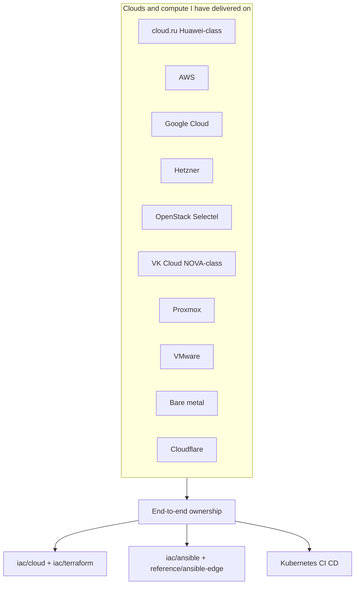
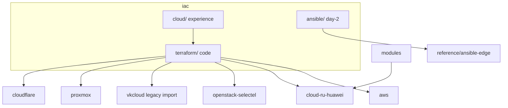
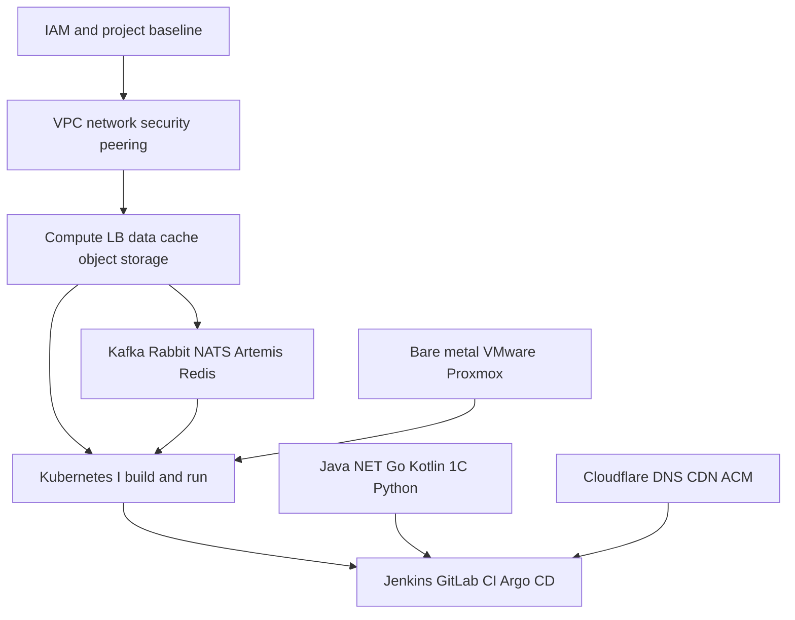
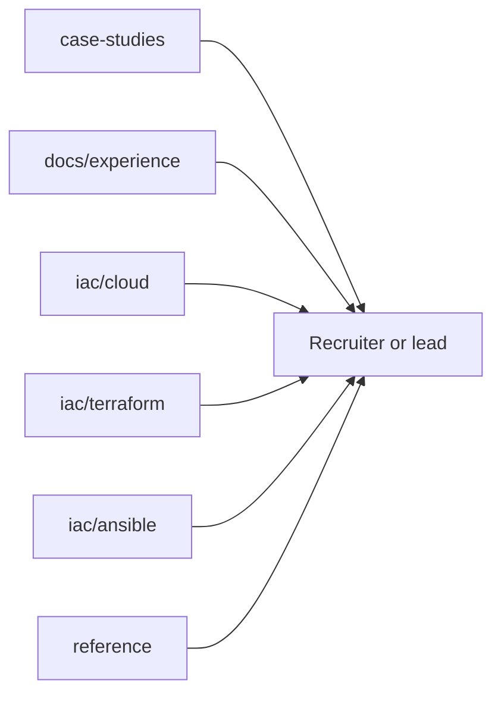

# Narberall: Platform Engineer Lab

**Platform Engineer. AI and turnkey cloud delivery. Six years, senior in these niches.**

I design and ship platforms end to end: cloud project bootstrap (IAM, VPC, networking), compute, managed data, Kubernetes, CI/CD, application and utility code, documentation, and monitoring.

The same ownership covers **greenfield** (empty cloud or rack → production) and **legacy** (hand-built estates → IaC, runbooks, monitoring, cheaper to run). A large share of that work was **loaded production**: high RPS, large user bases, **~99.9% annual SLA**, multi-zone HA, and changes that must not take the product down. Security is in the first delivery (hardening, EDR, least privilege, Vault / ESO, CI gates), not a later project. IaC and pipelines are split and laid out so developers, on-call, and **audit** can follow them. I ship in a **team with a lead** and as the **single platform owner** on one or several concurrent projects (reachable). On later engagements I **trained people and delegated** as a de facto lead while reporting to PMs, CTOs, and project-wide tech leads. About **six years** of that pattern: bank/SBP-class payments, blockchain, delivery e-commerce, 50+ microservice estates and heavy JVM monoliths. Full narrative: [`docs/experience.md`](docs/experience.md).

This repo is my public lab: NDA-safe case studies, **sanitized Terraform / Terragrunt**, **Ansible day-2**, diagrams, and the portfolio site source.

**Live site:** _(add URL after first deploy)_  
**License:** MIT

---

## Start here

| You are… | Open |
|-----------|------|
| Hiring manager / lead | [`docs/experience.md`](docs/experience.md) (including [education](docs/experience.md#education)) then [`iac/cloud/`](iac/cloud/) then [case studies](#case-studies-iac-related) |
| Engineer reviewing IaC | [`iac/terraform/`](iac/terraform/) |
| Engineer reviewing legacy-as-code | [`iac/cloud/vk-cloud.md`](iac/cloud/vk-cloud.md) then [`case-studies/05-legacy-estate-as-code.md`](case-studies/05-legacy-estate-as-code.md) |
| Engineer reviewing Ansible / edge | [`iac/ansible/`](iac/ansible/) then [`reference/ansible-edge/`](reference/ansible-edge/) |
| Engineer reviewing OS / hardware depth | [`practice/home-lab/os-workstation.md`](practice/home-lab/os-workstation.md) |

```text
iac/
  cloud/        # Experience by platform (keywords + links)
  terraform/    # Code, one folder per cloud
  ansible/      # Day-2 Linux / Xray GitOps → reference/ansible-*
```

---

## Why this is a curated lab (not full private trees)

Published IaC is a **curated showcase**: representative modules, roots, and resource examples from real delivery.

**Full client / employer Terraform trees are not published.** Reasons:

1. **Security and confidentiality** - real account IDs, hostnames, CIDRs, IAM bindings, and operational history must stay private
2. **Size and history** - production IaC repos are often large, multi-year codebases; dumping them here would bury the signal under noise

What you get instead: enough real `.tf` / Terragrunt to see that I can describe **an entire cloud platform as code**, plus a resource map in [`iac/terraform/RESOURCES.md`](iac/terraform/RESOURCES.md).

---

## Delivery scope (what I own)

I regularly stand up infrastructure **from zero** in public clouds and on premises:

1. Cloud / project baseline: accounts, IAM, networks (VPC / subnets / routing / security groups / peering)
2. Compute and data: VMs, load balancers, managed DB, cache, object storage, messaging (Kafka-class)
3. Kubernetes platforms I build and operate myself (see [clusters](#kubernetes-and-databases) below)
4. Edge and identity-adjacent pieces: DNS (Cloudflare), CDN/ACM patterns, CI users and roles
5. CI/CD into those clusters (**Jenkins** including VM→Kubernetes workers; **GitLab CI + Argo CD** for branch/tag GitOps), plus day-2 Linux/Ansible and observability

**Cloud.ru note for international readers:** cloud.ru (and similar RU hyperscalers in this lab) is **Huawei Cloud class**. The resource model and day-to-day patterns closely follow **AWS** (VPC, ECS/EC2-class compute, CCE/EKS-class Kubernetes, RDS, OBS/S3, DMS/Kafka-class). That work is transferable AWS-shaped experience.

**VK Cloud note for international readers:** VK Cloud (MCS) is **NOVA Cloud class** (Kazakhstan OpenStack IaaS). Under the hood the resource model is **OpenStack**: Nova compute, Cinder volumes, Neutron networks (VPC-equivalent), Keystone identity. That work is transferable OpenStack experience (NOVA Cloud KZ, Selectel-class, and other OpenStack IaaS). Provider in this lab: `vk-cs/vkcs`.

Also shipped platforms on **AWS**, **Google Cloud**, **Hetzner**, **OpenStack / Selectel**, **VK Cloud (NOVA Cloud class / MCS)**, **VMware**, **Proxmox**, and **bare-metal** servers in previous roles.



### Greenfield and legacy

Greenfield is the empty-project story. A large part of the work is the other side: **arrive on legacy**, inventory what is already running, and make it operable as a platform without a reckless rebuild.

That claim has a concrete proof in this lab: a console-built **NOVA Cloud class** (VK Cloud / MCS) project (no Terraform before I arrived). I described **the whole layout from zero** (networks / VPC-equivalent, subnets, security groups, flavors, AZs) and brought **70+ VMs** into Terraform, then imported live compute until `plan` was clean. Code and counts: [`case-studies/05-legacy-estate-as-code.md`](case-studies/05-legacy-estate-as-code.md), [`iac/terraform/vkcloud/ESTATE.md`](iac/terraform/vkcloud/ESTATE.md).

| I take over | What “turnkey” means |
|-------------|----------------------|
| Hand-built cloud / VMs / clusters | IaC (or import into state), inventory, no more click-ops as source of truth. **Proof:** 70+ VMs + networks/SG catalog, [case 05](case-studies/05-legacy-estate-as-code.md) |
| Undocumented delivery | Runbooks, diagrams, on-call notes so the next person can ship |
| Slow release / fragile ops | CI/CD, GitOps: Jenkins and/or GitLab CI + Argo CD, faster path from commit to environment |
| Cost and waste | Right-size compute, storage, idle environments; cut obvious cloud spend |
| Blind production | Metrics, logs, alerts; SLI/SLO-shaped visibility before a full observability stack |
| Loaded production | High RPS, multi-zone HA, seamless migrations, DBMS under lock and replication pressure |
| Weak or implicit trust | Hardening, EDR, users/rights, secrets in Vault/ESO from day one — without a separate security backlog |
| Opaque Git / click-ops | Separate repos (not a dump monorepo), obvious IaC and pipeline layout, branches that match promotion |
| Incidents | Crisis handling including off-hours: restore service, then encode the fix (see below) |

Speed is part of the offer: baseline automation, monitoring, and documentation in days-to-weeks, not a six-month “transformation programme” before anything is safer.

### How I work (team, solo, and de facto lead)

About **six years** on the market. I position as a **strong senior in my niches** (platform, loaded production, CI/CD, day-2 of serious apps) — not a title on a badge.

I have worked in a **large engineering organization with a dedicated lead**. Team delivery is normal and welcome: reviews, shared on-call, someone else owning product while I own platform.

On later engagements the badge was not always “Lead,” but the work was: I **trained colleagues, delegated, and owned the result**. Reporting was **direct** to project managers, technical directors / CTOs, team leads, and **tech leads of the whole project** — dates, risk, and “can we ship,” not only a ticket queue.

A common hiring pattern now is **one platform engineer for a whole product** — sometimes for **several products at once**. I do that too: full ownership, concurrent projects, and I stay **reachable** on those threads. That is capacity and ownership, not a story about avoiding teams or about a shop that had no management.

### Six years: domains, apps, brokers, JVM

Hiring usually cannot infer this from Terraform. The long form is [`docs/experience.md`](docs/experience.md). The short form:

| Domain | What “accompany” meant |
|--------|------------------------|
| Bank / payments (RF) | Large B2B/P2P programmes, infrastructure next to **SBP** (Russia’s Faster Payments System — instant, bank-grade). Cut-offs, HA, audit, a stuck money path is P1 |
| Blockchain | Large smart-contract / chain-facing products: environments, keys, deploy path (NDA-safe case studies to expand) |
| Delivery / shops | Food and grocery-class e-commerce: **thousands of users per hour** at peaks; checkout and brokers on the critical path |
| Collaboration | **Atlassian** (Jira/Confluence/Bitbucket-class) and **Nextcloud**: upgrade, backup, identity, storage — down means the company notices |

| Runtime / glue | What I owned |
|----------------|--------------|
| Java, Kotlin, C#/.NET, Go, Python, **1C:Enterprise** | Build, image/publish, deploy — the path to prod, not a claim I wrote every business line |
| **Jenkins** | Plugins, workers; **moved dedicated-VM workers onto Kubernetes** so builds scale and snowflake boxes die |
| **GitLab CI + Argo CD** | Even more of the work: **seamless** deploys by **branch and tag**, **auto MRs**, merge when the written rules pass |
| **SonarQube**, **Trivy**, **OSV-Scanner** | Stood up **from zero** and wired as CI gates that people actually use |
| Kafka, RabbitMQ, NATS, **Artemis**, Redis | Lag, DLQ, disk, eviction — a broker that is “up” but not draining is an outage |
| **50+ microservices** | Release graph, base images, traces, secrets/promotion so fifty pipelines stay shippable |
| Heavy JVM **monoliths** (few backends) | **Tomcat**/servlet + JVM: thread pools vs JDBC, **heap dumps**, **thread dumps**, GC logs — restarting the pod is not a strategy |

Same ~99.9% SLA and Cisco-style incident loop as below. Same security defaults as [secrets and layout](#security-secrets-and-how-the-code-is-organized).

### Production load, SLA, and crisis response

Much of the production work was on **busy user-facing systems** (high request rates, large concurrent audiences) with an annual availability target around **99.9% SLA**. That forces a specific style of change and recovery:

| Concern | How it shows up in the work |
|---------|-----------------------------|
| Seamless migrations | Rolling / blue-green / replica cutover so users do not see a maintenance window |
| Fault tolerance | No single VM, disk, or AZ as the only path; fail over, then fix the primary |
| Multi-zone HA | Spread compute, data, and balancers across availability zones (or equivalent failure domains) |
| Metrics | Latency, errors, saturation, replication lag, lock waits — enough to see a breach before the SLA burns |

**Crisis / incident work** (including nights): restore the product first, then write the lasting fix.

Typical classes:

- Production service down: pull logs and metrics fast, isolate the failing layer (app, DB, balancer, cluster, network), recover, then prevent the next hit
- Connectivity loss (routing, upstream filtering, jurisdictional path blocks): restore reachability via an alternate path / region / failover — the engineering problem is **availability**, not a public how-to for evasion
- Data path under load: locks, replication break, balancer misbehavior — see [databases](#kubernetes-and-databases)

Troubleshooting follows a **Cisco-style seven-step** loop. Logs, metrics, and a written timeline beat guess-and-reboot:

1. Define the problem (who, what, when, blast radius vs SLA)
2. Gather information (logs, metrics, traces, recent changes, topology)
3. Analyze the information (layer: app, DB, balancer, cluster, network)
4. Eliminate possible causes (what the data rules out)
5. Propose a hypothesis
6. Test the hypothesis in the smallest safe step
7. Solve the problem and **document** so the next night is shorter

### Kubernetes and databases

**Kubernetes I operate** across the spectrum, not one vendor flavour:

- Cloud PaaS: EKS / CCE / GKE-class managed control planes
- Self-hosted / vanilla kubeadm-class on VMs or bare metal
- Platform distributions: **OpenShift**, **Deckhouse**

Same day-2 habits on all of them: deploy path, upgrades, capacity, backups adjacent to stateful workloads, incident response.

**Databases:** operate and **tune under load**, not only provision. Repeated production work:

| Topic | What I actually did |
|-------|---------------------|
| Heavy load | Connection pools, I/O and memory knobs, autovacuum / equivalent maintenance, storage growth |
| Long SQL | Plans, indexes, rewrite or split; stop a query from owning the instance |
| Locks / blocking | Find the waiter and the holder; kill or reschedule; fix the transaction shape |
| Replication | Primary/replica lag, failover, read-offload; know when the replica is lying |
| Load spread | Read replicas, connection balancers, app-side routing to the right role |
| Balancers | In front of DB and app: health, draining, sticky vs stateless |
| Sharding | When a single primary is the ceiling: key design, rebalance, avoid a cross-shard hot path |

PostgreSQL and managed RDS-class engines appear in the published Terraform; the same ops pattern applies to other engines in private estates. Backup/restore is assumed; the hard part is staying fast and consistent while the product is already busy.

### Security, secrets, and how the code is organized

Cybersecurity practices are part of **turnkey**, not a follow-up after go-live. I do not wait for a separate security TZ to ship a platform that is painful to operate or that fails a later audit.

| Practice | How it shows up in the work |
|----------|-----------------------------|
| Best practices | Least privilege, no shared root, firewall, sshd, patchable images; defaults that on-call can live with |
| EDR | Hosts and images take the estate’s EDR / endpoint agent as part of bootstrap, not “antivirus later” |
| OS hardening | Users, groups, sudo/IAM, file permissions, services that should not be public |
| Users and rights | Named admins, role-shaped access in cloud and on the box; an auditor can follow who can do what |
| Secrets | **HashiCorp Vault** (and/or cloud secret stores) and Kubernetes **External Secrets Operator (ESO)**. If the estate has none, I introduce one. Protected CI variables. No long-lived secrets in git. |
| CI security gates | **SonarQube**, **Trivy**, **OSV-Scanner** — install from zero, wire into promotion, keep the gate loud enough for audit and quiet enough that developers do not bypass it |
| Git layout | **Not a dump monorepo.** App, IaC, and pipeline/config live in repos a new engineer can find. Branches match promotion (dev → preprod → prod), not “everything on one branch forever” |
| IaC and pipelines | Obvious folders (`modules` / `live` / env), who can apply production, stages that match how people actually ship. **Jenkins** (plugins, K8s workers) and **GitLab CI + Argo CD** (branch/tag, auto MR, merge policy) |
| Who this is for | Developers and platform on-call: less friction. **Business and technical audit:** IAM, secrets, and change history walkable without a reconstruction project |

Handoff is meant to stay operable: security that blocks every deploy is as much a failure as secrets in git.

---

## IaC (start here)

All cloud write-ups and Terraform live under **[`iac/`](iac/)**.

| Go to | Why |
|-------|-----|
| [`iac/cloud/`](iac/cloud/) | Experience by platform, with links into code |
| [`iac/terraform/README.md`](iac/terraform/README.md) | Code navigation hub |
| [`iac/ansible/`](iac/ansible/) | Day-2 Ansible map → `reference/ansible-*` |
| [`iac/terraform/RESOURCES.md`](iac/terraform/RESOURCES.md) | Clouds × resource types in code |
| [`iac/terraform/aws/`](iac/terraform/aws/) | AWS root + Terragrunt live (EKS, RDS, ElastiCache) |
| [`iac/terraform/cloud-ru-huawei/`](iac/terraform/cloud-ru-huawei/) | Huawei-class multi-env root + Terragrunt |
| [`iac/terraform/vkcloud/`](iac/terraform/vkcloud/) | **Legacy as code:** VK Cloud / NOVA Cloud class, vkcs, catalog + purpose-split VMs, import |
| [`iac/terraform/modules/`](iac/terraform/modules/) | Reusable modules |
| [`iac/terraform/SANITIZE.md`](iac/terraform/SANITIZE.md) | What never goes into git |

I introduce Terraform/Terragrunt from zero on greenfield platforms, and I import hand-built cloud into state until `plan` is clean. Same map for OpenShift / Deckhouse / vanilla / PaaS Kubernetes and for DBMS that must stay fast under load (replication, locks, sharding) while the product keeps a **~99.9%** availability bar. Secrets (Vault / ESO) and a readable Git layout are part of that first delivery.







---

## Repo map

| Path | What |
|------|------|
| [`iac/`](iac/) | **IaC hub:** cloud experience + Terraform / Terragrunt + Ansible map |
| [`case-studies/`](case-studies/) | Problem → architecture → result |
| [`packages/`](packages/) | Fixed-scope offers |
| [`reference/`](reference/) | Non-TF reference kits (AI compose, Ansible, monitoring, apps) |
| [`practice/`](practice/) | Workstation MCP + home lab (OS/hardware/BIOS, AI, Ansible edge) |
| [`diagrams/`](diagrams/) | Architecture diagrams |
| [`site/`](site/) | Portfolio website source |
| [`docs/`](docs/) | Positioning, six-year experience narrative, sanitize checklist |

---

## Case studies (IaC-related)

- [Cloud platform turnkey / Terraform from zero](case-studies/02-cloud-platform-turnkey.md)
- [Brownfield import into Terraform state](case-studies/04-terraform-brownfield-import.md)
- [Legacy estate as Terraform (VK Cloud / NOVA Cloud class)](case-studies/05-legacy-estate-as-code.md)
- [AI / LLM platform](case-studies/01-ai-llm-platform.md)
- [Document AI pipeline](case-studies/03-document-ai-pipeline.md)

---

## Positioning

> Six years, senior in platform niches. Turnkey cloud and AI: greenfield or loaded legacy. De facto lead (train/delegate) under PMs, CTOs, and project-wide tech leads; also a teammate under a dedicated lead; also the single owner on concurrent products. Bank/SBP-class payments, blockchain, delivery e-commerce, Atlassian/Nextcloud. Java/.NET/Go/Kotlin/Python/1C delivery plus SonarQube/Trivy/OSV gates. **Jenkins** (plugins, VM workers → Kubernetes) and **GitLab CI + Argo CD** (branch/tag deploys, auto MR, merge rules). Kafka/Rabbit/NATS/Artemis/Redis. 50+ microservices and JVM/Tomcat monoliths (heap and thread dumps). Secure by default (hardening, EDR, Vault / ESO). ~99.9% SLA, seamless migrations, multi-zone HA, Cisco-style 7-step incidents. **B.Sc. Information Systems and Technologies (09.03.02), SPbSUT (Bonch-Bruevich)**; Cisco and Windows Server practice during the degree. Hardware/OS depth in the home lab. Detail: [`docs/experience.md`](docs/experience.md).
