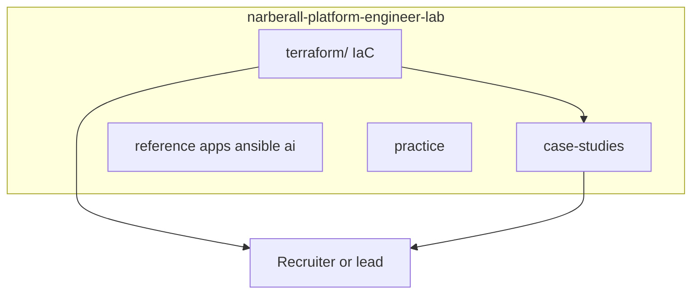
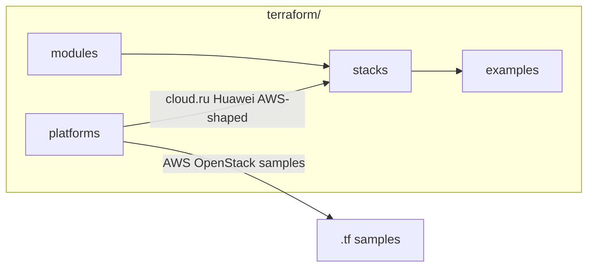
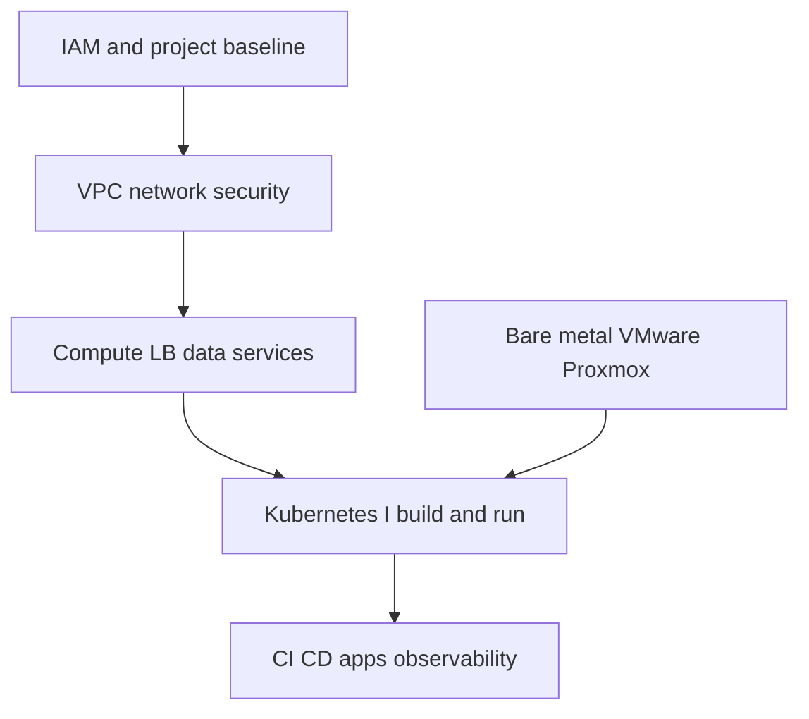

# Narberall: Platform Engineer Lab

**Platform Engineer. AI and turnkey cloud delivery.**

I design and ship platforms end to end: cloud project bootstrap (IAM, VPC, networking), compute, managed data, Kubernetes, CI/CD, application and utility code, documentation, and monitoring.  
This repo is my public lab: NDA-safe case studies, sanitized IaC, diagrams, and the portfolio site source.

**Live site:** _(add URL after first deploy)_  
**License:** MIT

---

## Delivery scope (what I own)

I regularly stand up infrastructure **from zero** in public clouds and on premises:

1. Cloud / project baseline: accounts, IAM, networks (VPC / subnets / routing / security groups)
2. Compute and data: VMs, load balancers, managed DB / object storage
3. Kubernetes platforms I build and operate myself (managed and self-hosted / bare metal where required)
4. CI/CD into those clusters, plus day-2 Linux/Ansible and observability

**Cloud.ru note for international readers:** cloud.ru (and similar RU hyperscalers in this lab) is **Huawei Cloud class**. The resource model and day-to-day patterns closely follow **AWS** (VPC, ECS/EC2-class compute, CCE/EKS-class Kubernetes, RDS, OBS/S3). Working there is transferable AWS-shaped experience, not a separate exotic island.

Also shipped platforms on **AWS**, **Google Cloud**, **Hetzner**, **VMware**, **Proxmox**, and **bare-metal** servers in previous roles.

---

## Terraform / IaC (start here)

All Terraform and Terragrunt code lives in the top-level **[`terraform/`](terraform/)** directory.

| Go to | Why |
|-------|-----|
| [`terraform/README.md`](terraform/README.md) | IaC navigation hub |
| [`terraform/platforms/`](terraform/platforms/) | Real samples: cloud.ru/Huawei, AWS, OpenStack/Selectel, Proxmox, Cloudflare |
| [`terraform/stacks/multi-env-root/`](terraform/stacks/multi-env-root/) | Full multi-env root (network, VMs, K8s, RDS, OBS) |
| [`terraform/stacks/terragrunt-live/`](terraform/stacks/terragrunt-live/) | Terragrunt DRY layout (cloud.ru-class) |
| [`terraform/stacks/aws-terragrunt-live/`](terraform/stacks/aws-terragrunt-live/) | AWS Terragrunt live (EKS / RDS) |
| [`terraform/modules/`](terraform/modules/) | Reusable modules used by stacks |

I introduce Terraform/Terragrunt from zero on greenfield platforms, and I import hand-built cloud into state until `plan` is clean.

---

## Repo map

| Path | What |
|------|------|
| [`terraform/`](terraform/) | **IaC: Terraform + Terragrunt** (platforms, stacks, modules, examples) |
| [`case-studies/`](case-studies/) | Problem → architecture → result |
| [`packages/`](packages/) | Fixed-scope offers |
| [`reference/`](reference/) | Non-TF reference kits (AI compose, Ansible, monitoring, apps) |
| [`practice/`](practice/) | Workstation tooling + home lab |
| [`diagrams/`](diagrams/) | Architecture diagrams |
| [`site/`](site/) | Portfolio website source |
| [`docs/`](docs/) | Positioning, content guide |

---

## Case studies (IaC-related)

- [Cloud platform turnkey / Terraform from zero](case-studies/02-cloud-platform-turnkey.md)
- [Brownfield import into Terraform state](case-studies/04-terraform-brownfield-import.md)
- [AI / LLM platform](case-studies/01-ai-llm-platform.md)
- [Document AI pipeline](case-studies/03-document-ai-pipeline.md)

---

## Maintenance zones

See [`OWNERS.md`](OWNERS.md): work machine owns most paths; home machine fills only `practice/home-lab/` and `HOME_SLOT` files.

## Positioning

> Turnkey cloud and AI infrastructure: IaC, CI/CD, LLM/RAG stacks, apps, docs, and observability. AWS-shaped Huawei/cloud.ru depth plus AWS, GCP, Hetzner, VMware, Proxmox, and bare metal.
