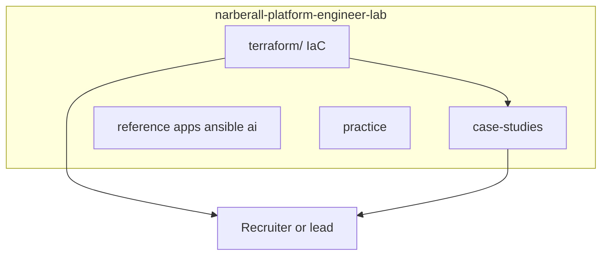
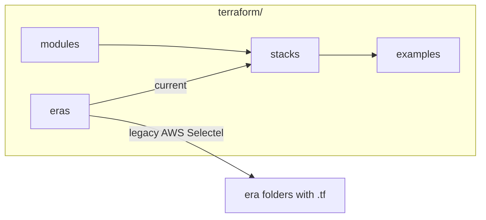

# Narberall: Platform Engineer Lab

**Platform Engineer. AI and turnkey cloud delivery.**

I design and ship platforms end to end: infrastructure, application and utility code, documentation, and monitoring.  
This repo is my public lab: NDA-safe case studies, sanitized IaC, diagrams, and the portfolio site source.

**Live site:** _(add URL after first deploy)_  
**License:** MIT

---

## Terraform / IaC (start here)

All Terraform and Terragrunt code lives in the top-level **[`terraform/`](terraform/)** directory.

| Go to | Why |
|-------|-----|
| [`terraform/README.md`](terraform/README.md) | IaC navigation hub |
| [`terraform/eras/`](terraform/eras/) | Current vs legacy (AWS / Selectel) code |
| [`terraform/stacks/multi-env-root/`](terraform/stacks/multi-env-root/) | Full multi-env root (network, VMs, K8s, RDS, OBS) |
| [`terraform/stacks/terragrunt-live/`](terraform/stacks/terragrunt-live/) | Terragrunt DRY layout |
| [`terraform/modules/`](terraform/modules/) | Reusable modules used by stacks |

I introduce Terraform/Terragrunt from zero on greenfield platforms, and I import hand-built cloud into state until `plan` is clean.

---

## Repo map

| Path | What |
|------|------|
| [`terraform/`](terraform/) | **IaC: Terraform + Terragrunt** (modules, stacks, eras, examples) |
| [`case-studies/`](case-studies/) | Problem → architecture → result |
| [`packages/`](packages/) | Fixed-scope offers |
| [`reference/`](reference/) | Non-TF reference kits (AI compose, Ansible, monitoring, apps) |
| [`practice/`](practice/) | Workstation tooling + home lab |
| [`diagrams/`](diagrams/) | Architecture diagrams |
| [`site/`](site/) | Portfolio website source |
| [`docs/`](docs/) | Positioning, content guide |

---

## Case studies (IaC-related)

- [Cloud platform turnkey / Terraform from zero](case-studies/02-cloud-platform-turnkey.md)
- [Brownfield import into Terraform state](case-studies/04-terraform-brownfield-import.md)
- [AI / LLM platform](case-studies/01-ai-llm-platform.md)
- [Document AI pipeline](case-studies/03-document-ai-pipeline.md)

---

## Maintenance zones

See [`OWNERS.md`](OWNERS.md): work machine owns most paths; home machine fills only `practice/home-lab/` and `HOME_SLOT` files.

## Positioning

> Turnkey cloud and AI infrastructure: IaC, CI/CD, LLM/RAG stacks, apps, docs, and observability.
