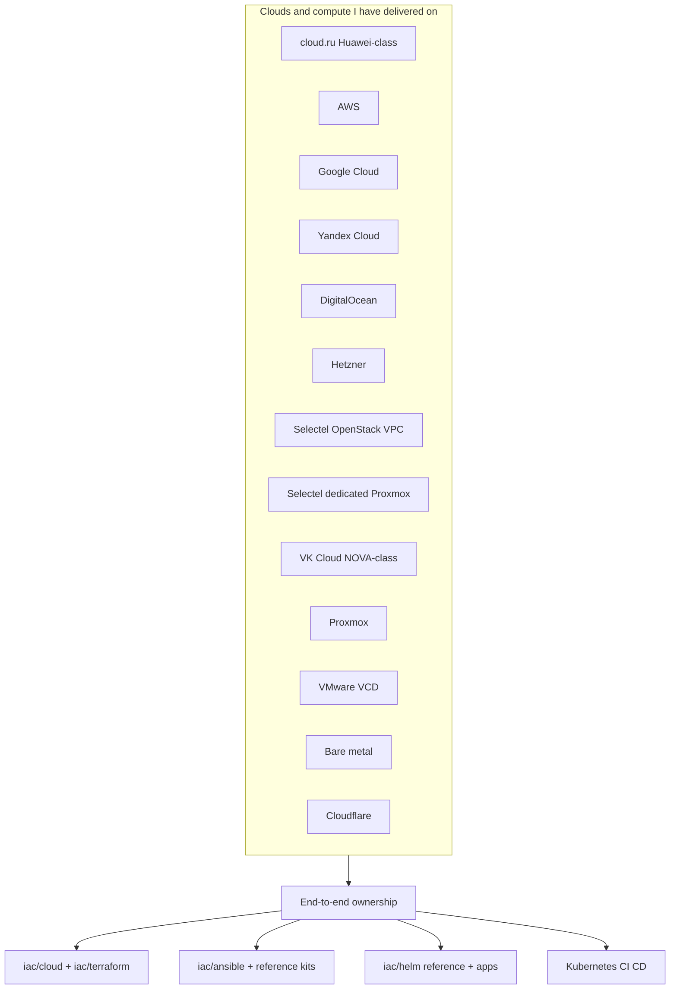
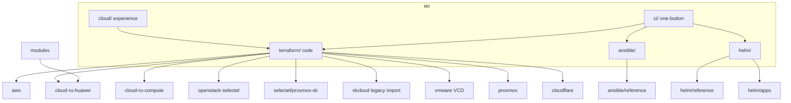
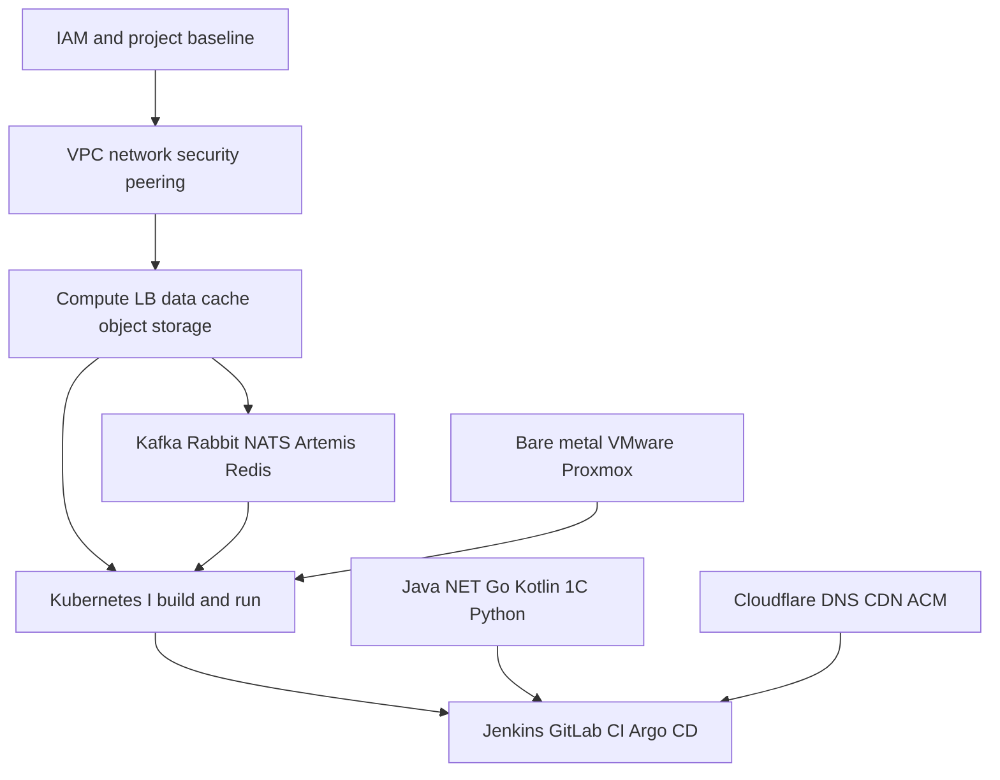
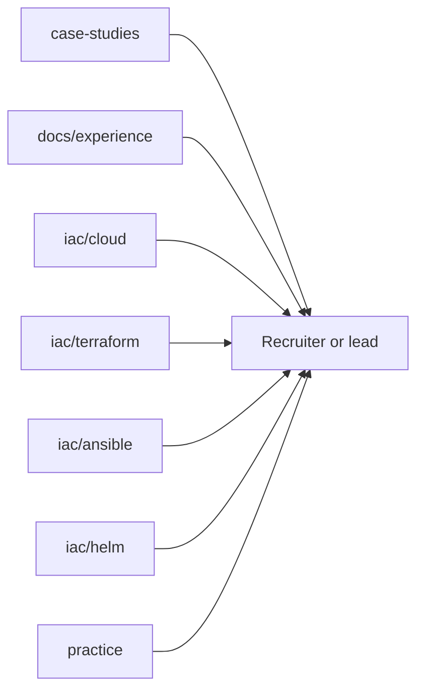

# Narberall: Platform Engineer Lab

**Platform Engineer. AI and turnkey cloud delivery. Six years, senior in these niches.**

**For business first:** I can do **whatever the infra needs** (stand up, accompany, document, incident, cost, identity, data, CI) and I do it **fast**. Baseline in **days to a couple of weeks**, not a quarter of workshops. Everything written down so the next person and audit can follow it. **Minimal change windows**, **~99.9% SLA**. Cloud move is one of the things I also do quickly (people treat it as a year). Idle non-prod can **park at night**. OCR/LLM exists to **speed accounting, analysts, and developers**, not to demo a chatbot. The same calendar includes a **repeatable multi-agent workstation** (Cursor, Claude Code, Codex, local LLM; MCP + local or API models) so that work does not depend on a public chat or a Windows-only box. Diagrams: [`architecture/`](architecture/). Outcomes: [`docs/for-business.md`](docs/for-business.md). LLMOps: [`architecture/01-llmops.md`](architecture/01-llmops.md). SRE: [`architecture/05-sre.md`](architecture/05-sre.md), catalog [`docs/sre/`](docs/sre/). Product APIs and agent trust: [`architecture/06-product-apis.md`](architecture/06-product-apis.md), [`docs/security-ai.md`](docs/security-ai.md). Workstation: [`practice/workstation/`](practice/workstation/).

I design and ship platforms end to end: cloud project bootstrap (IAM, VPC, networking), compute, managed data, Kubernetes, CI/CD, application and utility code, documentation, and monitoring.

The same ownership covers **greenfield** (empty cloud or rack → production) and **legacy** (hand-built estates → IaC, runbooks, monitoring, cheaper to run). A large share of that work was **loaded production**: high RPS, large user bases, **~99.9% annual SLA**, multi-zone HA, and changes that must not take the product down. Security is in the first delivery (hardening, EDR, least privilege, Vault / ESO, CI gates), not a later project. IaC and pipelines are split and laid out so developers, on-call, and **audit** can follow them. I ship in a **team with a lead** and as the **single platform owner** on one or several concurrent projects (reachable). On later engagements I **trained people and delegated** as a de facto lead while reporting to PMs, CTOs, and project-wide tech leads. About **six years** of that pattern: bank/SBP-class payments, blockchain, delivery e-commerce, 50+ microservice estates and heavy JVM monoliths. About **four of those years** I did Ansible, Helm, CI, bash, and deploys **by hand**, before coding agents existed. Much of this lab is from that period. I use AI now the way any current engineer does (research through drafting charts and pipelines) because the business calendar requires it. I still can without agents. One person is simply slower than ten agents on one task. Full narrative: [`docs/experience.md`](docs/experience.md).

This repo is my public lab: NDA-safe case studies, **sanitized Terraform / Terragrunt**, **Ansible**, **Helm** (cluster reference kits and [`iac/helm/apps/`](iac/helm/apps/) samples), diagrams, and the portfolio site source.

**Live site:** _(add URL after first deploy)_  
**License:** MIT

---

## Start here

| You are… | Open |
|-----------|------|
| Founder / PM / international buyer | [`docs/for-business.md`](docs/for-business.md) then [`architecture/`](architecture/) |
| Hiring manager / lead | [`docs/experience.md`](docs/experience.md) (including [education](docs/experience.md#education)) then [`iac/cloud/`](iac/cloud/) then [`iac/ansible/`](iac/ansible/) and [`iac/helm/`](iac/helm/) (cluster [`reference/`](iac/helm/reference/) + product samples [`apps/`](iac/helm/apps/)) then [case studies](#case-studies-iac-related) |
| Engineer reviewing IaC | [`iac/terraform/`](iac/terraform/) |
| Engineer reviewing legacy-as-code | [`iac/cloud/vk-cloud.md`](iac/cloud/vk-cloud.md) then [`case-studies/05-legacy-estate-as-code.md`](case-studies/05-legacy-estate-as-code.md) |
| Engineer reviewing Ansible / edge | [`iac/ansible/`](iac/ansible/) then [`iac/ansible/reference/ansible-edge/`](iac/ansible/reference/ansible-edge/) |
| Engineer reviewing payments identity Ansible | [`iac/ansible/reference/ansible-payments-idplat/`](iac/ansible/reference/ansible-payments-idplat/) then [case 08](case-studies/08-payments-swarm-autodeploy.md) |
| Engineer reviewing estate Ansible | [`iac/ansible/reference/ansible-estate/`](iac/ansible/reference/ansible-estate/) then [case 10](case-studies/10-ansible-estate.md) |
| Engineer reviewing GPU/LLM Ansible | [`iac/ansible/reference/ansible-llm-collab/`](iac/ansible/reference/ansible-llm-collab/) then [case 01](case-studies/01-ai-llm-platform.md) |
| Engineer reviewing Ansible kits (bootstrap, app, backup, AWS, KB, metrics) | [`iac/ansible/reference/`](iac/ansible/reference/) (`ansible-bootstrap`, `ansible-app-platform`, `ansible-backup-borg`, `ansible-aws-hosts`, `ansible-kb-linux`, `monitoring-starter`, `ansible-runner`) |
| Engineer reviewing Helm / GitOps cluster | [`iac/helm/`](iac/helm/) then [`iac/helm/reference/helm-estate-cluster/`](iac/helm/reference/helm-estate-cluster/) and product samples [`iac/helm/apps/`](iac/helm/apps/) then [`case-studies/11-helm-estate.md`](case-studies/11-helm-estate.md) |
| Engineer reviewing CI (infra + builds + gates) | [`iac/ci/`](iac/ci/) then [`diagrams/iac/ci-turnkey.md`](diagrams/iac/ci-turnkey.md) |
| Engineer reviewing OS / hardware depth | [`practice/home-lab/os-workstation.md`](practice/home-lab/os-workstation.md) |
| Engineer reviewing MCP / multi-agent workstation | [`practice/workstation/mcp-ops-toolchain.md`](practice/workstation/mcp-ops-toolchain.md) then [`practice/workstation/reference/`](practice/workstation/reference/) and [`docs/security-ai.md`](docs/security-ai.md) (Cursor, Claude Code, Codex, local LLM; Linux, macOS, or WSL) |
| Engineer reviewing SRE / monitoring | [`docs/sre/`](docs/sre/) then [`architecture/05-sre.md`](architecture/05-sre.md), overlay [`iac/helm/reference/helm-estate-cluster/monitoring/`](iac/helm/reference/helm-estate-cluster/monitoring/), and [case 11](case-studies/11-helm-estate.md) |
| Engineer reviewing product APIs / agent trust | [`architecture/06-product-apis.md`](architecture/06-product-apis.md) then [`docs/security-ai.md`](docs/security-ai.md) and [`practice/workstation/`](practice/workstation/) |

```text
iac/
  cloud/        # Experience by platform (keywords + links)
  terraform/    # Code, one folder per cloud
  ansible/      # Linux / Xray / LLM / estate / payments + reference/ kits
  helm/         # Cluster GitOps: reference/ kits (mesh, ESO, Argo, obs) + apps/ product samples
  ci/           # CI catalog: turnkey map + sanitized pipelines/
practice/
  workstation/  # Multi-agent desk + MCP + local/API models; bash/Docker kit, any OS
  home-lab/     # GPU compose, OS/hardware, Ansible edge
```

---

## Why this is a curated lab (not full private trees)

Published IaC is a **curated showcase**: representative modules, roots, and resource examples from real delivery.

**Full client / employer Terraform trees are not published.** Reasons:

1. **Security and confidentiality** - real account IDs, hostnames, CIDRs, IAM bindings, and operational history must stay private
2. **Size and history** - production IaC repos are often large, multi-year codebases; dumping them here would bury the signal under noise

What you get instead: enough real `.tf` / Terragrunt to see that I can describe **an entire cloud platform as code**, plus a resource map in [`iac/terraform/RESOURCES.md`](iac/terraform/RESOURCES.md).

---

## Delivery scope (what I own)

I regularly stand up infrastructure **from zero** in public clouds and on premises:

1. Cloud / project baseline: accounts, IAM, networks (VPC / subnets / routing / security groups / peering)
2. Compute and data: VMs, load balancers, managed DB, cache, object storage, messaging (Kafka-class)
3. Kubernetes platforms I build and operate myself (see [clusters](#kubernetes-and-databases) below)
4. Edge and identity-adjacent pieces: DNS (Cloudflare), CDN/ACM patterns, CI users and roles
5. CI/CD into those clusters (**Jenkins** including VM→Kubernetes workers; **GitLab CI + Argo CD** for branch/tag GitOps), plus Linux Ansible, Helm, and observability

**Cloud.ru note for international readers:** cloud.ru (and similar RU hyperscalers in this lab) is **Huawei Cloud class**. The resource model and day-to-day patterns closely follow **AWS** (VPC, ECS/EC2-class compute, CCE/EKS-class Kubernetes, RDS, OBS/S3, DMS/Kafka-class). That work is transferable AWS-shaped experience.

**VK Cloud note for international readers:** VK Cloud (MCS) is **NOVA Cloud class** (Kazakhstan OpenStack IaaS). Under the hood the resource model is **OpenStack**: Nova compute, Cinder volumes, Neutron networks (VPC-equivalent), Keystone identity. That work is transferable OpenStack experience (NOVA Cloud KZ, Selectel-class, and other OpenStack IaaS). Provider in this lab: `vk-cs/vkcs`.

**VMware note for international readers:** cloud.ru VMware is **VMware Cloud Director (VCD)**, a different API from Huawei-class Advanced. Under the hood: org / VDC / Edge / vApp / VM / storage profiles. That work is transferable VCD / vCloud Director experience. Provider in this lab: `vmware/vcd`. Code: [`iac/terraform/vmware/`](iac/terraform/vmware/). One-button host CI: [`iac/ci/`](iac/ci/).

**Selectel note for international readers:** Selectel is one of the largest independent **Russian cloud and datacenter** operators (often listed with Yandex Cloud, VK Cloud, and cloud.ru as a top-tier local IaaS/colo brand). Two products, two APIs: **Selectel Cloud / VPC** is **OpenStack** (Nova / Cinder / Neutron / Keystone; `selectel` + `openstack` providers). **Dedicated** nodes in Selectel DCs run **Proxmox VE** (`telmate/proxmox`). Not a rebrand of AWS or OVH. Code: [`iac/terraform/openstack-selectel/`](iac/terraform/openstack-selectel/), [`iac/terraform/selectel/`](iac/terraform/selectel/). Write-up: [`iac/cloud/selectel.md`](iac/cloud/selectel.md).

Also shipped platforms on **AWS**, **Google Cloud**, **Yandex Cloud**, **DigitalOcean**, **Hetzner**, **OpenStack / Selectel**, **VK Cloud (NOVA Cloud class / MCS)**, **VMware Cloud Director**, **Proxmox**, and **bare-metal** servers in previous roles.



### Greenfield and legacy

Greenfield is the empty-project story. A large part of the work is the other side: **arrive on legacy**, inventory what is already running, and make it operable as a platform without a reckless rebuild.

That claim has a concrete proof in this lab: a console-built **NOVA Cloud class** (VK Cloud / MCS) project (no Terraform before I arrived). I described **the whole layout from zero** (networks / VPC-equivalent, subnets, security groups, flavors, AZs) and brought **70+ VMs** into Terraform, then imported live compute until `plan` was clean. Code and counts: [`case-studies/05-legacy-estate-as-code.md`](case-studies/05-legacy-estate-as-code.md), [`iac/terraform/vkcloud/ESTATE.md`](iac/terraform/vkcloud/ESTATE.md).

| I take over | What “turnkey” means |
|-------------|----------------------|
| Hand-built cloud / VMs / clusters | IaC (or import into state), inventory, no more click-ops as source of truth. **Proof:** 70+ VMs + networks/SG catalog, [case 05](case-studies/05-legacy-estate-as-code.md) |
| Undocumented delivery | Runbooks, diagrams, on-call notes so the next person can ship |
| Slow release / fragile ops | CI/CD, GitOps: Jenkins and/or GitLab CI + Argo CD, faster path from commit to environment |
| Cost and waste | Right-size compute, storage, idle environments; **night park / weekday start** on non-prod (Huawei-class / cloud.ru and the same idea on AWS). Review: [`architecture/02-finops-night-park.md`](architecture/02-finops-night-park.md) |
| Blind production | Metrics, logs, alerts; SLI/SLO-shaped visibility before a full observability stack |
| Loaded production | High RPS, multi-zone HA, **minimal windows**, DBMS under lock and replication pressure, **~99.9% SLA** |
| Cloud move (when asked) | Same platform shape on the next API. I do this **fast**; it is not the whole offer. Example: VK Cloud → Huawei-class Advanced. [`architecture/04-seamless-move.md`](architecture/04-seamless-move.md) |
| Weak or implicit trust | Hardening, EDR, users/rights, secrets in Vault/ESO from day one — without a separate security backlog |
| Opaque Git / click-ops | Separate repos (not a dump monorepo), obvious IaC and pipeline layout, branches that match promotion |
| Incidents | Crisis handling including off-hours: restore service, then encode the fix (see below) |

Speed is the offer: **whatever the estate needs**, documented, with **short windows** and the SLA kept. Baseline in **days-to-weeks**, not a six-month programme before anything is safer. Same bar for AI: OCR/LLM is a **process multiplier**, not a slide. Managers: [`architecture/00-days-not-months.md`](architecture/00-days-not-months.md).

### How I work (team, solo, and de facto lead)

About **six years** on the market. I position as a **strong senior in my niches** (platform, loaded production, CI/CD, operate serious apps) — not a title on a badge.

I have worked in a **large engineering organization with a dedicated lead**. Team delivery is normal and welcome: reviews, shared on-call, someone else owning product while I own platform.

On later engagements the badge was not always “Lead,” but the work was: I **trained colleagues, delegated, and owned the result**. Reporting was **direct** to project managers, technical directors / CTOs, team leads, and **tech leads of the whole project** — dates, risk, and “can we ship,” not only a ticket queue.

A common hiring pattern now is **one platform engineer for a whole product** — sometimes for **several products at once**. I do that too: full ownership, concurrent projects, and I stay **reachable** on those threads. That is capacity and ownership, not a story about avoiding teams or about a shop that had no management.

### Six years: domains, apps, brokers, JVM

Hiring usually cannot infer this from Terraform. The long form is [`docs/experience.md`](docs/experience.md). The short form is the stack I actually accompanied (NDA-safe sectors, no employer names).

| Domain | What “accompany” meant |
|--------|------------------------|
| Bank / payments (RF) | Large B2B/P2P programmes, infrastructure next to **SBP** (Russia’s Faster Payments System: instant, bank-grade). Cut-offs, HA, audit, a stuck money path is P1. **.NET** identity/payment planes on **Docker Swarm then Kubernetes**, Ansible, **NATS then Kafka**, PostgreSQL/MSSQL, **mTLS** and crypto-adjacent modules, closed-loop Linux (Astra-class) and Windows Server. CI: **Azure DevOps** and **Argo CD**. Public slice: [case 08](case-studies/08-payments-swarm-autodeploy.md) |
| Treasury / trade-finance / documents | Loaded **Kubernetes** (prod + preprod), **Helm + Argo CD**, **Vault / ESO**, **Kafka + Debezium**, Camunda-class BPM, signing / HSM-adjacent VMs, Istio-class mesh, policy gateway. Releases with **minimal windows**. Same ~99.9% bar |
| Blockchain | Large smart-contract / chain-facing products: node ops (Tron / ETH-class), keys, env isolation, deploy path, lag/catch-up. NDA-safe case studies to expand |
| Delivery / shops | Food and grocery-class e-commerce: **thousands of users per hour** at peaks. **50+ Spring** services, CCE-class Kubernetes, **Spring Cloud Config + Vault**, managed **Kafka**, RDS PostgreSQL, **Harbor**, WAF/ELB, autostands (**MinIO** in-cluster), **Apache Superset** / BI, **NiFi**, **Jaeger**, **Linkerd**. Checkout and brokers on the critical path |
| Collaboration / corporate IT | **Atlassian** (Jira / JSM / Confluence / Bitbucket-class), **Nextcloud** (+ OnlyOffice / Mattermost), nginx / WAF, **AD / ADFS / NPS / CA**, **Teleport**, GitLab, **n8n**, **1C:Enterprise** (Windows app + PostgreSQL). Upgrade, backup, identity, storage. Down means the company notices |
| Document AI / capture | OCR and enterprise capture (ContentCapture-class) into structured JSON, then LLM extract, handoff to **1C** / ERP. Cases [01](case-studies/01-ai-llm-platform.md) and [03](case-studies/03-document-ai-pipeline.md) |
| Enterprise ITSM / EDO / CRM | High-load web (document exchange, counterparty monitoring, ITSM, CRM). **ELK / Graylog**, Grafana, Zabbix, Jira Service Desk, Tomcat, SQL incident loop, customer-facing SLA |
| Enterprise Java product delivery | Vendor ITSM/BPM-class Java: **Tomcat**, Nginx/IIS, **Patroni + etcd**, Oracle / MSSQL / PostgreSQL / InfluxDB, **Artemis + Kafka**, **Keycloak** (SAML / OIDC / Kerberos / AD). Jenkins, Maven, Nexus / Artifactory. Train client engineers |
| Multi-tenant Kubernetes | Many client estates in parallel: **Deckhouse** (and vanilla / OpenShift / cloud PaaS), **Helm + werf**, GitLab CI per env, from **bare metal / Proxmox** to AWS / Selectel / Yandex / DigitalOcean / Hetzner. Strict incident SLA, hot-fix and rollback the same day |

| App runtime | What I owned |
|-------------|--------------|
| **Java / Kotlin / Spring Boot** | Build, image, Helm, JVM under load. Path to prod, not every business line |
| **C# / .NET** (incl. .NET Core) | Build, publish, Swarm/K8s or IIS/Kestrel. Payments identity and enterprise APIs |
| **Go** | Small static binaries: same secrets, probes, rollouts |
| **Python** (Django, FastAPI) | Services, jobs, AI-adjacent APIs; image, not “works on my laptop” |
| **PHP (Laravel)** | Pack and ship prod-ready into the cluster (Helm/werf-class) |
| **Node.js** | Same GitOps path as the rest of the estate |
| **1C:Enterprise** | Environments, publish, PG next to Windows 1C. Not a functional-consultant claim |

| CI / GitOps | What I owned |
|-------------|--------------|
| **Jenkins** | Plugins, workers; **moved dedicated-VM workers onto Kubernetes** so builds scale and snowflake boxes die |
| **GitLab CI + Argo CD** | Most of the recent work: **seamless** deploys by **branch and tag**, **auto MRs**, merge when the written rules pass. GitLab as a product: runners, backups, tune |
| **Azure DevOps + Argo CD** | Closed-loop / payments estates where Azure DevOps was already the build plane |
| **Helm + werf** | Multi-env package and deliver; GitOps, not a Friday YAML copy |
| **Maven, Nexus, Artifactory** | Java artefact path next to Jenkins/GitLab |
| **SonarQube, Trivy, OSV-Scanner** | Stood up **from zero** and wired as gates people actually use |

| Data / brokers / analytics | What I owned |
|---------------------------|--------------|
| **Kafka**, RabbitMQ, **NATS**, **Artemis**, **Debezium** | Lag, DLQ, disk, CDC. A broker that is “up” but not draining is an outage |
| **Redis** | Cache, sessions, locks, eviction as a product decision |
| **PostgreSQL** (incl. **Patroni + etcd**), MySQL, **MSSQL**, **Oracle**, MongoDB, **ClickHouse**, InfluxDB | Provision, backup, tune under load, long SQL, locks, replication |
| **Apache Superset**, **Supabase**, **Airflow**, **n8n**, **NiFi**, Camunda-class BPM | BI, BaaS, jobs, automation, document/process flow. Operate, not a click-demo |
| **50+ microservices** | Release graph, base images, traces, secrets/promotion so fifty pipelines stay shippable |
| Heavy JVM **monoliths** (few backends) | **Tomcat**/servlet + JVM: thread pools vs JDBC, **heap dumps**, **thread dumps**, GC logs. Restarting the pod is not a strategy |

| Observability / SRE | What I owned |
|---------------------|--------------|
| **Metrics** | **Prometheus** + **Alertmanager**, **Grafana** (dashboards, alert rules, contact points), **VictoriaMetrics**-class. **kube-state-metrics**, node-exporter, Pushgateway, **Blackbox**, cloud-provider exporters (CloudEye-class / CloudWatch-class). On-call alerts that fire on SLI, not on noise |
| **Logs** | **OpenObserve** (HA ingest, retention, object-store backend) + **OpenTelemetry Collector** on the nodes. **Loki** + Promtail / Vector / Fluent Bit. **ELK / OpenSearch**: Elasticsearch, **Logstash**, Kibana, Filebeat. **Graylog**. Same habit: collect, retain, give L2 a saved query, not a grep on the box |
| **Traces** | **Jaeger**, Zipkin-class, **OpenTelemetry**. Correlation across 50+ services so “user cannot pay” is not fifty log greps |
| **SRE loop** | Stand the stack up from zero, wire exporters, tune retention, page the right people, write the runbook. Incident: metrics + logs + traces first, then the lasting fix. Host-only starter (sysstat / vnstat) when a full stack is not there yet. Lab overlay: **12** Grafana alert groups, **14** dashboard artefacts, two cloud exporters, OpenObserve collector. Catalog: [`docs/sre/`](docs/sre/), manager page: [`architecture/05-sre.md`](architecture/05-sre.md) |

| Storage / identity | What I owned |
|--------------------|--------------|
| S3 / OBS, **MinIO**, **Ceph**, NFS | App data and infra backup. Cloud object stores and on-box/cluster stores. Log backends land here too (OpenObserve / Loki / ELK) |
| **Harbor**, GitLab / Docker registry | Images that CI actually promotes |
| **Vault / ESO**, **Keycloak**, AD / ADFS, SAML / OIDC / Kerberos, **Teleport** | Secrets and who can reach what. Introduce Vault if missing |
| Cloudflare, CoreDNS, unbound | Public DNS and in-cluster / local resolvers |
| Staff / site VPN (OpenVPN / Pritunl-class) | Reachability for admins and sites, not a public evasion how-to |
| AppSec-adjacent in the estate | Nessus, DefectDojo, Semgrep, ZAP, Dependency-Track: I accompany the VMs and the pipeline, not a claim I am the AppSec lead |

Same ~99.9% SLA and Cisco-style incident loop as below. Same security defaults as [secrets and layout](#security-secrets-and-how-the-code-is-organized).

### Production load, SLA, and crisis response

Much of the production work was on **busy user-facing systems** (high request rates, large concurrent audiences) with an annual availability target around **99.9% SLA**. That forces a specific style of change and recovery:

| Concern | How it shows up in the work |
|---------|-----------------------------|
| Seamless migrations | Rolling / blue-green / replica cutover so users do not see a maintenance window |
| Fault tolerance | No single VM, disk, or AZ as the only path; fail over, then fix the primary |
| Multi-zone HA | Spread compute, data, and balancers across availability zones (or equivalent failure domains) |
| Metrics | Latency, errors, saturation, replication lag, lock waits — enough to see a breach before the SLA burns |

**Crisis / incident work** (including nights): restore the product first, then write the lasting fix.

Typical classes:

- Production service down: pull logs and metrics fast, isolate the failing layer (app, DB, balancer, cluster, network), recover, then prevent the next hit
- Connectivity loss (routing, upstream filtering, jurisdictional path blocks): restore reachability via an alternate path / region / failover — the engineering problem is **availability**, not a public how-to for evasion
- Data path under load: locks, replication break, balancer misbehavior — see [databases](#kubernetes-and-databases)

Troubleshooting follows a **Cisco-style seven-step** loop. Logs, metrics, and a written timeline beat guess-and-reboot:

1. Define the problem (who, what, when, blast radius vs SLA)
2. Gather information (logs, metrics, traces, recent changes, topology)
3. Analyze the information (layer: app, DB, balancer, cluster, network)
4. Eliminate possible causes (what the data rules out)
5. Propose a hypothesis
6. Test the hypothesis in the smallest safe step
7. Solve the problem and **document** so the next night is shorter

### Kubernetes and databases

**Kubernetes I operate** across the spectrum, not one vendor flavour:

- Cloud PaaS: EKS / CCE / GKE-class managed control planes
- Self-hosted / vanilla kubeadm-class on VMs or bare metal
- Platform distributions: **OpenShift**, **Deckhouse**

Same operate habits on all of them: deploy path, upgrades, capacity, backups adjacent to stateful workloads, incident response.

**Databases:** operate and **tune under load**, not only provision. Repeated production work:

| Topic | What I actually did |
|-------|---------------------|
| Heavy load | Connection pools, I/O and memory knobs, autovacuum / equivalent maintenance, storage growth |
| Long SQL | Plans, indexes, rewrite or split; stop a query from owning the instance |
| Locks / blocking | Find the waiter and the holder; kill or reschedule; fix the transaction shape |
| Replication | Primary/replica lag, failover, read-offload; know when the replica is lying |
| Load spread | Read replicas, connection balancers, app-side routing to the right role |
| Balancers | In front of DB and app: health, draining, sticky vs stateless |
| Sharding | When a single primary is the ceiling: key design, rebalance, avoid a cross-shard hot path |
| Users and rights | Flyway/DDL owner vs application DML; extra read-only (audit/BI) and read-write (tools) grants; revoke without stealing OWNER. Coded on RDS PostgreSQL: [`iac/ansible/reference/ansible-estate/`](iac/ansible/reference/ansible-estate/) (`estate_databases`) |

PostgreSQL and managed RDS-class engines appear in the published Terraform; the same ops pattern applies to other engines in private estates. Backup/restore is assumed; the hard part is staying fast and consistent while the product is already busy. User lifecycle is Ansible, not a DBA ticket: [case 10](case-studies/10-ansible-estate.md).

### Security, secrets, and how the code is organized

Cybersecurity practices are part of **turnkey**, not a follow-up after go-live. I do not wait for a separate security TZ to ship a platform that is painful to operate or that fails a later audit.

| Practice | How it shows up in the work |
|----------|-----------------------------|
| Best practices | Least privilege, no shared root, firewall, sshd, patchable images; defaults that on-call can live with |
| EDR | Hosts and images take the estate’s EDR / endpoint agent as part of bootstrap, not “antivirus later” |
| OS hardening | Users, groups, sudo/IAM, file permissions, services that should not be public |
| Users and rights | Named admins, role-shaped access in cloud and on the box; an auditor can follow who can do what |
| Secrets | **HashiCorp Vault** (and/or cloud secret stores) and Kubernetes **External Secrets Operator (ESO)**. If the estate has none, I introduce one. Protected CI variables. No long-lived secrets in git. |
| CI security gates | **SonarQube**, **Trivy**, **OSV-Scanner** — install from zero, wire into promotion, keep the gate loud enough for audit and quiet enough that developers do not bypass it |
| Git layout | **Not a dump monorepo.** App, IaC, and pipeline/config live in repos a new engineer can find. Branches match promotion (dev → preprod → prod), not “everything on one branch forever” |
| IaC and pipelines | Obvious folders (`modules` / `live` / env), who can apply production, stages that match how people actually ship. **Jenkins** (plugins, K8s workers) and **GitLab CI + Argo CD** (branch/tag, auto MR, merge policy) |
| Who this is for | Developers and platform on-call: less friction. **Business and technical audit:** IAM, secrets, and change history walkable without a reconstruction project |

Handoff is meant to stay operable: security that blocks every deploy is as much a failure as secrets in git.

---

## IaC (start here)

All cloud write-ups and Terraform live under **[`iac/`](iac/)**.

| Go to | Why |
|-------|-----|
| [`iac/cloud/`](iac/cloud/) | Experience by platform, with links into code |
| [`iac/terraform/README.md`](iac/terraform/README.md) | Code navigation hub |
| [`iac/ansible/`](iac/ansible/) | Ansible map + kits under `iac/ansible/reference/` |
| [`iac/helm/`](iac/helm/) | Helm / GitOps: cluster kits under `iac/helm/reference/` and curated product samples under `iac/helm/apps/` |
| [`iac/ci/`](iac/ci/) | **CI catalog:** turnkey map (Jenkins + GitLab CI, Java builds, gates, MR, revoke) |
| [`iac/terraform/vmware/`](iac/terraform/vmware/) | **VCD greenfield:** catalog, guest init, DB-class VM, `vmware/vcd` |
| [`iac/terraform/RESOURCES.md`](iac/terraform/RESOURCES.md) | Clouds × resource types in code |
| [`iac/terraform/aws/`](iac/terraform/aws/) | AWS root + multi-account slice + Terragrunt live |
| [`iac/terraform/cloud-ru-huawei/`](iac/terraform/cloud-ru-huawei/) | Huawei-class multi-env root + Terragrunt |
| [`iac/terraform/cloud-ru-compute/`](iac/terraform/cloud-ru-compute/) | **Huawei compute catalog:** CCE, RDS, GitLab/Vault/AppSec/Teleport; split state vs sibling live |
| [`iac/terraform/vkcloud/`](iac/terraform/vkcloud/) | **Legacy as code:** VK Cloud / NOVA Cloud class, vkcs, catalog + purpose-split VMs, import |
| [`iac/terraform/selectel/`](iac/terraform/selectel/) | **Selectel:** OpenStack VPC + dedicated Proxmox on RU cloud/DC |
| [`iac/terraform/COVERAGE.md`](iac/terraform/COVERAGE.md) | Published vs private Terraform per cloud |
| [`iac/terraform/modules/`](iac/terraform/modules/) | Reusable modules |
| [`iac/terraform/SANITIZE.md`](iac/terraform/SANITIZE.md) | What never goes into git |

I introduce Terraform/Terragrunt from zero on greenfield platforms, and I import hand-built cloud into state until `plan` is clean. Same map for OpenShift / Deckhouse / vanilla / PaaS Kubernetes and for DBMS that must stay fast under load (replication, locks, sharding) while the product keeps a **~99.9%** availability bar. Secrets (Vault / ESO) and a readable Git layout are part of that first delivery.







---

## Repo map

| Path | What |
|------|------|
| [`architecture/`](architecture/) | **Manager diagrams** (days, LLMOps, FinOps, reuse, SRE, product APIs, cloud move). Existing case mermaid stays under `diagrams/` |
| [`docs/for-business.md`](docs/for-business.md) | Days / cheaper / simpler, in buyer language |
| [`iac/`](iac/) | **IaC hub:** cloud experience + Terraform / Terragrunt + Ansible reference kits + Helm reference kits and `helm/apps/` product samples |
| [`case-studies/`](case-studies/) | Problem → architecture → result |
| [`packages/`](packages/) | Fixed-scope offers |
| [`practice/`](practice/) | **Same offer, engineer loop:** MCP + local/API models (hours on Linux, macOS, or WSL) plus home lab (OS/hardware/BIOS, GPU compose, Ansible edge). Kits under each catalog `reference/`. Helm product samples: [`iac/helm/apps/`](iac/helm/apps/), not under `practice/` |
| [`diagrams/`](diagrams/) | Architecture diagrams |
| [`site/`](site/) | Portfolio website source |
| [`docs/`](docs/) | Positioning, six-year experience narrative, [`sre/`](docs/sre/) catalog, [`security-ai.md`](docs/security-ai.md), sanitize checklist |

---

## Case studies (IaC-related)

LLMOps first (process speed), then cloud:

- [AI / LLM platform (private GPU API + collab Ansible)](case-studies/01-ai-llm-platform.md)
- [Document AI / OCR pipeline](case-studies/03-document-ai-pipeline.md)
- [Cloud platform turnkey / Terraform from zero](case-studies/02-cloud-platform-turnkey.md)
- [Brownfield import into Terraform state](case-studies/04-terraform-brownfield-import.md)
- [Legacy estate as Terraform (VK Cloud / NOVA Cloud class)](case-studies/05-legacy-estate-as-code.md)
- [VMware VCD from zero + one-button host lifecycle](case-studies/06-vmware-vcd-greenfield.md)
- [Huawei-class compute catalog (split state)](case-studies/07-huawei-compute-catalog.md)
- [SBP-class identity autodeploy (Swarm, then Kubernetes)](case-studies/08-payments-swarm-autodeploy.md)
- [Selectel VPC + dedicated Proxmox](case-studies/09-selectel-vpc-and-dedicated.md)
- [Huawei-class estate Ansible](case-studies/10-ansible-estate.md)
- [Helm estate / GitOps cluster](case-studies/11-helm-estate.md)

---

## Positioning

> Six years, senior in platform niches. About four of those years hands-on before coding agents (Ansible, Helm, CI, bash). AI is a current multiplier, not the source of the skill. **Business first:** whatever the infra needs, **fast**, fully documented, **minimal windows**, **~99.9% SLA**. Turnkey cloud and AI: greenfield or loaded legacy. De facto lead (train/delegate) under PMs, CTOs, and project-wide tech leads; also a teammate under a dedicated lead; also the single owner on concurrent products. Bank/SBP-class payments, treasury/trade-finance, blockchain, delivery e-commerce, Atlassian/Nextcloud/1C, document AI, multi-tenant Deckhouse estates. Java/Kotlin/.NET/Go/Python/PHP/Node/1C plus SonarQube/Trivy/OSV. **Jenkins** (VM workers → Kubernetes), **GitLab CI + Argo CD**, Azure DevOps, Helm/werf. Kafka/Debezium/Rabbit/NATS/Artemis/Redis. PG/Patroni, MySQL, MSSQL, Oracle, Mongo, ClickHouse. Superset, Supabase, Airflow, n8n, NiFi. Harbor, MinIO, Ceph, Vault, Keycloak, Teleport. Observability/SRE: Prometheus, Alertmanager, Grafana, OpenObserve, Loki, ELK/Logstash, Graylog, Jaeger, OTel. 50+ microservices and JVM/Tomcat monoliths. Secure by default (hardening, EDR, Vault / ESO). Multi-zone HA, Cisco-style 7-step incidents. **B.Sc. Information Systems and Technologies (09.03.02), SPbSUT (Bonch-Bruevich)**; Cisco and Windows Server practice during the degree. Hardware/OS depth in the home lab. Detail: [`docs/experience.md`](docs/experience.md).
