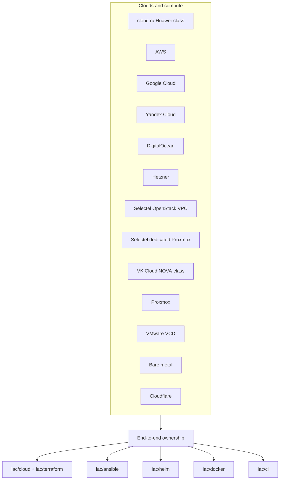

# Narberall: Platform Engineer Lab

**Platform Engineer. AI and turnkey cloud delivery. Six years, senior in these niches.**

I stand up, accompany, and document whatever the estate needs: cloud, Kubernetes, CI, identity, data, cost, incidents. Baseline in **days to a couple of weeks**. **Minimal change windows**, **~99.9% SLA**. Idle non-prod can **park at night**. OCR/LLM speeds accounting and analysts, not a chatbot demo. The same calendar includes a **multi-agent workstation** (Cursor, Claude Code, Codex, local LLM; MCP + local or API models) so work does not depend on a public chat or a Windows-only box.

The same ownership covers **greenfield** (empty cloud or rack to production) and **legacy** (hand-built estates to IaC). About **four of those six years** I wrote Ansible, Helm, CI, and bash **by hand**. AI is a current multiplier, not the source of the skill. Full narrative and stack tables: [`docs/experience.md`](docs/experience.md). Buyer page: [`docs/for-business.md`](docs/for-business.md). Manager diagrams: [`architecture/`](architecture/).

This GitHub repository **is** the public portfolio: NDA-safe cases plus sanitized Terraform, Ansible, Helm, Docker / Compose, and CI kits. Full client trees stay private.

**License:** MIT. **Contact:** GitHub profile on this repository.

---

## Start here

| Reader | Open |
|--------|------|
| Founder / PM / international buyer | [`docs/for-business.md`](docs/for-business.md) then [`architecture/`](architecture/) |
| Hiring manager / lead | [`docs/experience.md`](docs/experience.md) then [cases 05, 11, 13](#case-studies) |
| Engineer reviewing IaC | [`iac/`](iac/) (cloud, terraform, ansible, helm, docker, ci) |
| Engineer reviewing practice | [`practice/`](practice/) (workstation MCP + home lab) then [`docs/sre/`](docs/sre/) |

```text
iac/
  cloud/        # Experience by platform
  terraform/    # One folder per cloud
  ansible/      # Linux / edge / LLM / estate / payments + kits
  helm/         # Cluster GitOps + apps/ product samples
  docker/       # One mechanic per Dockerfile; host and local stacks
  ci/           # Living pipeline kits
practice/
  workstation/  # Multi-agent desk + MCP
  home-lab/     # GPU compose, OS/hardware, Ansible edge
```

---

## Why this is a curated lab

Published IaC is a **showcase**: one richest slice per mechanic, not a private monorepo dump.

Full client Terraform, chart farms, and pipeline copies stay out: live account IDs, hostnames, and years of history must stay private, and a dump would bury the signal. What is published is enough to see an entire cloud platform as code. Resource map: [`iac/terraform/RESOURCES.md`](iac/terraform/RESOURCES.md).

---

## Greenfield and legacy

Proof of legacy in this lab: a console-built **NOVA Cloud class** (VK Cloud / MCS) project with no Terraform on arrival. I described the layout from zero and imported **70+ VMs** until `plan` was clean. [Case 05](case-studies/05-legacy-estate-as-code.md), [`iac/terraform/vkcloud/ESTATE.md`](iac/terraform/vkcloud/ESTATE.md).

Clouds I have delivered on include **AWS**, **Google Cloud**, **Yandex Cloud**, **DigitalOcean**, **Hetzner**, **OpenStack / Selectel**, **VK Cloud**, **VMware Cloud Director**, **Proxmox**, **Huawei-class / cloud.ru**, and **bare metal**. Transfer notes (Huawei-class as AWS-shaped, VK as OpenStack, VCD, Selectel): [`iac/cloud/`](iac/cloud/).



---

## Repo map

| Path | What |
|------|------|
| [`architecture/`](architecture/) | Short manager reviews (days, LLMOps, FinOps, SRE, APIs, cloud move) |
| [`docs/for-business.md`](docs/for-business.md) | Days / cheaper / simpler |
| [`docs/experience.md`](docs/experience.md) | Six-year narrative, education, stack tables |
| [`iac/`](iac/) | Cloud experience + Terraform + Ansible + Helm + Docker + CI |
| [`case-studies/`](case-studies/) | Problem, architecture, result |
| [`packages/`](packages/) | Fixed-scope offers |
| [`practice/`](practice/) | Workstation MCP + home lab |
| [`diagrams/`](diagrams/) | Case and practice mermaid |
| [`docs/sre/`](docs/sre/) | Monitoring catalog |
| [`site/`](site/) | Future static site scaffold (GitHub is the live portfolio) |

---

## Case studies

LLMOps first (process speed), then cloud:

- [AI / LLM platform (private GPU API + collab Ansible)](case-studies/01-ai-llm-platform.md)
- [Document AI / OCR pipeline](case-studies/03-document-ai-pipeline.md)
- [Cloud platform turnkey / Terraform from zero](case-studies/02-cloud-platform-turnkey.md)
- [Brownfield import into Terraform state](case-studies/04-terraform-brownfield-import.md)
- [Legacy estate as Terraform (VK Cloud / NOVA Cloud class)](case-studies/05-legacy-estate-as-code.md)
- [VMware VCD from zero + one-button host lifecycle](case-studies/06-vmware-vcd-greenfield.md)
- [Huawei-class compute catalog (split state)](case-studies/07-huawei-compute-catalog.md)
- [SBP-class identity autodeploy (Swarm, then Kubernetes)](case-studies/08-payments-swarm-autodeploy.md)
- [Selectel VPC + dedicated Proxmox](case-studies/09-selectel-vpc-and-dedicated.md)
- [Huawei-class estate Ansible](case-studies/10-ansible-estate.md)
- [Helm estate / GitOps cluster](case-studies/11-helm-estate.md)
- [Docker images and Compose stacks](case-studies/12-docker-images.md)
- [CI pipelines (GitLab, Jenkins, werf)](case-studies/13-ci-pipelines.md)
