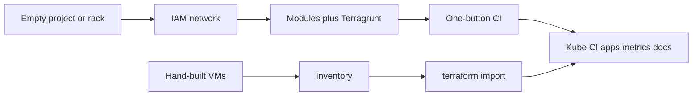

# Days, not months

**Business:** whatever the infra needs (stand up, accompany, document) should be **operable in days to a couple of weeks**, with **short change windows** and the **SLA kept**. A six-month "transformation programme" before the first safer deploy is a cost, not a virtue. Cloud move is optional and fast when asked; it is not this page.

Existing write-ups (unchanged): [case 02](../case-studies/02-cloud-platform-turnkey.md), [case 05](../case-studies/05-legacy-estate-as-code.md), [case 06](../case-studies/06-vmware-vcd-greenfield.md), [CI](../iac/ci/).
