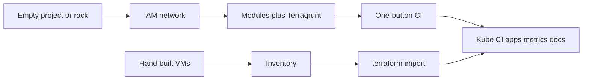

# Days, not months

**Business:** whatever the infra needs (stand up, accompany, document) should be **operable in days to a couple of weeks**, with **short change windows** and the **SLA kept**. A six-month "transformation programme" before the first safer deploy is a cost, not a virtue. Cloud move is optional and fast when asked; it is not this page.

| Before this work | After (published calendar) |
|------------------|----------------------------|
| Quarter of workshops before the first safer deploy | Baseline in **days to a couple of weeks** |
| Next environment is another project | Parameter change: **minutes** for VPC+VM, **hours** for HA EKS/CCE-class ([`03-reuse-modules.md`](03-reuse-modules.md)) |
| Hand-built estate: next resize is a console week | **Days** to a clean `plan`; next change is apply. Proof: **70+** VMs, **200+** state addresses ([case 05](../case-studies/05-legacy-estate-as-code.md)) |
| Release is a meeting or Friday `kubectl` | Branch or tag. **One include** instead of fifty copied job files ([case 13](../case-studies/13-ci-pipelines.md)) |
| New Grafana view is a ticket | **Same day** (12 alert groups, 14 dashboards in git) ([case 11](../case-studies/11-helm-estate.md)) |
| Idle non-prod billed 24/7 | Night park in git ([case 10](../case-studies/10-ansible-estate.md)) |
| Cloud move treated as a year | Design in **days**, freeze in **hours** ([`04-seamless-move.md`](04-seamless-move.md)) |

Existing write-ups: [case 02](../case-studies/02-cloud-platform-turnkey.md), [case 05](../case-studies/05-legacy-estate-as-code.md), [case 06](../case-studies/06-vmware-vcd-greenfield.md), [CI](../iac/ci/), [case 13](../case-studies/13-ci-pipelines.md). Host kits: [`../iac/ansible/`](../iac/ansible/), [case 10](../case-studies/10-ansible-estate.md). Helm: [`../iac/helm/`](../iac/helm/), [case 11](../case-studies/11-helm-estate.md). Images: [`../iac/docker/`](../iac/docker/), [case 12](../case-studies/12-docker-images.md). Same-day Grafana: [`05-sre.md`](05-sre.md), catalog [`../docs/sre/`](../docs/sre/). Product APIs: [`06-product-apis.md`](06-product-apis.md).
