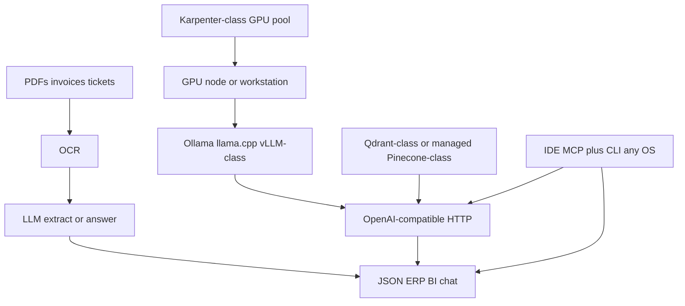

# LLMOps / AI (process speed, not a demo)

**Business:** OCR and LLM are here to **multiply throughput**. Accounting stops re-keying invoices. Analysts get structured fields. Developers and on-call get a local or private API instead of pasting tenant data into a public chat. The **engineer loop** is the same share of the offer: MCP + CLI on a laptop so Terraform, tickets, and GPU jobs do not wait on a Windows-only setup.

I do not sell "we installed a model." I sell a **path**: GPU or CPU serve, TLS API, backup, who can call it, a vector store when RAG is the job, and a workstation kit that copies onto **Linux, macOS, or WSL** in hours.

The coded estate path is Ansible, not a laptop compose. [`../iac/ansible/reference/ansible-llm-collab/`](../iac/ansible/reference/ansible-llm-collab/) is the private GPU API **and** the collab plane on one inventory: Nextcloud groupfolders, n8n form/webhook GitOps, Kafka, CIS, plus GitLab / JSM / 1C / ContentCapture-class hosts. [Case 01](../case-studies/01-ai-llm-platform.md) is that story. Workstation compose (Ollama / SD / MCP) stays under `practice/`.

Existing proof:

- [Case 01](../case-studies/01-ai-llm-platform.md) (estate Ansible), [case 03](../case-studies/03-document-ai-pipeline.md) (OCR pipeline)
- Ansible GPU/LLM + collab: [`../iac/ansible/reference/ansible-llm-collab/`](../iac/ansible/reference/ansible-llm-collab/)
- Compose: [`../practice/home-lab/reference/ai/llm-compose-kit/`](../practice/home-lab/reference/ai/llm-compose-kit/)
- Lab GPU: [`../practice/home-lab/ai-lab.md`](../practice/home-lab/ai-lab.md)
- Workstation MCP + CLI (Linux / macOS / WSL): [`../practice/workstation/`](../practice/workstation/), code [`../practice/workstation/reference/`](../practice/workstation/reference/)
- EKS + Karpenter-class unit: [`../iac/terraform/aws/live/`](../iac/terraform/aws/live/)
- Map: [`../iac/terraform/ai-stack/`](../iac/terraform/ai-stack/)
