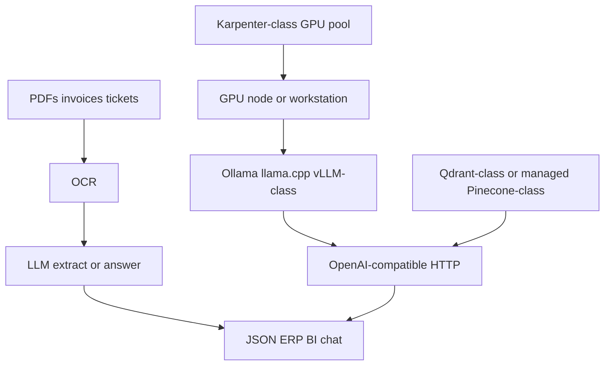

# LLMOps / AI (process speed, not a demo)

**Business:** OCR and LLM are here to **multiply throughput**. Accounting stops re-keying invoices. Analysts get structured fields. Developers and on-call get a local or private API instead of pasting tenant data into a public chat.

I do not sell "we installed a model." I sell a **path**: GPU or CPU serve, TLS API, backup, who can call it, and a vector store when RAG is the job.

Existing proof (unchanged trees):

- [Case 01](../case-studies/01-ai-llm-platform.md), [case 03](../case-studies/03-document-ai-pipeline.md)
- Compose: [`../reference/ai/llm-compose-kit/`](../reference/ai/llm-compose-kit/)
- Lab GPU: [`../practice/home-lab/ai-lab.md`](../practice/home-lab/ai-lab.md)
- EKS + Karpenter-class unit: [`../iac/terraform/aws/live/`](../iac/terraform/aws/live/)
- Map: [`../iac/terraform/ai-stack/`](../iac/terraform/ai-stack/)
