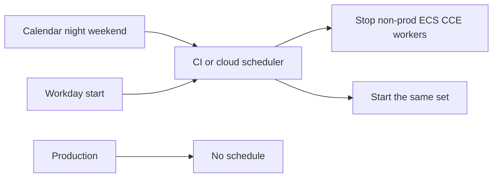

# FinOps: park idle, keep prod

**Business:** non-prod that runs 24/7 is the usual leak. I have put **scheduled stop / start** on Huawei-class (cloud.ru) compute so nights and weekends do not look like production on the invoice. Same idea maps to AWS instance schedules and to scale-to-zero node pools.

Prod stays up. Dev/stage/demo sleep. The schedule is code, not a person who forgets Friday.

This page is the review. Full private schedulers stay out (account IDs). Pattern sketch: [`../iac/terraform/examples/night-park/`](../iac/terraform/examples/night-park/). Huawei-class roots already in the lab are the place that schedule would attach: [`../iac/terraform/cloud-ru-huawei/`](../iac/terraform/cloud-ru-huawei/), [`../iac/terraform/cloud-ru-compute/`](../iac/terraform/cloud-ru-compute/). Hibernate operator as Ansible: [`../iac/ansible/reference/ansible-estate/`](../iac/ansible/reference/ansible-estate/), [case 10](../case-studies/10-ansible-estate.md).
