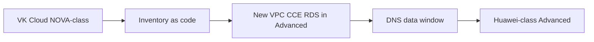

# Seamless cloud move (planned Advanced cutover)

**Business:** changing clouds should feel like a **maintenance window**, not a rewrite of the product. Same Kubernetes, same CI, new API underneath.

The lab already has **both sides** as sanitized code (do not treat this as a finished public cutover log):

- Today-shaped OpenStack IaaS: [`../iac/terraform/vkcloud/`](../iac/terraform/vkcloud/)
- Target-shaped Huawei / AWS-class: [`../iac/terraform/cloud-ru-huawei/`](../iac/terraform/cloud-ru-huawei/), [`../iac/terraform/cloud-ru-compute/`](../iac/terraform/cloud-ru-compute/)

A **planned** move (VK Cloud / NOVA-class → Huawei-class Advanced) uses that pair: inventory, dual-run or replica, DNS cut, freeze measured in hours. Users keep the same URLs. That is the same habit as the ~99.9% SLA migrations already described in the root README.

