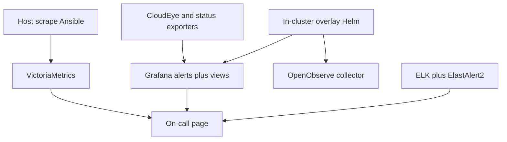

# SRE and monitoring

**Business:** on-call must see a breach **before** the customer does. I do not sell "we installed Grafana." I sell a **path**: scrape or collect, store, alert a human can act on, a dashboard that matches the SLI, and a habit of opening new views when the product grows.

The long catalog (stacks I ran, layer map, Helm and Ansible pointers): [`../docs/sre/`](../docs/sre/). Product HTTP APIs and how agents are allowed to touch secrets live on a **separate** page: [`06-product-apis.md`](06-product-apis.md).

## Complementary layers (do not merge)

| Layer | Where it lives | What on-call uses |
|-------|----------------|-------------------|
| Host / cybersec | Ansible: [`../iac/ansible/reference/ansible-app-platform/`](../iac/ansible/reference/ansible-app-platform/) `monitoring_deploy`, [`../iac/ansible/reference/ansible-llm-collab/extras/sec-stack/`](../iac/ansible/reference/ansible-llm-collab/extras/sec-stack/), node-exporter on the estate | Prometheus remote_write to VictoriaMetrics, blackbox, cAdvisor, host Grafana / vmalert |
| Host before Prom | [`../iac/ansible/reference/monitoring-starter/`](../iac/ansible/reference/monitoring-starter/) | sysstat / vnstat |
| In-cluster overlay | [`../iac/helm/reference/helm-estate-cluster/monitoring/`](../iac/helm/reference/helm-estate-cluster/monitoring/) | Grafana **provisioned** alerts and dashboard JSON, two cloud exporters, OpenObserve collector |
| PromQL pack | [`../iac/helm/reference/helm-addons-extra/custom-prometheus-rules/`](../iac/helm/reference/helm-addons-extra/custom-prometheus-rules/) | Deckhouse CustomPrometheusRules I maintained (CNPG, Redis, Cilium, ES, ingress) |
| Log runtime | [`../iac/helm/reference/helm-addons-extra/elastalert2/`](../iac/helm/reference/helm-addons-extra/elastalert2/) | ElastAlert2 + Falco on Elasticsearch |
| Traces / OTel | [`../iac/helm/reference/helm-data-plane/`](../iac/helm/reference/helm-data-plane/) Jaeger, [`../iac/helm/reference/helm-addons-extra/opentelemetry-collector/`](../iac/helm/reference/helm-addons-extra/opentelemetry-collector/) | Shop-class traces; collector chart |

Vendor Grafana / Prometheus / OpenObserve **trees** stay out of git. Pins and the values I turned are in the overlay README.

`noDataState: OK` on metric rules is a product decision: a scrape timeout must not page. Notify when the query returns a value and the threshold fires.

## Existing proof

- Catalog: [`../docs/sre/`](../docs/sre/)
- [Case 11](../case-studies/11-helm-estate.md): in-cluster overlay (12 alert files, 14 dashboard JSON, CloudEye exporters, OpenObserve collector)
- [Case 10](../case-studies/10-ansible-estate.md): node-exporter on the Huawei-class hosts; Prom to VictoriaMetrics and host Grafana in sibling Ansible kits
- Helm hub: [`../iac/helm/`](../iac/helm/)
- Ansible scrape: [`../iac/ansible/reference/ansible-app-platform/`](../iac/ansible/reference/ansible-app-platform/)
