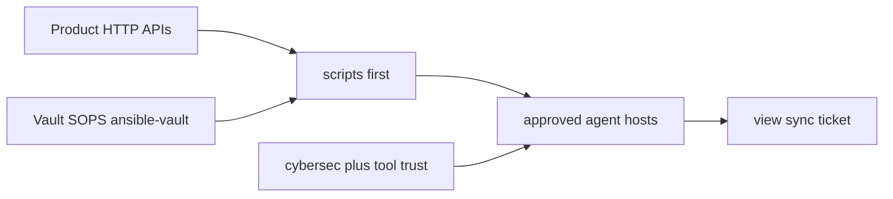

# Product APIs and agent trust

**Business:** accompany is hours when the estate is an **HTTP API**, not a week of click-ops. I treat Grafana, Prometheus / VictoriaMetrics, OpenObserve, Elasticsearch, Vault, Argo CD, Jira/JSM, GitLab, n8n, Harbor, and cloud consoles as backends I already speak. Scripts and IDE agents call those APIs.

This page is the **API and trust** half. On-call monitoring (scrape, store, page) is [`05-sre.md`](05-sre.md) plus the catalog [`../docs/sre/`](../docs/sre/). How secrets reach an agent: [`../docs/security-ai.md`](../docs/security-ai.md).

## Surfaces I automated

| Surface | What I automated | Lab pointer |
|---------|------------------|-------------|
| **Grafana** / **Prom** / **VM** | New views and rules the same day; silences; recording rules | [`05-sre.md`](05-sre.md), overlay in [`../docs/sre/metrics.md`](../docs/sre/metrics.md) |
| **Vault** HTTP | Tokens, policies, KV; not the browser REPL | [`../iac/ansible/reference/ansible-estate/`](../iac/ansible/reference/ansible-estate/) |
| **Argo CD** | `app sync`, wait, rollout | [`../practice/workstation/reference/scripts/utility/k8s/argocd_deploy_verify.sh`](../practice/workstation/reference/scripts/utility/k8s/argocd_deploy_verify.sh) |
| **Kubernetes** | logs, context switch, SD scrape | [`../practice/workstation/reference/kube-ops/`](../practice/workstation/reference/kube-ops/) |
| **Jira / JSM** / **Confluence** | Tickets and wiki from scripts | [`../practice/workstation/reference/scripts/`](../practice/workstation/reference/scripts/) |
| **GitLab** | Inventory, pipelines, auto MR | CI catalog [`../iac/ci/`](../iac/ci/) |
| **n8n** | Form / webhook GitOps | [case 01](../case-studies/01-ai-llm-platform.md) |
| **Harbor / MinIO / SonarQube** | Image path, object, quality gate | Helm addons + Ansible |
| **Keycloak / Teleport** | Identity and access as API | Payments / estate stories |
| **Cloud** (Huawei-class, AWS, OpenStack, VCD) | Inventory and apply through providers | [`../iac/terraform/`](../iac/terraform/), [case 05](../case-studies/05-legacy-estate-as-code.md) |
| **Replicate** / local LLM HTTP | Async create + poll, no `Prefer: wait` | [`../practice/workstation/mcp-ops-toolchain.md`](../practice/workstation/mcp-ops-toolchain.md) |

I write the requests as **scripts first**, then point IDE agents (Cursor, Claude Code, Codex, local wrappers) at those scripts. The buyer result is a new view, a sync, or a ticket in minutes. The scripts and the charts behind them are a skill I already had: about **four years** of hands-on infra (Ansible, Helm, CI, bash) before coding agents. Agents multiply a calendar I could already close alone, just slower.

## Trust is not "paste the .env"

I worked next to **cybersec**, not around them. An agent sees env files, tokens, or a host only after the **approach is agreed** and that tool is **trusted** for that class of secret. High-value credentials do not sit in chat context. They live in Vault / SOPS / Ansible Vault; the wrapper gets a **reference** (path, key name, wrapped lookup), not the live value. Same habit as Ansible lookups. Detail: [`../docs/security-ai.md`](../docs/security-ai.md).

## Existing proof

- Workstation scripts: [`../practice/workstation/`](../practice/workstation/)
- Secrets inventory (key names only): [`../practice/workstation/reference/secrets-env/`](../practice/workstation/reference/secrets-env/)
- [Case 01](../case-studies/01-ai-llm-platform.md): private GPU API + n8n / JSM-class inventory
- Monitoring APIs (Grafana HTTP, PromQL): [`05-sre.md`](05-sre.md)
