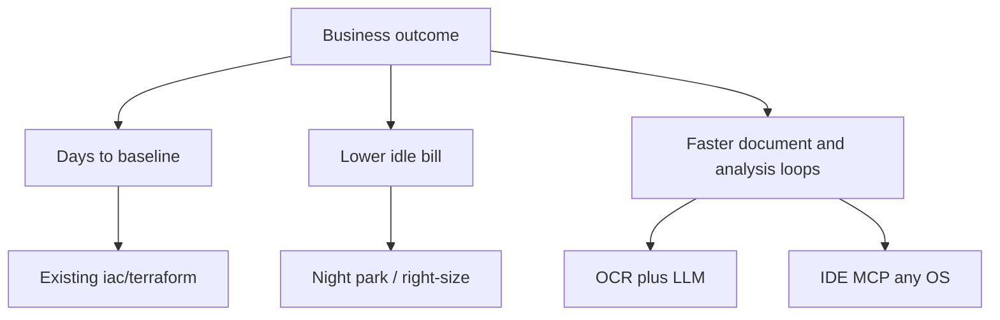

# Architecture cases (for managers)

Leads and founders do not read a thousand lines of Terraform. These pages are **short architectural reviews**: one diagram, one business sentence, links into the existing lab. Nothing below replaces [`../case-studies/`](../case-studies/) or [`../diagrams/`](../diagrams/). Those stay the source of the longer stories and the mermaid already published.

Diagrams live in git as **Mermaid** (GitHub renders them; same idea as Eraser / Structurizr C4: boxes and flows, not a slide pack). Export to SVG later if a site needs it.

Leitmotif: [`../docs/for-business.md`](../docs/for-business.md). Headline is **full infra, fast, documented, short windows, high SLA**. Cloud move is one page, not the first ask.

| Page | Audience question | Existing proof |
|------|-------------------|----------------|
| [Days, not months](00-days-not-months.md) | How fast is a usable platform, and is it written down? | Cases 02, 05, 06, 07, CI catalog |
| [LLMOps / AI](01-llmops.md) | Why GPU and OCR, and why the IDE is part of the platform? | Cases 01, 03, `practice/home-lab/reference/ai/`, `practice/workstation/` (any OS) |
| [FinOps / night park](02-finops-night-park.md) | How does the bill drop without a rewrite? | Huawei-class schedule pattern |
| [Reusable units](03-reuse-modules.md) | What can be applied again next week? | `iac/terraform/modules`, AWS live, GitLab CI |
| [Cloud move](04-seamless-move.md) | When we must change clouds, can the freeze stay hours? | VK + Huawei-class trees (one skill among many) |

