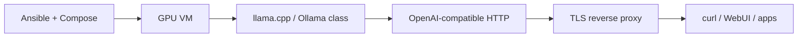

# Diagram: AI / LLM inference platform

Case study: [`../../case-studies/01-ai-llm-platform.md`](../../case-studies/01-ai-llm-platform.md).  
Code: [`../../practice/home-lab/reference/ai/llm-compose-kit/`](../../practice/home-lab/reference/ai/llm-compose-kit/), [`../../practice/home-lab/ai-lab.md`](../../practice/home-lab/ai-lab.md).
