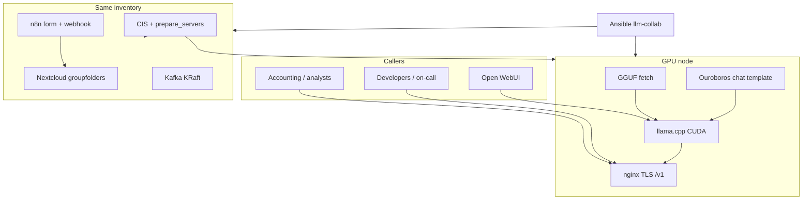

# Diagram: AI / LLM inference platform

Case study: [`../../case-studies/01-ai-llm-platform.md`](../../case-studies/01-ai-llm-platform.md).  
Code: [`../../iac/ansible/reference/ansible-llm-collab/`](../../iac/ansible/reference/ansible-llm-collab/).  
Home-lab compose (separate path): [`../../practice/home-lab/ai-lab.md`](../../practice/home-lab/ai-lab.md).
