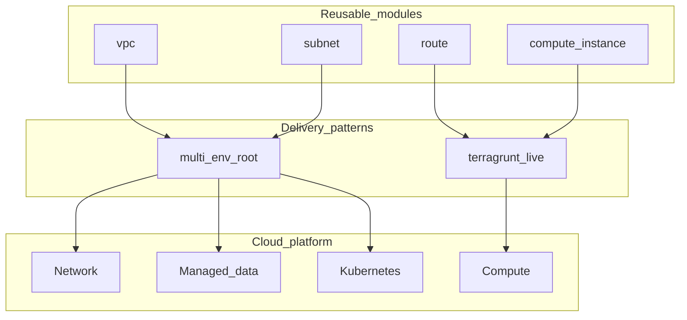

# Diagram: Cloud platform turnkey

```mermaid
flowchart TB
  subgraph modules [Reusable_modules]
    Vpc[vpc]
    Subnet[subnet]
    Route[route]
    Compute[compute_instance]
  end
  subgraph patterns [Delivery_patterns]
    MultiEnv[multi_env_root]
    TgLive[terragrunt_live]
  end
  subgraph cloud [Cloud_platform]
    Net[Network]
    Vm[Compute]
    Data[Managed_data]
    K8s[Kubernetes]
  end
  Vpc --> MultiEnv
  Subnet --> MultiEnv
  Route --> TgLive
  Compute --> TgLive
  MultiEnv --> Net
  TgLive --> Vm
  MultiEnv --> Data
  MultiEnv --> K8s
```
