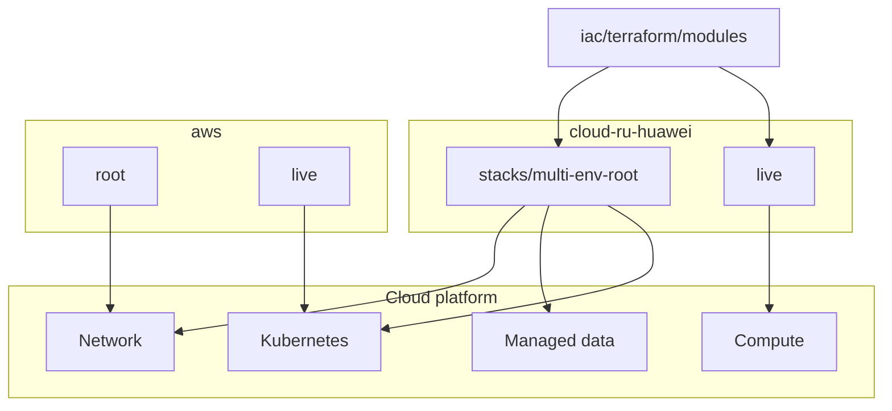

# Diagram: Cloud platform turnkey

Case study: [`../../case-studies/02-cloud-platform-turnkey.md`](../../case-studies/02-cloud-platform-turnkey.md).  
Code: [`../../iac/terraform/`](../../iac/terraform/), [`../../iac/cloud/`](../../iac/cloud/).

