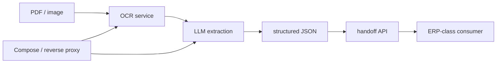

# Diagram: Document AI / OCR pipeline

```mermaid
flowchart LR
  In[PDF / image] --> OCR[OCR service]
  OCR --> LLM[LLM extraction]
  LLM --> JSON[structured JSON]
  JSON --> API[handoff API]
  API --> ERP[ERP-class consumer]
  Docker[Compose / reverse proxy] --> OCR
  Docker --> LLM
```

Case study: [`../../case-studies/03-document-ai-pipeline.md`](../../case-studies/03-document-ai-pipeline.md).
