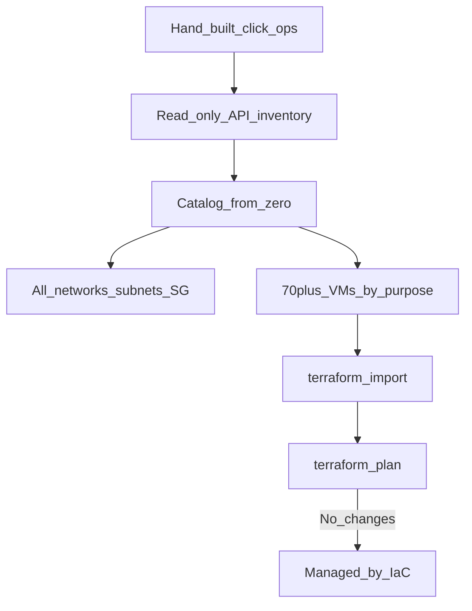

# Diagram: Legacy estate as Terraform (VK Cloud / NOVA Cloud class)

Case study: [`../../case-studies/05-legacy-estate-as-code.md`](../../case-studies/05-legacy-estate-as-code.md).  
Code: [`../../iac/terraform/vkcloud/`](../../iac/terraform/vkcloud/).
