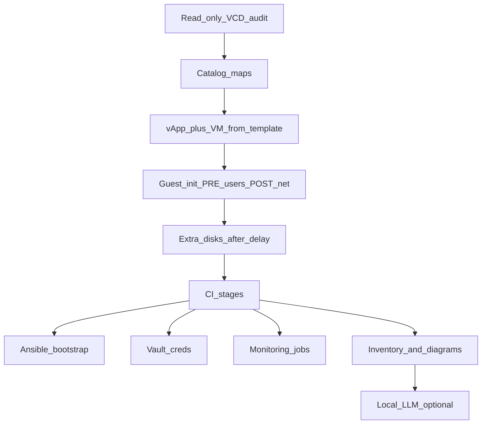

# Diagram: VMware VCD greenfield + CI stages

Case study: [`../../case-studies/06-vmware-vcd-greenfield.md`](../../case-studies/06-vmware-vcd-greenfield.md).  
Code: [`../../iac/terraform/vmware/`](../../iac/terraform/vmware/).  
CI: [`../../iac/ci/`](../../iac/ci/).
