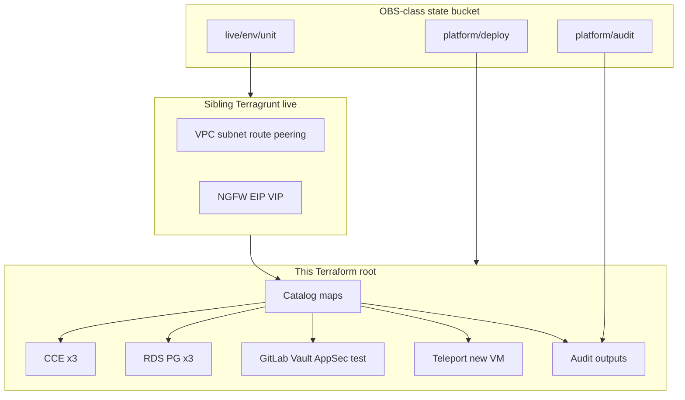

# Diagram: Huawei-class compute catalog

Case study: [`../../case-studies/07-huawei-compute-catalog.md`](../../case-studies/07-huawei-compute-catalog.md).  
Host continuation: [`../../case-studies/10-ansible-estate.md`](../../case-studies/10-ansible-estate.md).  
Cluster continuation: [`../../case-studies/11-helm-estate.md`](../../case-studies/11-helm-estate.md).

No real IPs or client hostnames in labels.
