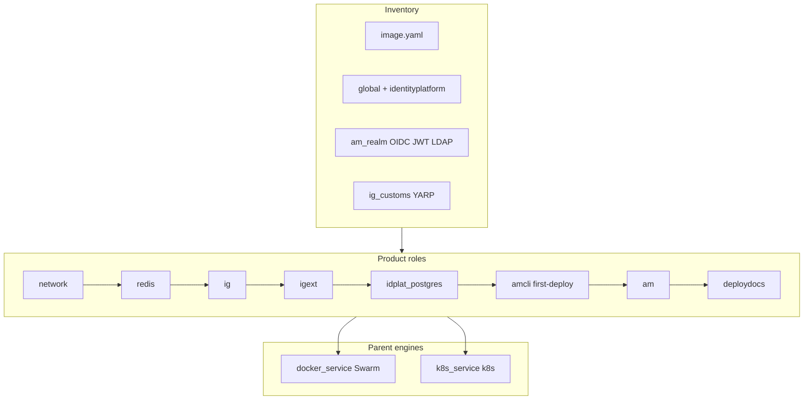

# Diagram: SBP-class identity autodeploy

```mermaid
flowchart TB
  subgraph inv [Inventory]
    Img[image.yaml]
    Gv[global + identityplatform]
    Realm[am_realm OIDC JWT LDAP]
    Yarp[ig_customs YARP]
  end
  subgraph engines [Parent engines]
    Dock[docker_service Swarm]
    K8s[k8s_service k8s]
  end
  subgraph stack [Product roles]
    Net[network]
    Redis[redis]
    IG[ig]
    IGx[igext]
    PG[idplat_postgres]
    CLI[amcli first-deploy]
    AM[am]
    Docs[deploydocs]
  end
  inv --> stack
  Net --> Redis
  Redis --> IG
  IG --> IGx
  IGx --> PG
  PG --> CLI
  CLI --> AM
  AM --> Docs
  stack --> Dock
  stack --> K8s
```

No real IPs, registry hosts, or employer names in labels.
