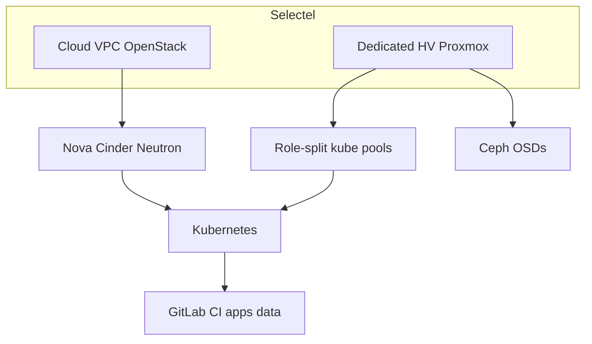

# Diagram: Selectel VPC and dedicated Proxmox

```mermaid
flowchart TB
  subgraph sel [Selectel]
    VPC[Cloud VPC OpenStack]
    DED[Dedicated HV Proxmox]
  end
  VPC --> Nova[Nova Cinder Neutron]
  DED --> Pools[Role-split kube pools]
  DED --> Ceph[Ceph OSDs]
  Nova --> K8s[Kubernetes]
  Pools --> K8s
  K8s --> Apps[GitLab CI apps data]
```

No live IPs, HV FQDNs, or account IDs on this page.
