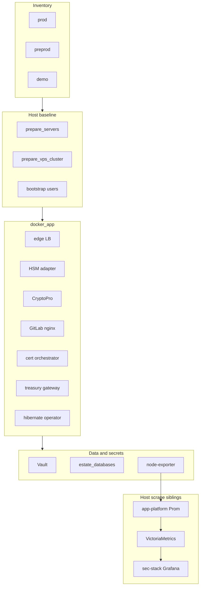

# Diagram: Huawei-class estate Ansible

Case study: [`../../case-studies/10-ansible-estate.md`](../../case-studies/10-ansible-estate.md).  
In-cluster half: [`../../case-studies/11-helm-estate.md`](../../case-studies/11-helm-estate.md).  
SRE catalog: [`../../docs/sre/`](../../docs/sre/). Product APIs: [`../../architecture/06-product-apis.md`](../../architecture/06-product-apis.md).  
Host kits: [`../../iac/ansible/reference/ansible-estate/`](../../iac/ansible/reference/ansible-estate/), [`../../iac/ansible/reference/ansible-app-platform/`](../../iac/ansible/reference/ansible-app-platform/), [`../../iac/ansible/reference/ansible-llm-collab/extras/sec-stack/`](../../iac/ansible/reference/ansible-llm-collab/extras/sec-stack/).

No real IPs, employer names, or live hostnames in labels.
