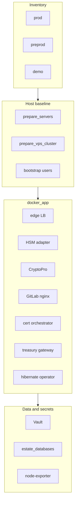

# Diagram: Huawei-class estate Ansible

```mermaid
flowchart TB
  subgraph inv [Inventory]
    Prod[prod]
    Pre[preprod]
    Demo[demo]
  end
  subgraph base [Host baseline]
    Prep[prepare_servers]
    Vps[prepare_vps_cluster]
    Users[bootstrap users]
  end
  subgraph apps [docker_app]
    LB[edge LB]
    HSM[HSM adapter]
    CP[CryptoPro]
    GL[GitLab nginx]
    Cert[cert orchestrator]
    GW[treasury gateway]
    Hib[hibernate operator]
  end
  subgraph data [Data and secrets]
    Vlt[Vault]
    DB[estate_databases]
    Exp[node-exporter]
  end
  inv --> base
  base --> apps
  apps --> data
```

No real IPs, employer names, or live hostnames in labels.
