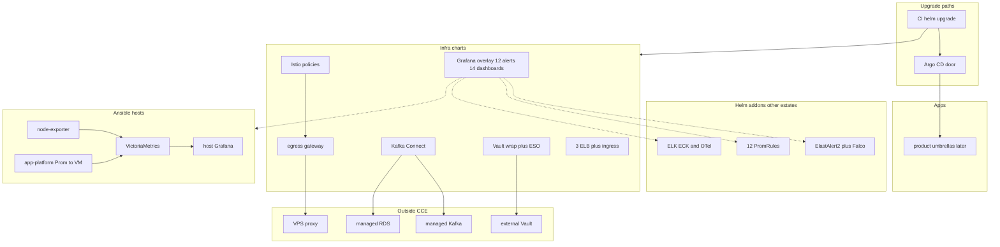

# Diagram: Huawei-class estate Helm

Case study: [`../../case-studies/11-helm-estate.md`](../../case-studies/11-helm-estate.md).  
Helm hub: [`../../iac/helm/`](../../iac/helm/).  
SRE catalog: [`../../docs/sre/`](../../docs/sre/). Product APIs: [`../../architecture/06-product-apis.md`](../../architecture/06-product-apis.md).  
Overlay volume: [`../../iac/helm/reference/helm-estate-cluster/monitoring/`](../../iac/helm/reference/helm-estate-cluster/monitoring/).  
Host VictoriaMetrics / Grafana: [`../../iac/ansible/reference/ansible-llm-collab/extras/sec-stack/`](../../iac/ansible/reference/ansible-llm-collab/extras/sec-stack/).  
Host scrape (Prom to VM): [`../../iac/ansible/reference/ansible-app-platform/`](../../iac/ansible/reference/ansible-app-platform/).  
Host node scrape: [`../../iac/ansible/reference/ansible-estate/`](../../iac/ansible/reference/ansible-estate/).

No real IPs, employer names, or live hostnames in labels.
