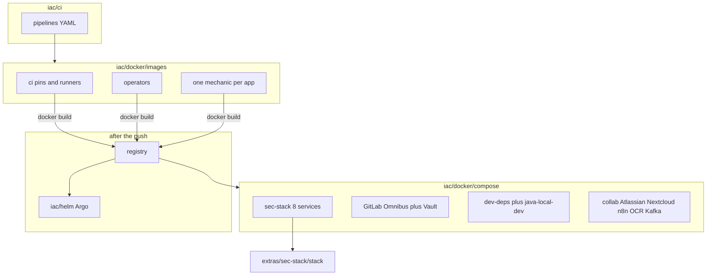

# Diagram: Docker images and Compose stacks

Case study: [`../../case-studies/12-docker-images.md`](../../case-studies/12-docker-images.md).  
Docker hub: [`../../iac/docker/`](../../iac/docker/).  
Images: [`../../iac/docker/images/`](../../iac/docker/images/).  
Compose: [`../../iac/docker/compose/`](../../iac/docker/compose/).  
CI catalog: [`../../iac/ci/`](../../iac/ci/).  
Helm: [`../../iac/helm/`](../../iac/helm/).  
SRE layers: [`../../docs/sre/layers.md`](../../docs/sre/layers.md).  
sec-stack Ansible copy: [`../../iac/ansible/reference/ansible-llm-collab/extras/sec-stack/stack/`](../../iac/ansible/reference/ansible-llm-collab/extras/sec-stack/stack/).

No real IPs, employer names, or live hostnames in labels.
