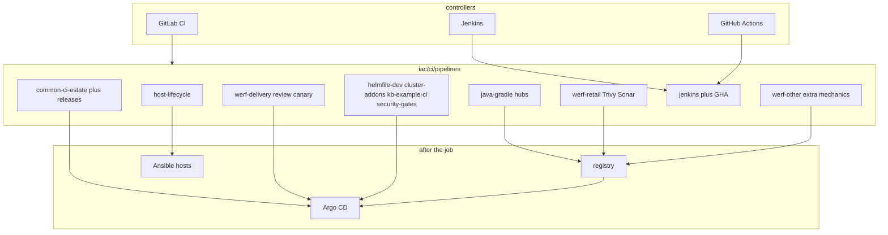

# Diagram: CI pipelines

Case study: [`../../case-studies/13-ci-pipelines.md`](../../case-studies/13-ci-pipelines.md).  
CI hub: [`../../iac/ci/`](../../iac/ci/).  
Kits: [`../../iac/ci/pipelines/`](../../iac/ci/pipelines/).  
Host button: [`../../iac/ci/pipelines/host-lifecycle.gitlab-ci.yml.example`](../../iac/ci/pipelines/host-lifecycle.gitlab-ci.yml.example).  
Images: [`../../iac/docker/`](../../iac/docker/).  
Helm: [`../../iac/helm/`](../../iac/helm/).  
Turnkey diagram: [`../iac/ci-turnkey.md`](../iac/ci-turnkey.md).

No real IPs, employer names, or live hostnames in labels.
