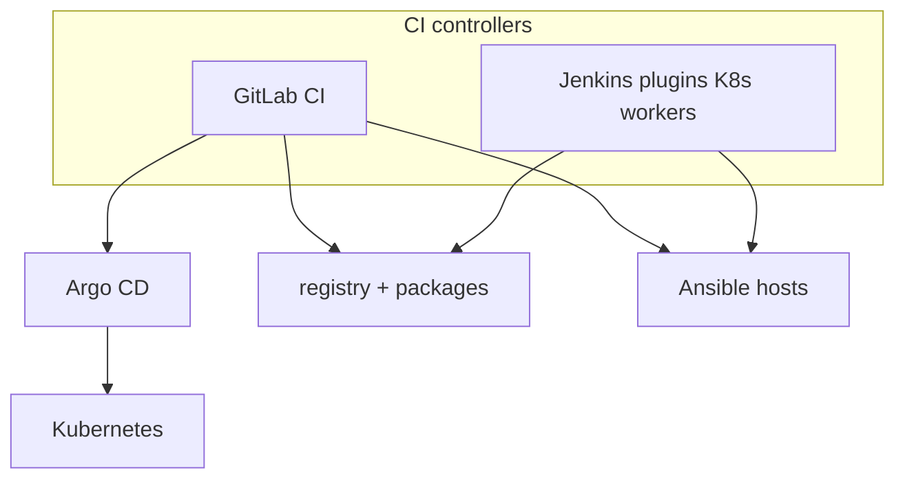
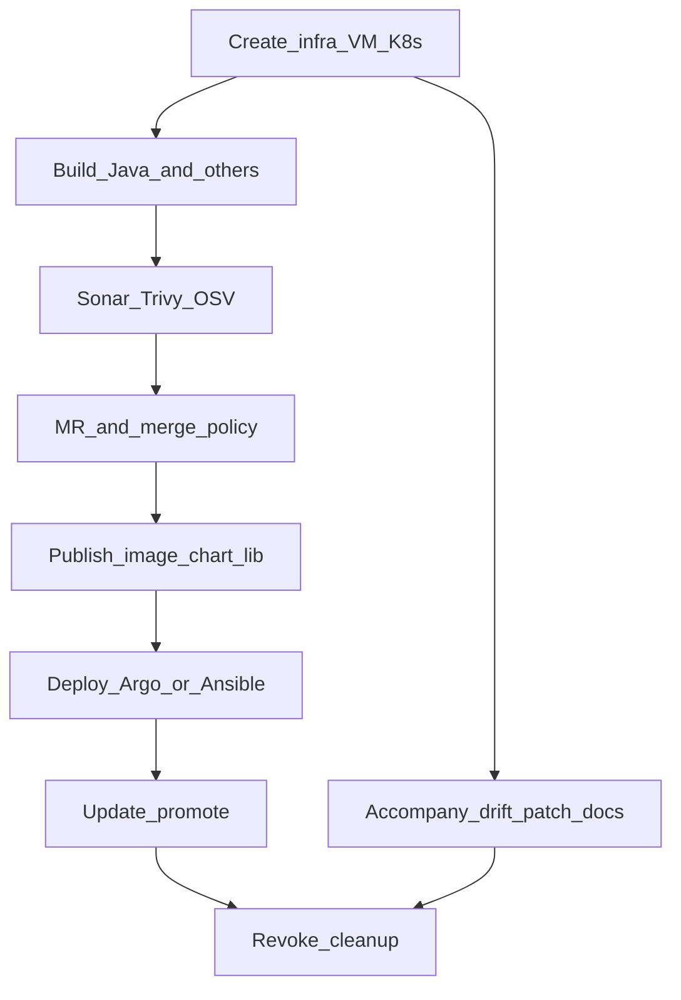
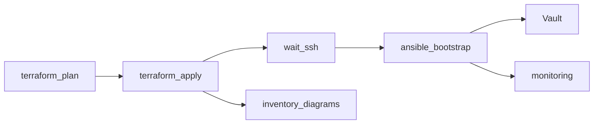

# Diagrams: CI catalog (turnkey)

Hub: [`../../iac/ci/`](../../iac/ci/).  
Pipelines folder: [`../../iac/ci/pipelines/`](../../iac/ci/pipelines/).

## Controllers

Jenkins: earlier and mid estates, workers moved from dedicated VMs onto Kubernetes.  
GitLab CI + Argo CD: more of the recent work. Same stages; different YAML.

## Full lifecycle

## Host one-button (published example)

Code for that last diagram: [`../../iac/ci/pipelines/host-lifecycle.gitlab-ci.yml.example`](../../iac/ci/pipelines/host-lifecycle.gitlab-ci.yml.example).
