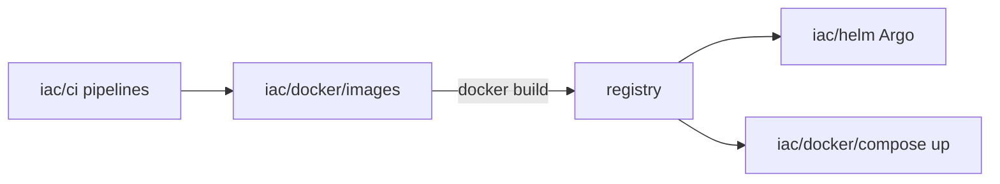
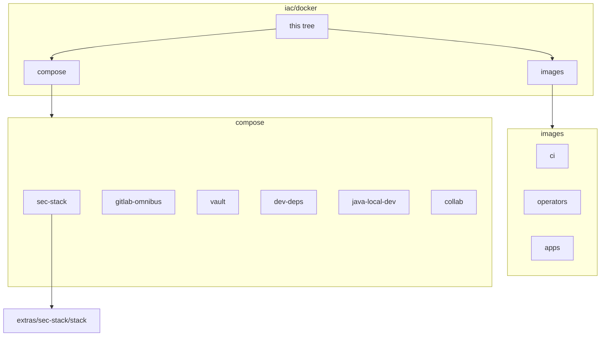

# Diagrams: Docker / Compose hub

Hub: [`../../iac/docker/`](../../iac/docker/).  
Images: [`../../iac/docker/images/`](../../iac/docker/images/).  
Compose: [`../../iac/docker/compose/`](../../iac/docker/compose/).  
Pipelines stay in [`../../iac/ci/`](../../iac/ci/).

## CI builds image, then Helm or Compose

## What lives where

Case: [`../../case-studies/12-docker-images.md`](../../case-studies/12-docker-images.md).  
Sanitize: [`../../iac/docker/SANITIZE.md`](../../iac/docker/SANITIZE.md).

No real IPs, employer names, or live hostnames in labels.
