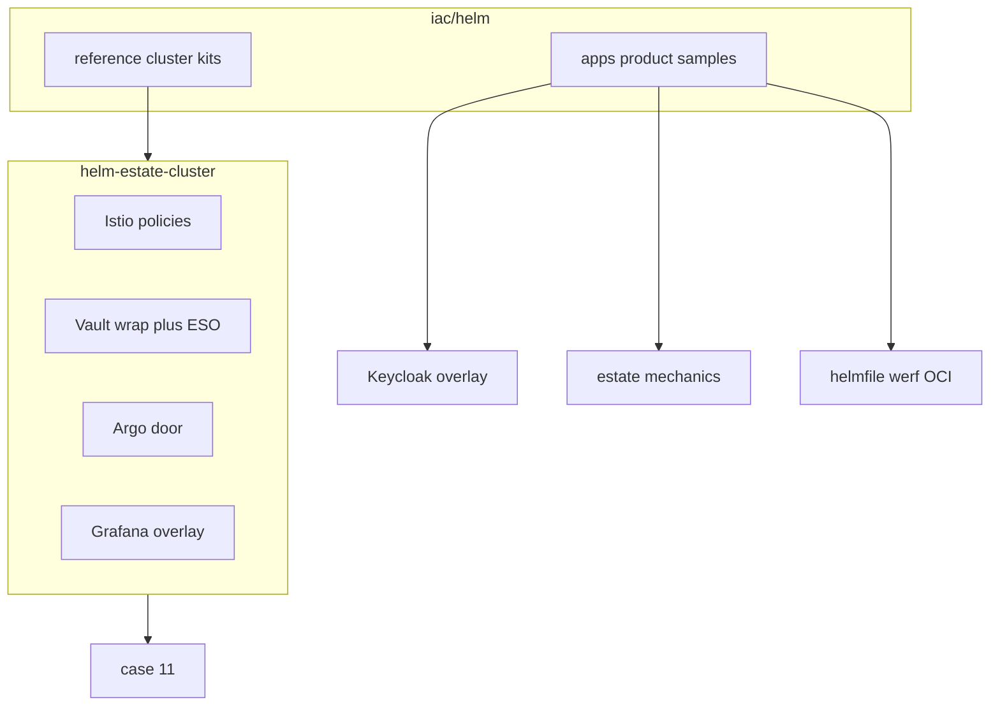

# Diagrams: Helm / GitOps hub

Hub: [`../../iac/helm/`](../../iac/helm/).  
Cluster kits: [`../../iac/helm/reference/`](../../iac/helm/reference/).  
Product samples: [`../../iac/helm/apps/`](../../iac/helm/apps/).  
Case: [`../../case-studies/11-helm-estate.md`](../../case-studies/11-helm-estate.md).

No real IPs or employer names in labels.
