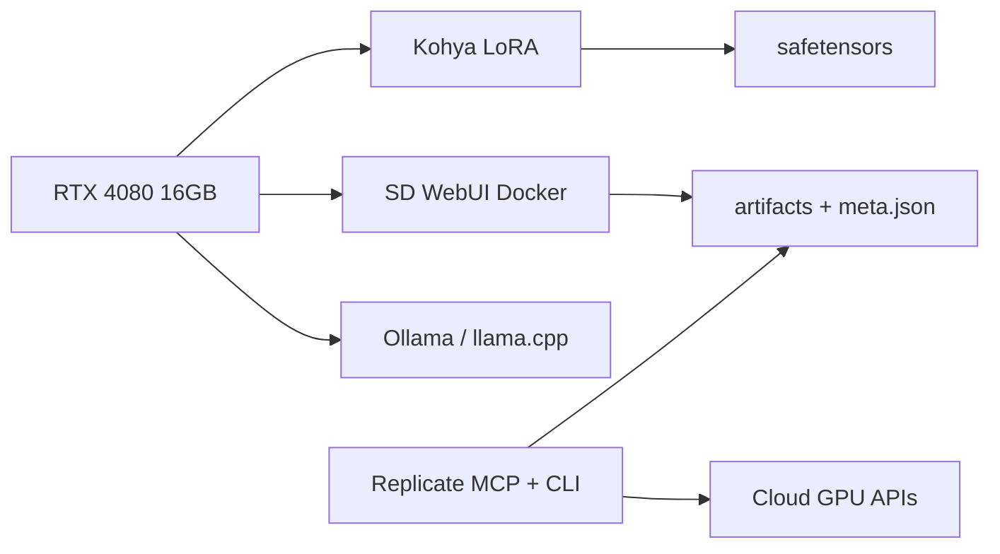

# Diagram: Local AI lab

```mermaid
flowchart LR
  GPU[RTX 4080 16GB]
  GPU --> SD[SD WebUI Docker]
  GPU --> Kohya[Kohya LoRA]
  GPU --> LLM[Ollama / llama.cpp]
  MCP[Replicate MCP + CLI] --> API[Cloud GPU APIs]
  MCP --> Disk[artifacts + meta.json]
  SD --> Disk
  Kohya --> Lora[safetensors]
```

Practice: [`../../../practice/home-lab/ai-lab.md`](../../../practice/home-lab/ai-lab.md).  
Code: [`../../../reference/ai/`](../../../reference/ai/).
