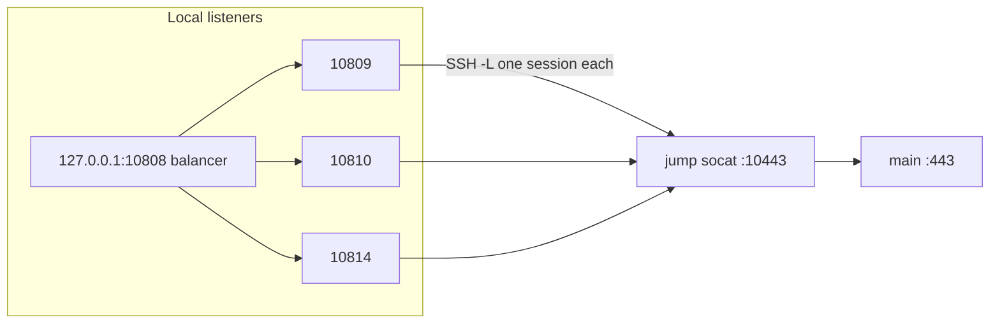

# Diagram: Android SSH + Docker balancer

Practice: [`../../../practice/home-lab/android-ssh.md`](../../../practice/home-lab/android-ssh.md).  
Code: [`../../../practice/home-lab/reference/apps/ssh-tunnel-android/`](../../../practice/home-lab/reference/apps/ssh-tunnel-android/), [`../../../practice/home-lab/reference/apps/ssh-tunnel-docker/`](../../../practice/home-lab/reference/apps/ssh-tunnel-docker/).
