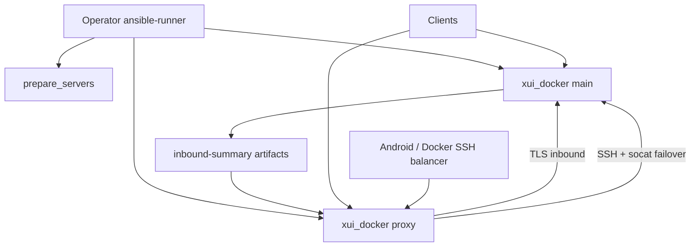

# Diagram: Edge platform

Practice: [`../../../practice/home-lab/edge-platform.md`](../../../practice/home-lab/edge-platform.md).  
Code: [`../../../iac/ansible/reference/ansible-edge/`](../../../iac/ansible/reference/ansible-edge/), [`../../../iac/ansible/`](../../../iac/ansible/).
