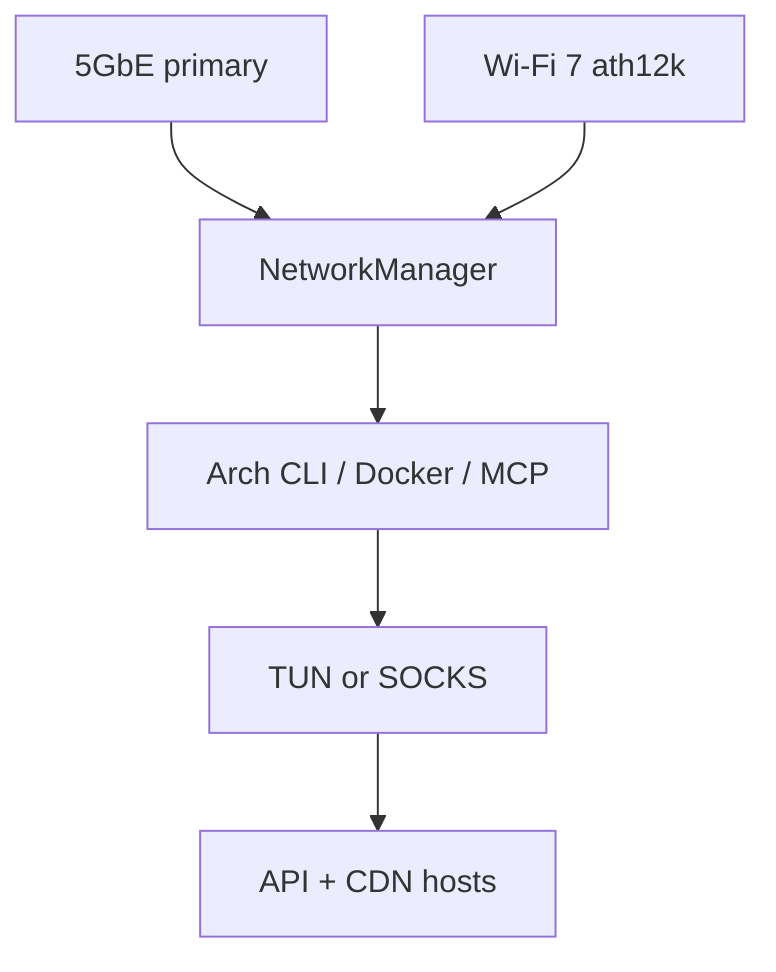

# Diagram: Workstation networking

```mermaid
flowchart TB
  Eth[5GbE primary]
  Wifi[Wi-Fi 7 ath12k]
  NM[NetworkManager]
  Eth --> NM
  Wifi --> NM
  NM --> Host[Arch CLI / Docker / MCP]
  TUN[TUN or SOCKS]
  TUN --> CDN[API + CDN hosts]
  Host --> TUN
```

Practice: [`../../../practice/home-lab/networking.md`](../../../practice/home-lab/networking.md).
