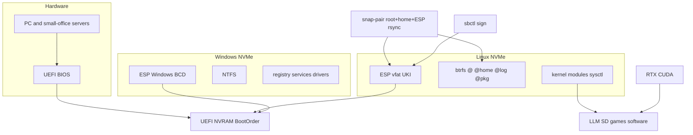

# Diagram: OS workstation

Practice: [`../../../practice/home-lab/os-workstation.md`](../../../practice/home-lab/os-workstation.md).  
Code: [`../../../practice/home-lab/reference/snap-pair/`](../../../practice/home-lab/reference/snap-pair/).
