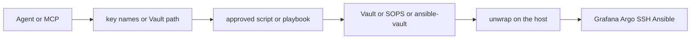

# Secrets, agents, and cybersec trust

**Business:** automation and AI do not get a free pass at production credentials. I worked next to **cybersec** for years. The rule is the same as for a new Ansible role or a new CI runner: the **approach is agreed**, the **tool is trusted** for that class of secret, and the blast radius is written down. Important values are not pasted into a chat or scattered across laptops.

Sanitize checklist (what never lands in git): [`security-sanitize.md`](security-sanitize.md). Workstation kit: [`../practice/workstation/`](../practice/workstation/). Product API map: [`../architecture/06-product-apis.md`](../architecture/06-product-apis.md).

## What I do not do

- Hand a production `.env`, kubeconfig, or SSH PEM to an untrusted chat or a new MCP "to see if it helps"
- Commit tokens, Vault unseal keys, or live Telegram / registry credentials
- Let an agent dump tenant payloads into a public model API
- Give every agent host the same rights as a human admin

## Trust is explicit

A new IDE agent, MCP server, or CLI wrapper is a **change**. Cybersec (or the estate owner acting as that role) signs off:

| Question | Before the tool is trusted |
|----------|----------------------------|
| Which host? | Cursor, Claude Code, Codex, local LLM, or a CI runner. Not "any chat window" |
| Which class of secret? | Lab tokens, JSM, Grafana editor, Vault unwrap, SSH to prod |
| What can it see? | Key **names**, a wrapped lookup, or (only if agreed) a local `chmod 600` file |
| What can it do? | Read-only list, run a named script, apply a playbook on `--limit` |
| Where is the unwrap? | Vault / SOPS / Ansible Vault on an approved host, not in the model prompt |

Until that is agreed, the agent works on **sanitized trees**, public docs, and placeholder values (`CHANGE_ME`, `example.com`).

## How a secret reaches automation

Three layers. The agent stays on the left.

1. **Names only in the IDE.** [`../practice/workstation/reference/secrets-env/`](../practice/workstation/reference/secrets-env/) and `list_secrets_env.sh` print key names and `ok|empty`. They do not print values.
2. **Day-to-day workstation tokens** (JSM, wiki, Replicate, a lab Grafana) sit in `chmod 600` env files **outside git**. A wrapper sources the file on the local box. The model sees the command, not the file body, unless that host was trusted for that file.
3. **High-value production secrets** (cloud keys, Vault root, DB master, SSH to money-path hosts) do **not** live in those env files. They live in **HashiCorp Vault**, **SOPS**, or **Ansible Vault**, with a narrow policy. The playbook or wrapper does a **lookup**. The agent receives a path, a key name, or a wrapped handle. It does not receive the live credential. That is the same habit as `hashi_vault` / `ansible-vault` on the estate: the YAML has a reference, the store has the value.

If a secret is required for AI-driven accompany, it is **encrypted at rest** first. Rights on the role or AppRole are least privilege (one path, one capability). Rotation stays a Vault / SOPS job, not a Slack paste.

## Hosts and Kubernetes

Server access follows the same model.

| Access | How it is granted | What the agent sees |
|--------|-------------------|---------------------|
| SSH | Approved alias + agent socket, or Teleport-class broker | Host alias and a named script (`ssh_probe`, `ansible_agent_run`). Not a raw PEM in the prompt |
| Ansible | [`ansible_agent_run.sh`](../practice/workstation/reference/scripts/utility/ansible/ansible_agent_run.sh) with `--limit` or `--all` required | Playbook path and inventory name. Copy under `/tmp` so the git worktree is not the write target |
| kubeconfig | Files under `~/.kube/clusters/<name>/` via [`kube-switch`](../practice/workstation/reference/kube-ops/) | Cluster **name**. The kubeconfig body is not pasted into chat |
| Argo CD | [`argocd_deploy_verify.sh`](../practice/workstation/reference/scripts/utility/k8s/argocd_deploy_verify.sh) | App name and cluster alias |

Break-glass human admin is still a human. An agent does not get a standing prod shell because a task was convenient.

## Tenant data and models

OCR/LLM and the multi-agent desk exist to **speed** accounting, analysts, and on-call. Tenant documents and production logs stay on the **private** GPU API or a local model unless the contract says a named vendor is allowed. Public chat windows are not a datastore. Same sentence on [`../architecture/01-llmops.md`](../architecture/01-llmops.md).

## Proof in this lab

- Secrets inventory: [`../practice/workstation/reference/secrets-env/`](../practice/workstation/reference/secrets-env/)
- Estate Vault usage: [`../iac/ansible/reference/ansible-estate/`](../iac/ansible/reference/ansible-estate/)
- Host Grafana / VM SOPS contract: [`../iac/ansible/reference/ansible-llm-collab/extras/sec-stack/`](../iac/ansible/reference/ansible-llm-collab/extras/sec-stack/)
- Helm secrets via ESO (values are names, Vault holds data): estate overlay ExternalSecret templates
- Sanitize: [`security-sanitize.md`](security-sanitize.md), [`../iac/helm/SANITIZE.md`](../iac/helm/SANITIZE.md)
