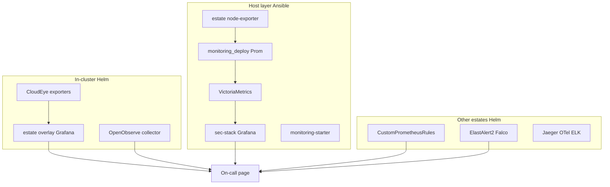

# SRE / monitoring catalog

**Business:** a breach should page a human who can act, not a dashboard nobody owns. This catalog is the **experience map**: stacks I ran, how host and cluster layers stay complementary, and pointers to the living Helm / Ansible / exporter trees in this lab. Operator Dockerfiles those trees consume live under [`../../iac/docker/images/operators/`](../../iac/docker/images/operators/). Hub table: [`../../iac/docker/images/README.md`](../../iac/docker/images/README.md). I do not merge them into Helm or Ansible.

Short manager page: [`../../architecture/05-sre.md`](../../architecture/05-sre.md). Product APIs and agent trust are **not** this folder: [`../../architecture/06-product-apis.md`](../../architecture/06-product-apis.md), [`../security-ai.md`](../security-ai.md).

| Page | What it is |
|------|------------|
| [`experience.md`](experience.md) | Stacks I stood up and used on call (metrics, logs, traces, older estates) |
| [`layers.md`](layers.md) | Host Ansible vs in-cluster Helm vs addons. Do not merge |
| [`metrics.md`](metrics.md) | Grafana, Prometheus, VictoriaMetrics, Alertmanager. Files and HTTP |
| [`logs-traces.md`](logs-traces.md) | OpenObserve, ELK / ECK, ElastAlert2 / Falco, Jaeger, OTel |
| [`on-call.md`](on-call.md) | Exporters, paging decisions, Cisco-style loop, same-day views |

## Start with code

| Need | Open |
|------|------|
| Overlay I wrote (12 alerts, 14 dashboards, two exporters, OO collector) | [`../../iac/helm/reference/helm-estate-cluster/monitoring/`](../../iac/helm/reference/helm-estate-cluster/monitoring/) |
| Host Prom → VictoriaMetrics | [`../../iac/ansible/reference/ansible-app-platform/`](../../iac/ansible/reference/ansible-app-platform/) `monitoring_deploy` |
| Host Grafana / vmalert | [`../../iac/ansible/reference/ansible-llm-collab/extras/sec-stack/`](../../iac/ansible/reference/ansible-llm-collab/extras/sec-stack/) |
| Node `:9100` on estate VMs | [`../../iac/ansible/reference/ansible-estate/`](../../iac/ansible/reference/ansible-estate/) |
| TLS watch, DNS-01, night-park **images** | [`../../iac/docker/images/operators/cert-monitoring/`](../../iac/docker/images/operators/cert-monitoring/), [`../../iac/docker/images/operators/cert-orchestrator/`](../../iac/docker/images/operators/cert-orchestrator/) (compose sits next to that image), [`../../iac/docker/images/operators/hibernate/`](../../iac/docker/images/operators/hibernate/) |
| CloudEye / status **images** (Helm charts stay the other half) | [`../../iac/docker/images/operators/cloud-metrics/`](../../iac/docker/images/operators/cloud-metrics/) Dockerfile only (`src/` not in git), [`../../iac/docker/images/operators/cloud-status/`](../../iac/docker/images/operators/cloud-status/) HTTP client in git |
| EDR coverage **image** (sec-stack pin) | [`../../iac/docker/images/operators/edr-coverage/`](../../iac/docker/images/operators/edr-coverage/) |
| sar / vnstat before Prom | [`../../iac/ansible/reference/monitoring-starter/`](../../iac/ansible/reference/monitoring-starter/) |
| PromQL pack (Deckhouse CRs) | [`../../iac/helm/reference/helm-addons-extra/custom-prometheus-rules/`](../../iac/helm/reference/helm-addons-extra/custom-prometheus-rules/) |
| Log runtime alerts | [`../../iac/helm/reference/helm-addons-extra/elastalert2/`](../../iac/helm/reference/helm-addons-extra/elastalert2/) |
| Traces / collector | [`../../iac/helm/reference/helm-data-plane/`](../../iac/helm/reference/helm-data-plane/), [`../../iac/helm/reference/helm-addons-extra/opentelemetry-collector/`](../../iac/helm/reference/helm-addons-extra/opentelemetry-collector/) |
| Observability split table | [`../../iac/helm/README.md#observability-split-do-not-duplicate-ansible`](../../iac/helm/README.md#observability-split-do-not-duplicate-ansible) |
| Cases | [10](../../case-studies/10-ansible-estate.md), [11](../../case-studies/11-helm-estate.md), [12](../../case-studies/12-docker-images.md) |

Vendor Grafana / Prometheus / OpenObserve chart **trees** stay out of git. What is published is the overlay I maintained, the host kits that scrape, and the operator images those kits and charts consume.
