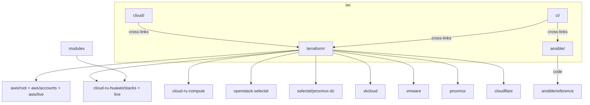

# IaC

**Business first:** this tree is how a platform appears in **days**, how idle non-prod **parks at night**, and how a planned cloud move stays **seamless**. Managers: [`../architecture/`](../architecture/), [`../docs/for-business.md`](../docs/for-business.md). Existing cloud notes, `RESOURCES.md`, and coverage stay as they are.

Infrastructure as Code as I deliver it: **cloud experience** (what I owned) plus **Terraform / Terragrunt** (how it looks in git) plus **Ansible** on hosts plus **CI** that turns a new server into inventory, Vault, monitoring, and docs.

Greenfield (empty project → apply) and **legacy** (inventory → import or wrap → clean `plan`, then monitoring and runbooks) use the same map. Kubernetes I operate includes OpenShift, Deckhouse, vanilla, and cloud PaaS. Databases are tuned under load (long SQL, locks, replication, sharding, balancers), not only provisioned. Production work includes **~99.9% SLA** systems: seamless migrations, multi-zone HA, and incident recovery. Security is in the first apply (hardening, EDR, least privilege, Vault / ESO, SonarQube/Trivy/OSV). Git is split and laid out so engineers and audit can follow it — not a dump monorepo. Same engineer in a team with a lead, as a de facto lead, or as the single owner across concurrent projects. Six-year domains (SBP-class banks, blockchain, delivery, JVM, 50+ services): [`../docs/experience.md`](../docs/experience.md).

This is a curated, sanitized lab. Full client and employer trees stay private (accounts, CIDRs, IAM history, multi-year size). What is published is enough to show end-to-end platform-as-code.

```text
iac/
  cloud/        # Experience by platform. Keywords, scope, links into code.
  terraform/    # Code. One folder per cloud, plus shared modules and examples.
  ansible/      # Linux / edge + reference/ kits (same habit as terraform/)
  ci/           # CI catalog: turnkey map + sanitized pipelines/
```

| Start here | Audience |
|------------|----------|
| [`cloud/`](cloud/) | Hiring managers and leads: where I have shipped, what I owned |
| [`terraform/`](terraform/) | Engineers: modules, roots, Terragrunt live layouts |
| [`ansible/`](ansible/) | Engineers: host bootstrap, Xray/panel, LLM/collab, estate docker_app, app platform, KB, Borg, AWS hosts |
| [`ci/`](ci/) | CI catalog: turnkey map (infra, Java builds, gates, MR, revoke) + `pipelines/` |



**Keywords:** IaC, Terraform, Terragrunt, Ansible, AWS, Huawei Cloud, cloud.ru, Google Cloud, Hetzner, OpenStack, Selectel, VK Cloud, NOVA Cloud, Kazakhstan, vkcs, VMware, VCD, vCloud Director, Proxmox, bare metal, Cloudflare, Kubernetes, OpenShift, Deckhouse, IAM, VPC, CI/CD, GitOps, Jenkins, GitLab CI, Argo CD, RDS, PostgreSQL, replication, sharding, HA, SLA, observability, brownfield, legacy estate, incident response, Vault, ESO, EDR, hardening, secrets, audit, Kafka, Redis, SonarQube, Trivy, JVM
