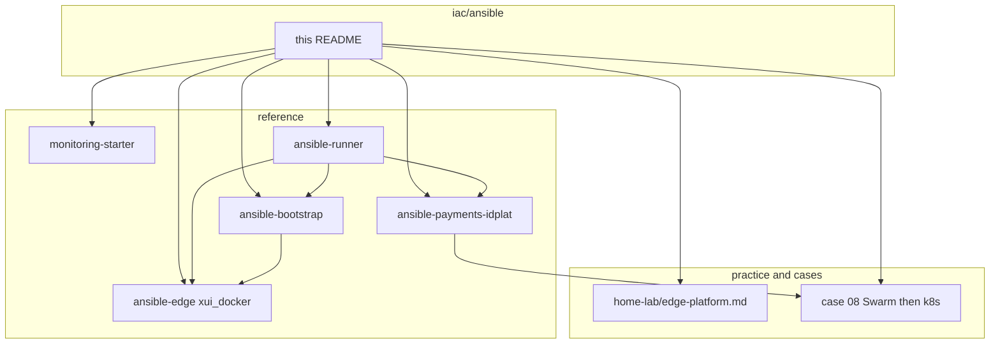

# Ansible (day-2)

Next-chat handoff (delete when done): [`../../TEMP_ANSIBLE_NEXT.md`](../../TEMP_ANSIBLE_NEXT.md).

**Business first:** hosts become inventory and a runbook in **days**, not a rebuild quarter. More Ansible slices will land later; this map stays. Buyer page: [`../../docs/for-business.md`](../../docs/for-business.md).

Linux and edge delivery as Ansible: the same GitOps habit as Terraform, on hosts instead of cloud APIs. Used on greenfield VPS fleets and on **legacy** hosts that must become inventory + roles without a rebuild. Failover paths (jump, alternate region, SSH backup channel) are part of keeping production reachable when a primary path fails. Host bootstrap includes named admin users, SSH keys, and optional sshd harden. OS/user hardening is part of the first run, not a later ticket.

A second, larger tree is **application autodeploy**: an SBP-class payments identity plane on Docker Swarm, with the same roles later pointed at Kubernetes.

Hunter-facing map. **Code** lives under [`../../reference/`](../../reference/) (sanitized). **Story** lives under [`../../practice/home-lab/edge-platform.md`](../../practice/home-lab/edge-platform.md) and [`../../case-studies/08-payments-swarm-autodeploy.md`](../../case-studies/08-payments-swarm-autodeploy.md).

```text
iac/ansible/          # this page
reference/
  ansible-bootstrap/          # prepare_servers
  ansible-edge/               # xui_docker (full Xray/panel role)
  ansible-payments-idplat/    # AM + IG + Redis + Postgres (Swarm / k8s)
  monitoring-starter/         # host_metrics
  utilities/ansible-runner/
practice/home-lab/edge-platform.md
case-studies/08-payments-swarm-autodeploy.md
```

| Kit | What hiring sees |
|-----|------------------|
| [`../../reference/ansible-bootstrap/`](../../reference/ansible-bootstrap/) | Empty VPS → admin user, SSH keys, Docker CE from download.docker.com, optional sshd harden |
| [`../../reference/ansible-edge/`](../../reference/ansible-edge/) | Full `xui_docker` playbook: Compose pin, ACME, panel API, inbound/clients/outbounds, routing tags, extra inbounds, `USR1` timer, socat failover |
| [`../../reference/ansible-payments-idplat/`](../../reference/ansible-payments-idplat/) | **Payments identity autodeploy:** Access Manager, Identity Gateway (YARP), Redis, Postgres; Swarm engine plus `k8s_service` |
| [`../../reference/monitoring-starter/`](../../reference/monitoring-starter/) | sysstat + vnstat + disk CSV as code |
| [`../../reference/utilities/ansible-runner/`](../../reference/utilities/ansible-runner/) | Control-node image: ansible-core + jmespath, `--network host` |



These roles are the day-2 half of the same delivery as Terraform. **CI is the button** that runs apply, then this map: [`../ci/`](../ci/). Terraform: [`../terraform/`](../terraform/). Cloud experience: [`../cloud/`](../cloud/). VCD hook example: [`../../reference/ansible-bootstrap/vcd-post-apply.yml.example`](../../reference/ansible-bootstrap/vcd-post-apply.yml.example).

**Keywords:** Ansible, GitOps, Docker Swarm, Kubernetes, YARP, OIDC, JWT, Xray, 3X-UI, UFW, ACME, systemd, inventory, SBP-class, payments identity
