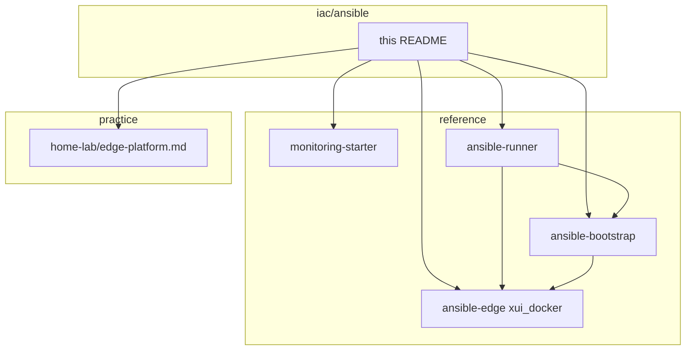

# Ansible (day-2)

Linux and edge delivery as Ansible: the same GitOps habit as Terraform, on hosts instead of cloud APIs. Used on greenfield VPS fleets and on **legacy** hosts that must become inventory + roles without a rebuild. Failover paths (jump, alternate region, SSH backup channel) are part of keeping production reachable when a primary path fails. Host bootstrap includes named admin users, SSH keys, and optional sshd harden — OS/user hardening is part of the first run, not a later ticket.

Hunter-facing map. **Code** lives under [`../../reference/`](../../reference/) (sanitized). **Story** lives under [`../../practice/home-lab/edge-platform.md`](../../practice/home-lab/edge-platform.md).

```text
iac/ansible/          # this page
reference/
  ansible-bootstrap/  # prepare_servers
  ansible-edge/       # xui_docker (full Xray/panel role)
  monitoring-starter/ # host_metrics
  utilities/ansible-runner/
practice/home-lab/edge-platform.md
```

| Kit | What hiring sees |
|-----|------------------|
| [`../../reference/ansible-bootstrap/`](../../reference/ansible-bootstrap/) | Empty VPS → admin user, SSH keys, Docker CE from download.docker.com, optional sshd harden |
| [`../../reference/ansible-edge/`](../../reference/ansible-edge/) | Full `xui_docker` playbook: Compose pin, ACME, panel API, inbound/clients/outbounds, routing tags, extra inbounds, `USR1` timer, socat failover |
| [`../../reference/monitoring-starter/`](../../reference/monitoring-starter/) | sysstat + vnstat + disk CSV as code |
| [`../../reference/utilities/ansible-runner/`](../../reference/utilities/ansible-runner/) | Control-node image: ansible-core + jmespath, `--network host` |



Terraform for the same platforms: [`../terraform/`](../terraform/). Cloud experience: [`../cloud/`](../cloud/).

**Keywords:** Ansible, GitOps, Docker, day-2 Linux, Xray, 3X-UI, UFW, ACME, systemd, inventory
