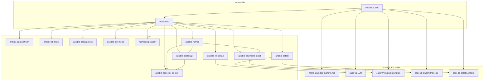

# Ansible

**Business first:** hosts become inventory and a runbook in **days**, not a rebuild quarter. Buyer page: [`../../docs/for-business.md`](../../docs/for-business.md).

Linux and edge delivery as Ansible: the same GitOps habit as Terraform, on hosts instead of cloud APIs. Used on greenfield VPS fleets and on **legacy** hosts that must become inventory + roles without a rebuild. Failover paths (jump, alternate region, SSH backup channel) are part of keeping production reachable when a primary path fails. Host bootstrap includes named admin users, SSH keys, and optional sshd harden. OS/user hardening is part of the first run, not a later ticket.

Application trees sit on that baseline: GPU/LLM and collaboration, Huawei-class docker-app + Vault + night-park, Kafka/EDR/Postgres users, Borg backup, AWS host roles, and an SBP-class payments identity plane (Swarm, then Kubernetes).

## Who this page is for

| Reader | What to take | Then open |
|--------|----------------|-----------|
| Founder / PM | Hosts become inventory in **days**. Private LLM API keeps tenant files off a public chat. Idle non-prod can park. Identity and backup are coded, not a wiki. | [`../../docs/for-business.md`](../../docs/for-business.md), [case 01](../../case-studies/01-ai-llm-platform.md), [case 08](../../case-studies/08-payments-swarm-autodeploy.md), [case 10](../../case-studies/10-ansible-estate.md) |
| Hiring lead | Ansible is a second IaC language next to Terraform: living roles, not a three-task demo. | [`reference/`](reference/), [`../../docs/experience.md`](../../docs/experience.md) |
| Engineer | Full trees under `reference/`. Each kit README says what / why / how to run. | Kit table below |

Hunter-facing map. **Code** lives under [`reference/`](reference/) (sanitized), same pattern as [`../terraform/`](../terraform/). **Story** lives under [`../../practice/home-lab/edge-platform.md`](../../practice/home-lab/edge-platform.md) and the case studies linked below.

```text
iac/ansible/                 # this page
  SANITIZE.md
  reference/
    ansible-bootstrap/       # prepare_servers
    ansible-edge/            # xui_docker (full Xray/panel role)
    ansible-payments-idplat/ # AM + IG + Redis + Postgres (Swarm / k8s)
    ansible-llm-collab/      # GPU/LLM, Nextcloud, Kafka, CIS, n8n
    ansible-estate/          # docker_app, Vault, hibernate, Flyway/RO/RW users
    ansible-app-platform/    # Kafka mTLS, EDR, harden, Prometheus
    ansible-kb-linux/        # PostgreSQL / Percona / NTP / host audit
    ansible-backup-borg/     # Borg user + dump scripts
    ansible-aws-hosts/       # AWS bastion / DB / backup / users
    monitoring-starter/      # host_metrics
    ansible-runner/          # control-node image
practice/home-lab/edge-platform.md
case-studies/01-ai-llm-platform.md
case-studies/07-huawei-compute-catalog.md
case-studies/08-payments-swarm-autodeploy.md
case-studies/10-ansible-estate.md
```

| Kit | What it is | Why it exists (buyer) | What an engineer parses |
|-----|------------|------------------------|-------------------------|
| [`reference/ansible-bootstrap/`](reference/ansible-bootstrap/) | Empty-VPS baseline | A new box is reachable and hardened before any app | Admin user, SSH keys, Docker CE, optional sshd |
| [`reference/ansible-edge/`](reference/ansible-edge/) | Xray / panel | Edge stays up when a path fails (jump, socat, timer) | Full `xui_docker`: Compose, ACME, panel API, routing, `USR1` |
| [`reference/ansible-payments-idplat/`](reference/ansible-payments-idplat/) | SBP-class identity plane | Login and tokens are coded, Swarm then Kubernetes | AM + IG (YARP) + Redis + Postgres; `k8s_service` |
| [`reference/ansible-llm-collab/`](reference/ansible-llm-collab/) | **Private GPU API + collab estate** | Tenant files and chat stay off a public model. Nextcloud / n8n / Kafka sit on the same inventory as the LLM node | llama.cpp CUDA, nginx `/v1`, Nextcloud ACL GitOps, CIS, Kafka, living host map, [`extras/sec-stack/`](reference/ansible-llm-collab/extras/sec-stack/) (host VM + Grafana). Story: [case 01](../../case-studies/01-ai-llm-platform.md) |
| [`reference/ansible-estate/`](reference/ansible-estate/) | Huawei-class host runbook | After Terraform apply, apps and Vault are a playbook, idle compute parks. **Postgres users** are coded: Flyway/DDL vs app DML, extra RO/RW | `docker_app`, Vault, hibernate, `estate_databases`. [case 10](../../case-studies/10-ansible-estate.md) |
| [`reference/ansible-app-platform/`](reference/ansible-app-platform/) | App-estate scrape and Kafka | Brokers and Postgres users have a lifecycle, not a ticket | Kafka mTLS, EDR, Prometheus, node_exporter |
| [`reference/ansible-kb-linux/`](reference/ansible-kb-linux/) | Linux DB / NTP / audit | Ordinary hosts stay patched and timed; audit is a pull | PostgreSQL/repmgr, Percona, NTP, Ubuntu audit |
| [`reference/ansible-backup-borg/`](reference/ansible-backup-borg/) | Borg jobs as scripts | Restore path exists before the incident | `borg` user + MySQL/PG/Mongo/GitLab/etcd dumps |
| [`reference/ansible-aws-hosts/`](reference/ansible-aws-hosts/) | AWS guest after Terraform | EC2 is not "done" at apply: disks, DB, bastion, backup | Next to [`../terraform/aws/`](../terraform/aws/) |
| [`reference/monitoring-starter/`](reference/monitoring-starter/) | Host sar / vnstat | Visibility before a full Prometheus estate | sysstat, vnstat, disk CSV |
| [`reference/ansible-runner/`](reference/ansible-runner/) | Control-node image | CI and a laptop run the same playbooks | ansible-core + jmespath, `--network host` |



These roles are the host half of the same delivery as Terraform. **CI is the button** that runs apply, then this map: [`../ci/`](../ci/). Terraform: [`../terraform/`](../terraform/). Cloud experience: [`../cloud/`](../cloud/). What never goes into git: [`SANITIZE.md`](SANITIZE.md). VCD hook example: [`reference/ansible-bootstrap/vcd-post-apply.yml.example`](reference/ansible-bootstrap/vcd-post-apply.yml.example).

**Observability split:** VictoriaMetrics, host Grafana, node-exporter, and sar stay in this Ansible tree. In-cluster Grafana / OpenObserve is Helm, not a second VM stack here. Detail: [`../helm/README.md#observability-split-do-not-duplicate-ansible`](../helm/README.md#observability-split-do-not-duplicate-ansible). Same-day views: [`../../architecture/05-sre.md`](../../architecture/05-sre.md), [`../../docs/sre/`](../../docs/sre/). Product APIs: [`../../architecture/06-product-apis.md`](../../architecture/06-product-apis.md).

**Keywords:** Ansible, GitOps, Docker Swarm, Kubernetes, YARP, OIDC, JWT, Xray, 3X-UI, UFW, ACME, systemd, inventory, SBP-class, payments identity, LLM, Nextcloud, Kafka, CIS, Vault, Borg, AWS, Huawei-class, EDR, Prometheus
