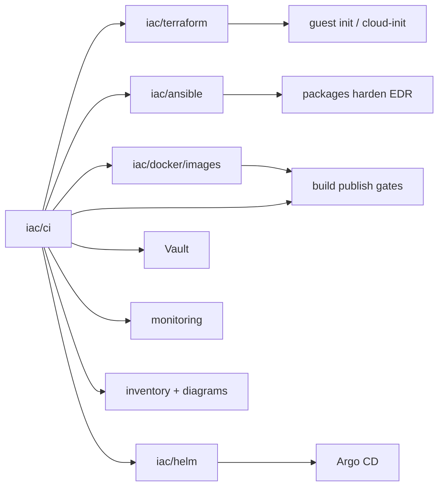

# CI

**Business first:** a named pipeline is the **button** (create, accompany, revoke). Hours after runners exist, not a meeting. Manager view: [`../../architecture/00-days-not-months.md`](../../architecture/00-days-not-months.md). Case: [`../../case-studies/13-ci-pipelines.md`](../../case-studies/13-ci-pipelines.md).

I publish CI the same way as Helm and Docker: a hunter hub plus living kits under [`pipelines/`](pipelines/). Full client `.gitlab-ci.yml` and Jenkinsfile farms stay private. What is here is enough to see a shared include, a Java hub, werf review and canary, a Jenkinsfile, and **one richest include per mechanic**. A three-hundred-file dump would not teach more.

Terraform creates (or imports) the thing. Ansible makes the guest operable. Helm / Argo bootstrap lives in [`../helm/`](../helm/) ([case 11](../../case-studies/11-helm-estate.md)). **CI is still the button** that runs the right slice. The sibling **build context** is [`../docker/images/`](../docker/images/) ([case 12](../../case-studies/12-docker-images.md)). Pipelines stay here.

## Who this page is for

| Reader | What to take | Then open |
|--------|----------------|-----------|
| Founder / PM | A branch or tag is the release. Argo or Ansible is the next button, not a Friday copy. | [`../../docs/for-business.md`](../../docs/for-business.md), [case 13](../../case-studies/13-ci-pipelines.md) |
| Hiring lead | CI is a fifth IaC language next to Terraform, Ansible, Helm, and Docker. Proof is one include per mechanic, not a private monorepo dump. Published job bodies here are SonarQube and Trivy. | [`pipelines/`](pipelines/), [`../../docs/experience.md`](../../docs/experience.md) |
| Engineer | Kits under `pipelines/`. Each kit README says what shipped vs what is documented only. Catalog copies keep the `.example` suffix. | Kit table below |

The IaC folders are siblings:

| Folder | Owns |
|--------|------|
| [`../terraform/`](../terraform/) | Cloud APIs, state, guest init / cloud-init, Kubernetes as code |
| [`../ansible/`](../ansible/) | On the host (packages, harden, EDR, metrics) |
| [`../helm/`](../helm/) | Cluster package, GitOps, Argo bootstrap |
| [`../docker/images/`](../docker/images/) | Dockerfile build context. One mechanic per image |
| [`../docker/compose/`](../docker/compose/) | Host and local `compose up` after the image exists |
| **this catalog** | Pipelines that call those, plus build / publish / deploy / revoke |

```text
iac/ci/                              # this hub
  SANITIZE.md
  pipelines/
    host-lifecycle.gitlab-ci.yml.example
    common-ci-estate/                # Kaniko / Helm / Argo includes + nested releases/
    common-ci-collab/                # thinner Kaniko + Ansible + sec-stack
    java-gradle/                     # service hubs; jobs/build/* commented
    review-stand/                    # time-boxed namespace
    images-kaniko/                   # pin catalog
    shop-test-allure/                # UI + Newman + Allure
    werf-retail/                     # multi-stage + Trivy + Sonar (no OSV)
    werf-delivery/                   # review / canary / notify
    werf-other/                      # extra werf mechanics (one folder each)
    jenkins/                         # Jenkinsfile + Borg monitor + include stub
    github-actions/                  # three workflows
    helmfile-dev/                    # two DEV helmfile applies
    cluster-addons/                  # manual Istio + ESO
    kb-example-ci/                   # one teaching werf converge
    security-gates/                  # DefectDojo / DT consumer + scripts only
```

Private runner tags, Vault paths, and tenant names stay out. See [`SANITIZE.md`](SANITIZE.md).

Six-year narrative (why Jenkins and GitLab both appear): [`../../docs/experience.md`](../../docs/experience.md).  
Diagrams: [`../../diagrams/iac/ci-turnkey.md`](../../diagrams/iac/ci-turnkey.md).  
Index of kits: [`pipelines/README.md`](pipelines/README.md).



---

## Living kits

One richest include per mechanic. Kit READMEs hold the file list. This table is the hunter map.

| Kit | What it is | Why it exists (buyer) | What an engineer parses |
|-----|------------|------------------------|-------------------------|
| [`pipelines/host-lifecycle.gitlab-ci.yml.example`](pipelines/host-lifecycle.gitlab-ci.yml.example) | One-button host | Empty VDC to inventory, Vault, and scrape | Plan → apply → SSH → Ansible → Vault → monitoring → docs |
| [`pipelines/common-ci-estate/`](pipelines/common-ci-estate/) | Shared estate include | Fifty repos include one file. Cutover is a numbered pipeline, not a Slack thread | Kaniko and Helm/Argo/Vault/Kafka job bodies. Nested `releases/` (MR create, approve, merge, revert, Ansible VM). Hub includes resolve inside this tree |
| [`pipelines/common-ci-collab/`](pipelines/common-ci-collab/) | Thinner include + sec-stack | A collab estate does not need the full estate graph | Three Kaniko jobs, Ansible host sync, Terragrunt + SOPS. Not a second `estate/common-ci` |
| [`pipelines/java-gradle/`](pipelines/java-gradle/) | Service hubs | One include, not fifty copied job files | Five hubs. Sonar, Allure, Helm deploy, Playwright, backup. AppSec tool includes. `jobs/build/*` stay commented (honest gap). No Trivy and no OSV here |
| [`pipelines/review-stand/`](pipelines/review-stand/) | Time-boxed namespace | A reviewer gets a stand with an expiry stamp | Hub triggers + NS label + OCI Helm upgrade + cleanup |
| [`pipelines/images-kaniko/`](pipelines/images-kaniko/) | Pin catalog | Hub tags, not a floating `FROM` on every Dockerfile | One manual Kaniko job per pin. Dockerfiles stay in [`../docker/images/`](../docker/images/) |
| [`pipelines/shop-test-allure/`](pipelines/shop-test-allure/) | UI + API + Allure | A stand is not done when Helm is green | Gradle + Chrome and Newman, then Allure upload. Not `include:` of `base.gradle.yml` |
| [`pipelines/werf-retail/`](pipelines/werf-retail/) | Retail multi-stage | Trivy and Sonar on the same werf train | `security-scan` (Trivy + Grype + GitLab SAST), `sonarqube`, cleanup, review, ReleaseCI, one BI env. No OSV file |
| [`pipelines/werf-delivery/`](pipelines/werf-delivery/) | Review / canary / notify | Delivery button, not a Friday `kubectl` | `REVIEW-START` / `STOP`, `WERF_SET_CANARY`, Slack threads, PHP gates. No Trivy and no Sonar here |
| [`pipelines/werf-other/`](pipelines/werf-other/) | Extra werf mechanics | Not a second retail or delivery dump | Shared hub plus `monorepo-unit`, `php-review-quota`, `werf-run-builder`, `opentofu` |
| [`pipelines/jenkins/`](pipelines/jenkins/) | Jenkins + Borg monitor | Earlier estates still run Jenkins | `Jenkinsfile.example`: `docker.build` → registry → AWX. Include stub documents a missing `infra/common-ci` (teaching 404). No shared library in this lab |
| [`pipelines/github-actions/`](pipelines/github-actions/) | Three workflows | Not every estate is GitLab | werf publish, Helm chart-testing / KinD, Go release matrix |
| [`pipelines/helmfile-dev/`](pipelines/helmfile-dev/) | Two DEV helmfile applies | Charts stay in the Helm SAMPLE | `docker:dind` then `helmfile apply`. Image CI stays next to the Dockerfile in [`../docker/images/ci/helmfile/`](../docker/images/ci/helmfile/) |
| [`pipelines/cluster-addons/`](pipelines/cluster-addons/) | Manual Istio + ESO | Mesh install is a click, then the estate kit adds policies | helmfile image, all `when: manual`. Charts in [`../helm/reference/helm-mesh-eso/`](../helm/reference/helm-mesh-eso/) |
| [`pipelines/kb-example-ci/`](pipelines/kb-example-ci/) | Teaching werf converge | One file, not a twenty-example dump | `multiwerf` + `werf ci-env` + converge. Borg / Deckhouse CI stay next to those charts |
| [`pipelines/security-gates/`](pipelines/security-gates/) | Consumer + scripts | DefectDojo and Dependency-Track wiring, not a third Trivy copy | Gitleaks / Semgrep / CycloneDX + clone scripts. Tool bodies stay in java-gradle and werf-retail |

Gates are **not** merged into one mega-folder. Cross-links:

| Gate | Published where | Honest note |
|------|-----------------|-------------|
| **SonarQube** | [`pipelines/java-gradle/jobs/test/`](pipelines/java-gradle/jobs/test/) and [`pipelines/werf-retail/sonarqube.yml.example`](pipelines/werf-retail/sonarqube.yml.example) | Java CLI and .NET in retail; class-file Sonar in the Gradle tree |
| **Trivy** | [`pipelines/werf-retail/security-scan.yml.example`](pipelines/werf-retail/security-scan.yml.example) | Real job body plus GitLab SAST / secret-detection and Grype |
| **AppSec tools** | [`pipelines/java-gradle/jobs/security/`](pipelines/java-gradle/jobs/security/) | One file per tool (Semgrep, PII, CycloneDX, DeepSecrets, DefectDojo, Dependency-Track) plus a ZAP plan |
| **DefectDojo consumer** | [`pipelines/security-gates/`](pipelines/security-gates/) | Templates + scripts. Not a second copy of the Java tool includes |
| **OSV-Scanner** | Not in this catalog | I stood the gate up on estates that asked for it. No source YAML was in the trees that were cleaned. No invented job |

---

## Controllers: Jenkins and GitLab CI + Argo CD

Both are real production time. Neither is a keyword.

**Jenkins** (a lot of earlier and mid estates): controller, **plugins**, credentials, pipeline libraries, and **workers**. Classic pain is a farm of dedicated build VMs that rot (disk, JDK drift, who installed that plugin). That configuration moved onto **Kubernetes**: workers as pods, scale with the queue, image in the registry, less snowflake metal. Builds got faster; ops got cheaper. The point is an operable Jenkins, not a museum of click-installed boxes. Same stages as below: build, scan, gate, publish, deploy, revoke. Published shape: [`pipelines/jenkins/Jenkinsfile.example`](pipelines/jenkins/Jenkinsfile.example). A shared-library `vars/*.groovy` tree is not in this lab.

**GitLab CI + Argo CD** (more of the recent work, and the preferred pair when the estate allows it):

| Piece | What it does in this catalog |
|-------|------------------------------|
| GitLab CI | Build, test, gates, images, promote. YAML in the repo |
| Argo CD | GitOps into the cluster: desired state in git, sync on-call can see, drift is a ticket |
| Branches / tags | Branch → preview / dev / stage. **Tag** → named release toward prod |
| Merge requests | Automatic MRs when the artefact is ready (version bump, env promote). Scripts under [`pipelines/common-ci-estate/releases/`](pipelines/common-ci-estate/releases/) |
| Merge policy | Auto-merge when **written** parameters match: green pipeline, approvals, labels, target branch |

Seamless here matches the SLA story in the [root README](../../README.md): the next service should not see a maintenance window because someone clicked Deploy. Rollback is another revision, not an SSH session.

---

## Turnkey map (infra through accompany)

A platform pipeline is not “apply a VM and stop.” The same catalog covers **create**, **run**, **ship apps**, and **take things back**.

### 1. Create infrastructure

Empty project or empty VDC → IAM / org, network, then compute:

- VMs (public cloud, VCD, Proxmox, bare metal): Terraform + guest init / cloud-init, then Ansible. Host path: [One button (hosts)](#one-button-hosts).
- Kubernetes I stand up and operate: cloud PaaS (EKS / CCE / GKE-class), vanilla, **OpenShift**, **Deckhouse**. Cluster create and node pools are pipeline stages with plan/apply, not a console weekend.
- Data and glue next to that cluster: RDS-class, Kafka-class, object storage, as in [`../terraform/`](../terraform/).

Apply on `main` is never implicit without a written rule (environment, approval, or `when: manual`).

### 2. Accompany infrastructure

After create, the estate stays in CI:

- Drift: `terraform plan` on a schedule; unexpected changes are a ticket
- Images and packages: OS patch windows, base-image rebuilds, Ansible idempotent runs
- Certificates, DNS, backups adjacent to stateful workloads
- Monitoring jobs stay registered; a silent new host is a bug
- Docs and diagrams refresh from facts (optional **local** LLM rewrite; no tenant data to public APIs)

### 3. Builds (application)

The same catalog ships **application** pipelines. A large share of that work is **Java / JVM** (Maven/Gradle, multi-module, fat JAR / Spring Boot, Tomcat-class WAR, shared parent POM, JDK on the worker image). Also Kotlin, C#/.NET, Go, Python, 1C publish paths. The rule is the same: the artefact is built in CI, not on a laptop.

Typical build stages (as in the private repos):

1. Checkout at a pinned SHA
2. Restore cache (Maven/Gradle/npm) without trusting a dirty worker
3. Compile / unit test
4. Package (JAR, image, chart)
5. Attach the git SHA and a version to the artefact

Fifty-plus microservice estates share **base images** and pipeline includes so fifty Dockerfiles are not patched by hand. Those parents live under [`../docker/images/`](../docker/images/). Heavy JVM monoliths use the same gates; the build is longer, the dump/GC story stays in [experience](../../docs/experience.md).

Honest gap on the published Java hubs: `jobs/build/*` (Kaniko / Helm / Maven publish) were not in the source tree. Those include lines stay **commented**. I did not invent build YAML. Werf kits carry the image build in `werf ci-env` + `werf converge` instead.

### 4. Publish

A green build is not “it compiled.” Publish is a named stage:

- Container registry (image + digest, not `:latest` as the only tag)
- Maven / generic package registry for libraries
- Helm / GitOps repo for the desired state Argo will sync
- SBOM next to the image when the estate asks for it (CycloneDX in java-gradle and security-gates)

Promote is a **new job** (or a new pipeline) to the next environment, not a rewrite of the artefact.

### 5. Scanning and quality gates

Gates stood up **from zero** and wired so people use them:

| Gate | When |
|------|------|
| **SonarQube** | Quality gate on the MR: smells, coverage the team agreed, block merge on the rules that matter |
| **Trivy** | Image / filesystem / IaC misconfig before promote |
| **OSV-Scanner** | Lockfile advisories so a known-bad library does not ship because nobody looked |

Gates that fail closed on noise get bypassed. The job is a gate developers can live with and auditors can point at. Fail the MR; do not only warn on `main`.

SonarQube and Trivy have published job bodies (table above). **OSV-Scanner is experience, not a file in this lab.**

### 6. Merge requests

Best practice as actually used:

- Pipeline required on the MR (build + gates)
- **Automatic MRs** when a release job says the artefact is ready (version bump, changelog, env promote)
- Merge when **parameters** match: green pipeline, required approvals, labels, only this target branch
- Rules written down, not tribal
- IaC MRs: `terraform plan` in the MR comment or artefact; apply after merge under protection

### 7. Deploy

- Kubernetes: GitLab (or Jenkins) proves the revision; **Argo CD** syncs it. Drift is visible.
- VMs / classic hosts: Ansible from the same pipeline that built the artefact, or a promote job that calls the playbook.
- Branch → non-prod. Tag → named prod path. No “copy this YAML on Friday.”

### 8. Updates

Patch the OS, bump the chart, bump the JDK on the worker image, rotate a library: each is a pipeline on a branch, with the same gates, then an MR. Infra updates use the Terraform plan/apply pair; app updates use build → gate → publish → sync.

### 9. Revoke and cleanup

A turnkey catalog also **takes access and leftovers back**. That is as important as create.

| Action | Typical CI job |
|--------|----------------|
| Revoke | Rotate or delete deploy tokens, registry credentials, guest passwords in Vault, CI variables that were one-shot |
| Unpublish | Untag or retain-policy old images; do not leave `:latest` as the only truth |
| Teardown | Destroy ephemeral preview / MR environments; `terraform destroy` only on written targets |
| Cleanup | Failed apply leftovers, orphan volumes the runbook allows, stale Helm revisions, old Jenkins workspaces |

Revoke is a **logged job**, not a Slack “please drop my key.” Cleanup is scheduled or manual-on-purpose, never a surprise destroy of prod. Published shapes: host-lifecycle docs stage, review-stand expiry, werf `cleanup` jobs, release revert.

---

## One button (hosts)

A new **server** is the obvious button. Stages can run alone or as one pipeline.

```text
1. validate / terraform plan
2. terraform apply           # VM or node + guest init (cloud-init or VCD initscript)
3. wait-ssh
4. ansible bootstrap         # packages, harden, access, EDR
5. vault                     # write host creds (never git)
6. monitoring                # scrape jobs / exporters
7. docs + diagrams           # inventory row; optional local LLM rewrite
```

Published example: [`pipelines/host-lifecycle.gitlab-ci.yml.example`](pipelines/host-lifecycle.gitlab-ci.yml.example).  
Terraform proof (VCD greenfield): [`../terraform/vmware/`](../terraform/vmware/).  
Ansible post-apply hook: [`../ansible/reference/ansible-bootstrap/vcd-post-apply.yml.example`](../ansible/reference/ansible-bootstrap/vcd-post-apply.yml.example).  
Ansible map: [`../ansible/`](../ansible/).

### What those host stages do

1. **Terraform / guest init.** Create the VM from a catalog template. First boot: users, SSH keys, `PermitRootLogin no`, static NIC. On VCD this is Guest Customization + a short initscript (PRE users, POST netplan). Hosted VCD often caps initscript at 1500 characters, so packages and harden are Ansible, not the first-boot script. Extra disks wait until customization finishes.
2. **Ansible post-hook.** Inventory from Terraform output. `apt` update/upgrade, baseline packages, hardening, named admin access, EDR agent.
3. **Monitoring.** Register the host. A downed new VM is an alert.
4. **Vault.** Guest passwords and bootstrap tokens go to Vault. State may hold them; git does not. ESO later if the host is a cluster node.
5. **Docs.** Inventory markdown + Mermaid from facts. Optional local LLM; public SaaS LLMs are not used for tenant facts.
6. **Logging.** Plan, apply log, ansible recap, vault ack, docs diff. Replayable.

The same bar applies to **app releases**, **infra changes**, and **data migrations**: named stages, not a tribal checklist.

---

## What is published / what stays out

**Published:** the turnkey map, host-lifecycle, estate and collab includes, Java hubs (with `jobs/build/*` commented), review-stand, Kaniko pins, Allure test pipeline, three werf kits, Jenkinsfile, three GitHub Actions workflows, helmfile DEV, cluster-addons, one KB teaching file, security-gates consumer + scripts.

**Stays out:** a private farm of per-service copies of the same include, stock templates with no custom body, missing include targets that were never in the cleaned trees (`jobs/build/*` stay commented; **OSV-Scanner YAML** is not invented), `werf.yaml` and Dockerfile farms (those stay in Helm / Docker), Jenkins shared-library source, live runner tags, Vault paths, tenant FQDNs.

Sanitize: [`SANITIZE.md`](SANITIZE.md).

---

## Case studies

- [CI pipelines (GitLab, Jenkins, werf)](../../case-studies/13-ci-pipelines.md)
- [Docker images and Compose](../../case-studies/12-docker-images.md)
- [Helm estate / GitOps cluster](../../case-studies/11-helm-estate.md)
- [VMware VCD from zero + one-button host lifecycle](../../case-studies/06-vmware-vcd-greenfield.md)
- [Greenfield turnkey](../../case-studies/02-cloud-platform-turnkey.md)

## Keywords

CI/CD, GitLab CI, Jenkins, GitHub Actions, plugins, Kubernetes workers, GitOps, Argo CD, werf, helmfile, Kaniko, merge request, auto MR, quality gate, SonarQube, Trivy, OSV-Scanner, Java, Maven, Gradle, JVM, Allure, DefectDojo, publish, registry, revoke, cleanup, Terraform, Ansible, Vault, ESO, EDR, monitoring, cloud-init, guest init, documentation, local LLM
