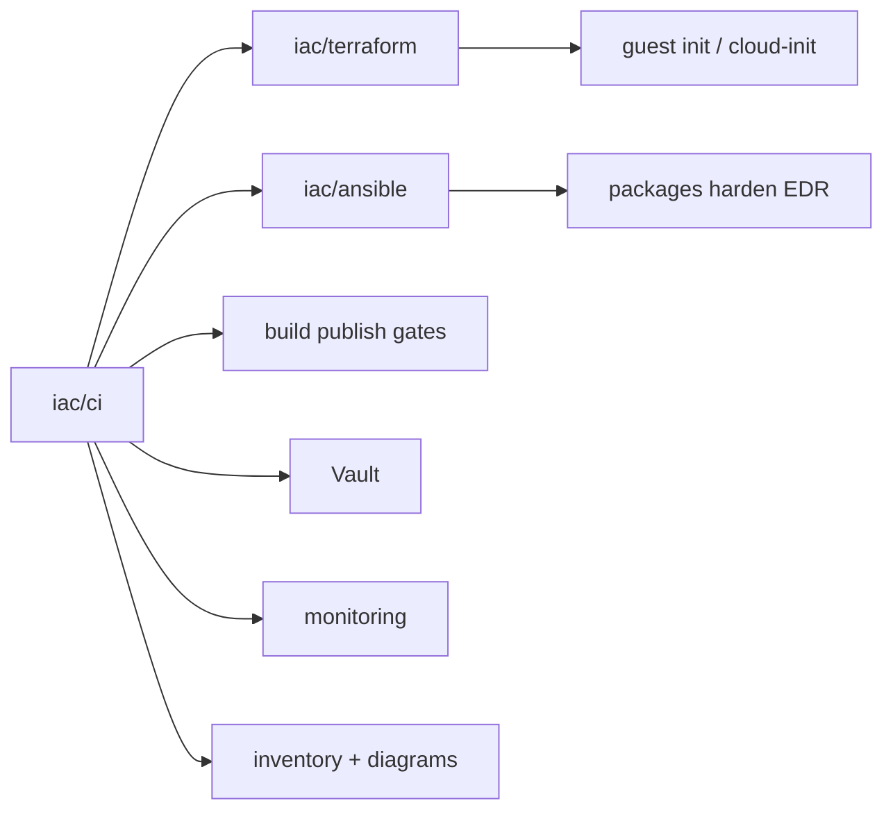

# CI

**Business first:** a named pipeline is the **button** (create, accompany, revoke). Hours after runners exist, not a meeting. Manager view: [`../../architecture/00-days-not-months.md`](../../architecture/00-days-not-months.md). Existing catalog below stays.

This directory is the **CI catalog** for the lab: how delivery is wired end to end. Not a dump of private `.gitlab-ci.yml` or Jenkinsfile trees.

The habit is the same on old repos and new ones: **infrastructure, builds, publishes, deploys, updates, revoke, and cleanup are pipelines**. Stages are named, logged, and split so a lead or an auditor can see what ran. YAML (or a Jenkinsfile) in git is the source of truth, not a tribal checklist and not a green tick in a screenshot.

Sanitized pipeline **code** lands under [`pipelines/`](pipelines/) as it is cleaned. This page is the **full map**. One host-lifecycle example is already there; the rest of the shapes below are described first on purpose.

Terraform creates (or imports) the thing. Ansible makes the guest operable. Application pipelines build and gate the artefact. **CI is the button** that runs the right slice. The three IaC folders are siblings:

| Folder | Owns |
|--------|------|
| [`../terraform/`](../terraform/) | Cloud APIs, state, guest init / cloud-init, Kubernetes as code |
| [`../ansible/`](../ansible/) | Day-2 on the host (packages, harden, EDR, metrics) |
| **this catalog** | Pipelines that call the two above, plus build / publish / deploy / revoke |

```text
iac/ci/                 # this hub (the story lives here)
  SANITIZE.md
  pipelines/            # sanitized GitLab CI / Jenkinsfiles (grows over time)
```

Private runner tags, Vault paths, and tenant names stay out. See [`SANITIZE.md`](SANITIZE.md).

Six-year narrative (why Jenkins and GitLab both appear): [`../../docs/experience.md`](../../docs/experience.md).  
Diagrams: [`../../diagrams/iac/ci-turnkey.md`](../../diagrams/iac/ci-turnkey.md).



---

## Controllers: Jenkins and GitLab CI + Argo CD

Both are real production time. Neither is a keyword.

**Jenkins** (a lot of earlier and mid estates): controller, **plugins**, credentials, pipeline libraries, and **workers**. Classic pain is a farm of dedicated build VMs that rot (disk, JDK drift, “who installed that plugin”). That configuration moved onto **Kubernetes**: workers as pods, scale with the queue, image in the registry, less snowflake metal. Builds got faster; day-2 got cheaper. The point is an operable Jenkins, not a museum of click-installed boxes. Same stages as below: build, scan, gate, publish, deploy, revoke.

**GitLab CI + Argo CD** (more of the recent work, and the preferred pair when the estate allows it):

| Piece | What it does in this catalog |
|-------|------------------------------|
| GitLab CI | Build, test, gates, images, promote. YAML in the repo |
| Argo CD | GitOps into the cluster: desired state in git, sync on-call can see, drift is a ticket |
| Branches / tags | Branch → preview / dev / stage. **Tag** → named release toward prod |
| Merge requests | Automatic MRs when the artefact is ready (version bump, env promote) |
| Merge policy | Auto-merge when **written** parameters match: green pipeline, approvals, labels, target branch |

Seamless here matches the SLA story in the [root README](../../README.md): the next service should not see a maintenance window because someone clicked Deploy. Rollback is another revision, not an SSH session.

This catalog will hold sanitized examples of **both** controllers. Until then the map is the same; only the YAML dialect changes.

---

## Turnkey map (infra through accompany)

A platform pipeline is not “apply a VM and stop.” The same catalog covers **create**, **run**, **ship apps**, and **take things back**.

### 1. Create infrastructure

Empty project or empty VDC → IAM / org, network, then compute:

- VMs (public cloud, VCD, Proxmox, bare metal): Terraform + guest init / cloud-init, then Ansible. Host path: [One button (hosts)](#one-button-hosts).
- Kubernetes I stand up and operate: cloud PaaS (EKS / CCE / GKE-class), vanilla, **OpenShift**, **Deckhouse**. Cluster create and node pools are pipeline stages with plan/apply, not a console weekend.
- Data and glue next to that cluster: RDS-class, Kafka-class, object storage, as in [`../terraform/`](../terraform/).

Apply on `main` is never implicit without a written rule (environment, approval, or `when: manual`).

### 2. Accompany infrastructure

After create, the estate stays in CI:

- Drift: `terraform plan` on a schedule; unexpected changes are a ticket
- Images and packages: OS patch windows, base-image rebuilds, Ansible idempotent runs
- Certificates, DNS, backups adjacent to stateful workloads
- Monitoring jobs stay registered; a silent new host is a bug
- Docs and diagrams refresh from facts (optional **local** LLM rewrite; no tenant data to public APIs)

### 3. Builds (application)

The same catalog ships **application** pipelines. A large share of that work is **Java / JVM** (Maven/Gradle, multi-module, fat JAR / Spring Boot, Tomcat-class WAR, shared parent POM, JDK on the worker image). Also Kotlin, C#/.NET, Go, Python, 1C publish paths. The rule is the same: the artefact is built in CI, not on a laptop.

Typical build stages (best practice, as in the private repos):

1. Checkout at a pinned SHA
2. Restore cache (Maven/Gradle/npm) without trusting a dirty worker
3. Compile / unit test
4. Package (JAR, image, chart)
5. Attach the git SHA and a version to the artefact

Fifty-plus microservice estates share **base images** and pipeline includes so fifty Dockerfiles are not patched by hand. Heavy JVM monoliths use the same gates; the build is longer, the dump/GC story stays in [experience](../../docs/experience.md).

### 4. Publish

A green build is not “it compiled.” Publish is a named stage:

- Container registry (image + digest, not `:latest` as the only tag)
- Maven / generic package registry for libraries
- Helm / GitOps repo for the desired state Argo will sync
- SBOM next to the image when the estate asks for it

Promote is a **new job** (or a new pipeline) to the next environment, not a rewrite of the artefact.

### 5. Scanning and quality gates

Gates stood up **from zero** and wired so people use them (same three as the global docs):

| Gate | When |
|------|------|
| **SonarQube** | Quality gate on the MR: smells, coverage the team agreed, block merge on the rules that matter |
| **Trivy** | Image / filesystem / IaC misconfig before promote |
| **OSV-Scanner** | Lockfile advisories so a known-bad library does not ship because nobody looked |

Gates that fail closed on noise get bypassed. The job is a gate developers can live with and auditors can point at. Fail the MR; do not only warn on `main`.

### 6. Merge requests

Best practice as actually used:

- Pipeline required on the MR (build + gates)
- **Automatic MRs** when a release job says the artefact is ready (version bump, changelog, env promote)
- Merge when **parameters** match: green pipeline, required approvals, labels, only this target branch
- Rules written down, not tribal
- IaC MRs: `terraform plan` in the MR comment or artefact; apply after merge under protection

### 7. Deploy

- Kubernetes: GitLab (or Jenkins) proves the revision; **Argo CD** syncs it. Drift is visible.
- VMs / classic hosts: Ansible from the same pipeline that built the artefact, or a promote job that calls the playbook.
- Branch → non-prod. Tag → named prod path. No “copy this YAML on Friday.”

### 8. Updates

Patch the OS, bump the chart, bump the JDK on the worker image, rotate a library: each is a pipeline on a branch, with the same gates, then an MR. Infra updates use the Terraform plan/apply pair; app updates use build → gate → publish → sync.

### 9. Revoke and cleanup

A turnkey catalog also **takes access and leftovers back**. That is as important as create.

| Action | Typical CI job |
|--------|----------------|
| Revoke | Rotate or delete deploy tokens, registry credentials, guest passwords in Vault, CI variables that were one-shot |
| Unpublish | Untag or retain-policy old images; do not leave `:latest` as the only truth |
| Teardown | Destroy ephemeral preview / MR environments; `terraform destroy` only on written targets |
| Cleanup | Failed apply leftovers, orphan volumes the runbook allows, stale Helm revisions, old Jenkins workspaces |

Revoke is a **logged job**, not a Slack “please drop my key.” Cleanup is scheduled or manual-on-purpose, never a surprise destroy of prod.

---

## One button (hosts)

A new **server** is the obvious button. Stages can run alone or as one pipeline.

```text
1. validate / terraform plan
2. terraform apply           # VM or node + guest init (cloud-init or VCD initscript)
3. wait-ssh
4. ansible bootstrap         # packages, harden, access, EDR
5. vault                     # write host creds (never git)
6. monitoring                # scrape jobs / exporters
7. docs + diagrams           # inventory row; optional local LLM rewrite
```

Published example: [`pipelines/host-lifecycle.gitlab-ci.yml.example`](pipelines/host-lifecycle.gitlab-ci.yml.example).  
Terraform proof (VCD greenfield): [`../terraform/vmware/`](../terraform/vmware/).  
Ansible post-apply hook: [`../../reference/ansible-bootstrap/vcd-post-apply.yml.example`](../../reference/ansible-bootstrap/vcd-post-apply.yml.example).  
Ansible map: [`../ansible/`](../ansible/).

### What those host stages do

1. **Terraform / guest init.** Create the VM from a catalog template. First boot: users, SSH keys, `PermitRootLogin no`, static NIC. On VCD this is Guest Customization + a short initscript (PRE users, POST netplan). Hosted VCD often caps initscript at 1500 characters, so packages and harden are Ansible, not the first-boot script. Extra disks wait until customization finishes.
2. **Ansible post-hook.** Inventory from Terraform output. `apt` update/upgrade, baseline packages, hardening, named admin access, EDR agent.
3. **Monitoring.** Register the host. A downed new VM is an alert.
4. **Vault.** Guest passwords and bootstrap tokens go to Vault. State may hold them; git does not. ESO later if the host is a cluster node.
5. **Docs.** Inventory markdown + Mermaid from facts. Optional local LLM; public SaaS LLMs are not used for tenant facts.
6. **Logging.** Plan, apply log, ansible recap, vault ack, docs diff. Replayable.

The same bar applies to **app releases**, **infra changes**, and **data migrations**: named stages, not a tribal checklist.

---

## What is published vs later

| Now | Later (same catalog, after sanitize) |
|-----|--------------------------------------|
| This map + diagrams | App build / Java Maven-Gradle includes |
| Host-lifecycle GitLab example | Publish + promote + Argo sync examples |
| Cross-links to Terraform and Ansible | Jenkinsfile equivalents (host + JVM build) |
| | MR bot / auto-MR skeleton |
| | Revoke / preview-teardown jobs |

Not claimed: every private pipeline is already in git here. Not published: Edge NAT/FW as code in the VCD slice, secrets, real hostnames, company runner tags.

---

## Case studies

- [VMware VCD from zero + one-button host lifecycle](../../case-studies/06-vmware-vcd-greenfield.md)
- [Greenfield turnkey](../../case-studies/02-cloud-platform-turnkey.md)

## Keywords

CI/CD, GitLab CI, Jenkins, plugins, Kubernetes workers, GitOps, Argo CD, merge request, auto MR, quality gate, SonarQube, Trivy, OSV-Scanner, Java, Maven, Gradle, JVM, publish, registry, revoke, cleanup, Terraform, Ansible, Vault, ESO, EDR, monitoring, cloud-init, guest init, documentation, local LLM
