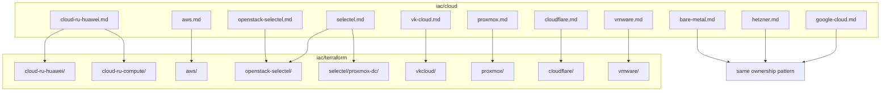

# Cloud experience

**Business first:** class of cloud (Huawei / AWS-shaped, OpenStack, VCD, Selectel) is how a buyer maps the skill. The buying question is still **calendar and bill**. Outcomes: [`../../docs/for-business.md`](../../docs/for-business.md). Foreign-reader notes below are unchanged.

Platforms I have stood up and operated: public cloud, private cloud, and on-prem. Each page is NDA-safe (sector and scale, not client names) and links to the Terraform that proves the same shape of work.

**cloud.ru note:** cloud.ru (and similar RU hyperscalers in this lab) is **Huawei Cloud class**. The resource model maps to **AWS** (VPC, ECS/EC2-class compute, CCE/EKS-class Kubernetes, RDS, OBS/S3, DMS/Kafka-class). That delivery is transferable AWS-shaped experience.

**VK Cloud note:** VK Cloud (MCS) is **NOVA Cloud class** (Kazakhstan OpenStack IaaS). Under the hood: **OpenStack** (Nova compute, Cinder volumes, Neutron networks, Keystone). Transferable to NOVA Cloud KZ and other OpenStack IaaS. Provider: `vk-cs/vkcs`.

**VMware note:** cloud.ru VMware is **VMware Cloud Director (VCD)**. Under the hood: org / VDC / Edge / vApp / VM. Transferable to any VCD / vCloud Director estate. Provider: `vmware/vcd`. Not the Huawei-class Advanced API.

**Selectel note:** Selectel is a top-tier **Russian cloud and datacenter** operator (own DCs, IaaS, dedicated, colo). Two APIs I used: **Selectel Cloud / VPC** (OpenStack Nova / Cinder / Neutron / Keystone) and **dedicated Proxmox** on Selectel hypervisors. Not a rebrand of AWS or OVH. Detail: [`selectel.md`](selectel.md).

## Map

| Platform | What I owned | Published Terraform |
|----------|----------------|---------------------|
| [cloud.ru / Huawei Cloud](cloud-ru-huawei.md) | Greenfield + brownfield: IAM, VPC, ECS, CCE, RDS, Kafka, OBS. **Second estate:** compute catalog with split state | [`../terraform/cloud-ru-huawei/`](../terraform/cloud-ru-huawei/), [`../terraform/cloud-ru-compute/`](../terraform/cloud-ru-compute/) |
| [AWS](aws.md) | Multi-account / multi-region: VPC, EC2, EKS, RDS, ElastiCache, IAM, S3, CloudFront | [`../terraform/aws/`](../terraform/aws/) |
| [Google Cloud](google-cloud.md) | Project/network bootstrap, compute, GKE-class / VM delivery | Narrative (private trees) |
| [Hetzner](hetzner.md) | Cloud VMs, networking, Linux baseline for app and CI | Narrative (private trees) |
| [Selectel](selectel.md) | Top-tier RU cloud + DC: OpenStack VPC **and** dedicated Proxmox | [`../terraform/openstack-selectel/`](../terraform/openstack-selectel/), [`../terraform/selectel/`](../terraform/selectel/) |
| [OpenStack / Selectel Cloud](openstack-selectel.md) | VPC slice: volume-boot, AZ, Postgres WAL, kube etcd | [`../terraform/openstack-selectel/`](../terraform/openstack-selectel/) |
| [VK Cloud (NOVA Cloud class)](vk-cloud.md) | **Proof of legacy:** 70+ hand-built VMs + full network/SG catalog from zero, then import | [`../terraform/vkcloud/`](../terraform/vkcloud/) |
| [Proxmox](proxmox.md) | VE guests for K8s, GitLab, Postgres | [`../terraform/proxmox/`](../terraform/proxmox/) |
| [VMware Cloud Director](vmware.md) | **Proof of greenfield VCD:** catalog from zero, guest init, DB-class VM, then CI hooks | [`../terraform/vmware/`](../terraform/vmware/) |
| [Bare metal](bare-metal.md) | Rack/server Linux, bootstrap, K8s without a hyperscaler | Narrative (private trees) |
| [Cloudflare](cloudflare.md) | DNS as code alongside compute roots | [`../terraform/cloudflare/`](../terraform/cloudflare/) |

## How I deliver (every cloud)

1. IAM / project / tenancy baseline
2. VPC or equivalent: subnets, routing, security groups, peering
3. Compute, load balancing, managed DB (tune under load: SQL, locks, replication, sharding — not only create), object storage, messaging (**Kafka**, RabbitMQ, NATS, Artemis, Redis)
4. Kubernetes I stand up and operate: cloud PaaS (EKS/CCE/GKE-class), vanilla, **OpenShift**, **Deckhouse**
5. CI/CD into the cluster: **Jenkins** (plugins, workers; dedicated VMs → Kubernetes) and **GitLab CI + Argo CD** (branch/tag deploys, auto MR, merge rules); Java / .NET / Go / Kotlin / Python / 1C paths; **SonarQube**, **Trivy**, **OSV-Scanner** gates from zero; apps, docs, monitoring handoff
6. Loaded production: multi-zone HA, seamless migrations, ~99.9% SLA, metrics that catch saturation and lag
7. Security from the first apply: OS/IAM hardening, EDR, users and rights, secrets in **Vault** / cloud stores / **ESO** (introduce if missing)
8. Repo and pipeline layout: separate repos (not a dump monorepo), branches that match promotion, folders an auditor and a new engineer can follow
9. On legacy estates: inventory → code or import → runbooks → alerts; add Vault/ESO and hardening if they were never there
10. Incidents including off-hours: Cisco-style 7-step (define → facts → analyze → eliminate → hypothesize → test → document); restore connectivity when a path is blocked; bring downed services back with log-driven isolation

Greenfield: empty project or empty rack → apply.  
Brownfield: inventory → code → `terraform import` → clean `plan`. Same pattern for accelerating delivery, cutting idle spend, and making ops visible.

See case studies: [turnkey from zero](../../case-studies/02-cloud-platform-turnkey.md), [brownfield import](../../case-studies/04-terraform-brownfield-import.md), [legacy estate as Terraform](../../case-studies/05-legacy-estate-as-code.md), [VMware VCD + one-button CI](../../case-studies/06-vmware-vcd-greenfield.md), [Huawei compute catalog](../../case-studies/07-huawei-compute-catalog.md), [Selectel VPC + dedicated](../../case-studies/09-selectel-vpc-and-dedicated.md).

Hosts (Ansible): [`../ansible/`](../ansible/). One-button CI: [`../ci/`](../ci/). Positioning: [`../../docs/positioning.md`](../../docs/positioning.md).
