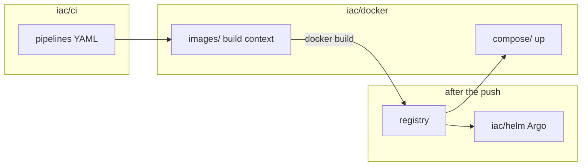

# Docker / Compose

**Business first:** the artefact is an **image in a registry**, then Helm syncs it or Compose brings the host stack up. Buyer page: [`../../docs/for-business.md`](../../docs/for-business.md). Case: [`../../case-studies/12-docker-images.md`](../../case-studies/12-docker-images.md).

I publish Docker the same way as Helm and Ansible: a hunter hub plus living kits. Full client image farms stay private. What is here is enough to see CI pins, two runner mechanics, estate operators, and **one richest Dockerfile per product mechanic**. A hundred-plus identical shop files would not teach more.

Pipelines stay in [`../ci/`](../ci/). The build context lives here under [`images/`](images/). Host and local stacks live under [`compose/`](compose/). Cluster package after the push is [`../helm/`](../helm/). Hub diagram: [`../../diagrams/iac/docker.md`](../../diagrams/iac/docker.md).

## Who this page is for

| Reader | What to take | Then open |
|--------|----------------|-----------|
| Founder / PM | CI builds the image. The registry is the hand-off. Helm or Compose is the next button, not a Friday copy. | [`../../docs/for-business.md`](../../docs/for-business.md), [case 12](../../case-studies/12-docker-images.md) |
| Hiring lead | Docker is a fourth IaC language next to Terraform, Ansible, and Helm: pins, split runtimes, and host stacks. Product proof is one mechanic per folder, not a shop dump. CI YAML is living kits under [`../ci/`](../ci/) ([case 13](../../case-studies/13-ci-pipelines.md)). | [`images/`](images/), [`compose/`](compose/), [`../../docs/experience.md`](../../docs/experience.md), [`../ci/`](../ci/) |
| Engineer | Images under `images/{ci,operators,apps}/`. Compose under `compose/`. Each kit README says what shipped vs what is documented only. | Kit tables below |

```text
iac/docker/                    # this page
  SANITIZE.md
  images/
    ci/                        # kaniko, ansible-ee, two base-runners, JVM/node pins, helmfile, maven
    operators/                 # certs, hibernate, cloud exporters, static nginx, EDR coverage
    apps/                      # one richest copy per runtime mechanic
  compose/
    sec-stack/                 # host VM + Grafana (also extras/sec-stack/stack/)
    hsm-adapter/
    gitlab-omnibus/
    vault/
    dev-deps/
    java-local-dev/
    php-dev/
    shop-extras/               # NiFi, docs portal, fluent-bit, static site
    ovpn-admin/ php-octane/ php-roadrunner/ php-amqp/ go-wine-bridge/ poetry-admin/
    collab/                    # Jira / wiki / JSM / Nextcloud / n8n / postfix / edge / OCR / Kafka
```

App-adjacent Compose sits in sibling folders next to those images.

| Kit | What it is | Why it exists (buyer) | What an engineer parses |
|-----|------------|------------------------|-------------------------|
| [`images/ci/`](images/ci/) | Runner and pin bases | Builds share a parent. The job does not apt-get a JDK or a browser every time | Kaniko retag, ansible-ee 2.16 + hvac, k8s runner vs docker-login runner, Temurin 11, Liberica 21, Node 20/22 pins, helmfile, Maven + docker CLI |
| [`images/operators/`](images/operators/) | Estate sidecars | Certs, night-park, CloudEye, EDR coverage, and a static site are images, not a wiki | Living trees. CloudEye Go `src/` is not in this lab |
| [`images/apps/`](images/apps/) | Product packaging | One mechanic per folder, not a shop image farm | Combined Gradle vs Liberica split, Next standalone vs nginx+envsubst, two e2e styles, vitest (shared `.npmrc`), Newman, packaging (NiFi, Keycloak, Superset, JSM), PHP/Poetry/Go |
| [`compose/sec-stack/`](compose/sec-stack/) | Host metrics Compose | Same eight services the Ansible role copies onto the VM | VictoriaMetrics, vmagent, vmalert, Alertmanager, Grafana, blackbox, PAN-OS, EDR. Twin: [`../ansible/reference/ansible-llm-collab/extras/sec-stack/stack/`](../ansible/reference/ansible-llm-collab/extras/sec-stack/stack/) |
| [`compose/hsm-adapter/`](compose/hsm-adapter/) | Nginx in front of an HSM adapter | Signing traffic hits a published vhost, not a raw port | `docker-compose.yaml` + `nginx.conf` |
| [`compose/gitlab-omnibus/`](compose/gitlab-omnibus/) | GitLab Omnibus DEV + PROD | The product is a compose pair and site confs, not a console install | `gitlab-ee` pin, `.env.example`, `git-dev.example.com` / `git.example.com` |
| [`compose/vault/`](compose/vault/) | Vault + nginx, DEV + PROD | Secrets stay on a host stack. This is not the Kafka cert sidecar | Compose files. `config/` / `ssl/` / `data/` stay off git |
| [`compose/dev-deps/`](compose/dev-deps/) | Local Java/shop dependencies | A laptop stand is six small files, not a CCE cluster | Jaeger, Kafka, MinIO, Postgres, Keycloak, Locust |
| [`compose/java-local-dev/`](compose/java-local-dev/) | Local JVM stands | Outbox, Kraft topics, host-DB, Keycloak SPI | `shop-rate` on host Postgres |
| [`compose/php-dev/`](compose/php-dev/) | PHP DEV compose family | x86 / M1 / vue / e2e / API / OMS / broker | One file per stand |
| [`compose/ovpn-admin/`](compose/ovpn-admin/) and siblings | App-adjacent Compose | OpenVPN admin, Octane, RoadRunner, AMQP, Wine bridge, Poetry admin | Sibling folders next to the images |
| [`compose/collab/`](compose/collab/) | Atlassian / Nextcloud / n8n / OCR / KRaft | Collaboration is a host compose, not a Helm umbrella | Living snapshots. Ansible ACL / n8n JSON stay in [`../ansible/reference/ansible-llm-collab/`](../ansible/reference/ansible-llm-collab/) |
| [`compose/shop-extras/`](compose/shop-extras/) | Shop-class extras (on disk) | NiFi, docs portal, fluent-bit sidecar, static site build | Living compose files in those four folders |

Sibling Dockerfiles that stay next to their kits (not moved here): [`../ansible/reference/ansible-runner/`](../ansible/reference/ansible-runner/) (unpinned runner; `images/ci/ansible-ee` is the Vault EE), [`../ansible/reference/ansible-app-platform/`](../ansible/reference/ansible-app-platform/) scratch image, [`../../practice/home-lab/reference/apps/ssh-tunnel-docker/`](../../practice/home-lab/reference/apps/ssh-tunnel-docker/).



## Observability split (do not duplicate Helm)

Host Grafana and VictoriaMetrics stay on a **VM**. The CCE overlay stays in Helm. Do not merge them into one compose that also ships Istio.

| Layer | Where it lives | What it is |
|-------|----------------|------------|
| Host metrics Compose | [`compose/sec-stack/`](compose/sec-stack/) and [`../ansible/reference/ansible-llm-collab/extras/sec-stack/stack/`](../ansible/reference/ansible-llm-collab/extras/sec-stack/stack/) | Eight services. The Ansible role copies `stack/` next to the playbook |
| Host scrape roles | [`../ansible/reference/ansible-app-platform/`](../ansible/reference/ansible-app-platform/) `monitoring_deploy` | Prom remote_write to VictoriaMetrics |
| In-cluster overlay | [`../helm/reference/helm-estate-cluster/monitoring/`](../helm/reference/helm-estate-cluster/monitoring/) | Grafana alerts and dashboards, CloudEye + status exporters, OpenObserve collector |

Manager page: [`../../architecture/05-sre.md`](../../architecture/05-sre.md). Catalog: [`../../docs/sre/layers.md`](../../docs/sre/layers.md).

## What is published / what stays out

**Published:** CI pins and runners, estate operators, one richest app image per mechanic, host and local Compose. The cybersec stack is here for hunters and again next to the Ansible role that copies it onto a VM.

**Stays out:** a hundred-plus near-identical Dockerfiles (one Gradle file covered a shop), extra copies of the same pin, product source trees, vendor binaries, CloudEye Go `src/`, live `.env` and PEM. Pipeline YAML lives under [`../ci/pipelines/`](../ci/pipelines/) ([case 13](../../case-studies/13-ci-pipelines.md)). A couple of image kits still carry a thin `.gitlab-ci.yml` next to the Dockerfile (helmfile pin).

Sanitize: [`SANITIZE.md`](SANITIZE.md).

**Keywords:** Docker, Compose, Dockerfile, Kaniko, Harbor, Jenkins, GitLab CI, Helm, Argo CD, Java, Gradle, Liberica, Node, Next.js, Playwright, PHP, Poetry, Keycloak, NiFi, Superset, Vault, GitLab Omnibus, VictoriaMetrics, Grafana, EDR, CloudEye
