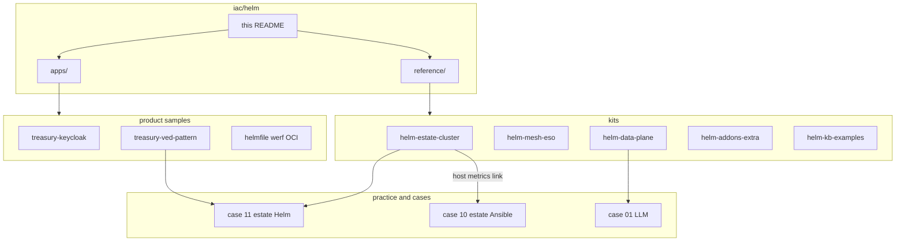

# Helm

**Business first:** the cluster is a **package and a GitOps entry**, not a Friday YAML copy. Buyer page: [`../../docs/for-business.md`](../../docs/for-business.md). Case: [`../../case-studies/11-helm-estate.md`](../../case-studies/11-helm-estate.md). Operator images those charts consume: [`../docker/images/operators/`](../docker/images/operators/). Pipelines that upgrade them: [`../ci/`](../ci/). Diagram: [`../../diagrams/iac/helm.md`](../../diagrams/iac/helm.md).

I publish Helm the same way as Terraform and Ansible: a hunter hub plus living kits under [`reference/`](reference/) and curated product samples under [`apps/`](apps/). Full client chart farms stay private. What is here is enough to see mesh egress, CDC on an external broker, secrets, GitOps bootstrap, complementary observability layers (host Ansible + in-cluster overlay + addons), and one richest copy per product mechanic.

Curated product samples live under [`apps/`](apps/).

## Who this page is for

| Reader | What to take | Then open |
|--------|----------------|-----------|
| Founder / PM | Releases are charts and an Argo project, not a meeting. Idle questions stay on the Ansible night-park page. | [`../../docs/for-business.md`](../../docs/for-business.md), [case 11](../../case-studies/11-helm-estate.md) |
| Hiring lead | Helm is a third IaC language next to Terraform and Ansible: custom CRs and values, not a vendored tarball dump. On-call proof is the estate overlay README (12 alerts / 14 dashboards) plus ElastAlert2. Product proof is one overlay per mechanic, not thirty shop charts. | [`reference/helm-estate-cluster/monitoring/`](reference/helm-estate-cluster/monitoring/), [`reference/helm-addons-extra/elastalert2/`](reference/helm-addons-extra/elastalert2/), [`apps/`](apps/), [`../../docs/experience.md`](../../docs/experience.md) |
| Engineer | Kits under `reference/` and samples under `apps/`. Each README says what shipped vs what is documented only. | Kit tables below |

```text
iac/helm/                    # this page
  SANITIZE.md
  reference/
    helm-estate-cluster/     # Istio policies, Kafka Connect, Vault/ESO, Argo, LB, ingress, Zalando, obs overlay
    helm-mesh-eso/           # Istio 1.30.3 install + ESO 2.9.0 install
    helm-data-plane/         # Linkerd, Jaeger, NiFi, DEV autostand contrast
    helm-addons-extra/       # MinIO, OTel, ELK/ECK, PromRules, ElastAlert2, SonarQube, Supabase, OpenVPN, backup, Dagster
    helm-kb-examples/        # d8-authz, redis-operator, borg, restic
  apps/                      # one richest copy per product mechanic
    treasury-keycloak/       # MUST overlay; codecentric 17.0.2 (not Bitnami Keycloak)
    treasury-ved-pattern/    # nine estate mechanics + shared libs
    icon-pro-sample/
    helmfile-dev/
    werf-raw/
    chart-flant-lib/
    chart-local-subchart/
    oci-common-app/
    werf-monorepo-sample/
```

| Kit | What it is | Why it exists (buyer) | What an engineer parses |
|-----|------------|------------------------|-------------------------|
| [`reference/helm-estate-cluster/`](reference/helm-estate-cluster/) | Production cluster envelope | Traffic leaves on purpose, CDC is coded, secrets are not in git, GitOps has a door | Custom Istio + Kafka Connect templates, thin Vault/ESO, Argo bootstrap, 3-ELB, ingress values, Zalando PG, overlay **12** Grafana alert YAML + **14** dashboard JSON + two cloud exporters + OpenObserve collector |
| [`reference/helm-mesh-eso/`](reference/helm-mesh-eso/) | Mesh and secrets **install** | The estate kit is policies. This kit is the charts CI actually upgrades | Istio `base`+`istiod` 1.30.3, ESO 2.9.0 |
| [`reference/helm-data-plane/`](reference/helm-data-plane/) | Second mesh + traces + flows | A shop estate that did not pick Istio | Linkerd (no issuer keys), Jaeger, NiFi. DEV Kafka/Postgres/MinIO is contrast only |
| [`reference/helm-addons-extra/`](reference/helm-addons-extra/) | Addons I stood up more than once | Logging, object storage, gates, BaaS, VPN admin, backup | One richest tree per addon. Dagster is overlay only |
| [`reference/helm-kb-examples/`](reference/helm-kb-examples/) | Teaching charts I actually used | Authz and backup are not folklore | Four small trees, not a 50-example dump |
| [`apps/`](apps/) | Product samples hub | Hunters should not look for umbrellas under `reference/` | One richest copy per mechanic. Living trees in the listed folders |
| [`apps/treasury-keycloak/`](apps/treasury-keycloak/) | Keycloak **overlay** | SSO is values + ExternalSecret, not an 84-file vendor tree | codecentric **17.0.2** pin, Bitnami PostgreSQL **10.3.13** unused, image 26 on managed PG. Not Bitnami Keycloak |
| [`apps/treasury-ved-pattern/`](apps/treasury-ved-pattern/) | Estate product mechanics | Nine mechanics, not thirty-seven services | `file://` `base-chart` / `front-base`, CryptoPro PVC variants, gRPC Service, truststore in values, remote-repo site, monolith overlay, integration ExternalSecret |
| [`apps/icon-pro-sample/`](apps/icon-pro-sample/) | Shop-class `.helm` pair | Same helpers, two services | gateway + keycloak. Not twenty-seven backends |
| [`apps/helmfile-dev/`](apps/helmfile-dev/) | Only helmfile SAMPLE | A DEV namespace is two helmfiles | llm-api + feed-api / feed-rss. Not Istio adjunct |
| [`apps/werf-raw/`](apps/werf-raw/) | werf without Chart.yaml | Some apps never grew a Chart.yaml | PHP webapps + SPA dashboard |
| [`apps/chart-flant-lib/`](apps/chart-flant-lib/) | Chart + HTTPS flant-lib | Packaging contrast | Living tree in that folder |
| [`apps/chart-local-subchart/`](apps/chart-local-subchart/) | Chart + local subchart | Packaging contrast | Living tree in that folder |
| [`apps/oci-common-app/`](apps/oci-common-app/) | Chart + OCI `common` | Library stays on the registry | `oci://example.registry/helm/common` |
| [`apps/werf-monorepo-sample/`](apps/werf-monorepo-sample/) | Shared werf values + one unit | Forty services shared one values file | `common-templates` + s3-cache-proxy. Not donor/slot charts |



## Observability split (do not duplicate Ansible)

Multiple complementary layers. Do not merge them into one compose or one chart.

| Layer | Where it lives | What it is |
|-------|----------------|------------|
| Host / cybersec | [`../ansible/reference/ansible-app-platform/`](../ansible/reference/ansible-app-platform/) `monitoring_deploy` | Prometheus remote_write **VictoriaMetrics**, Kubernetes SD, blackbox, cAdvisor |
| Host Grafana + VM | [`../ansible/reference/ansible-llm-collab/extras/sec-stack/`](../ansible/reference/ansible-llm-collab/extras/sec-stack/) | Roles for VictoriaMetrics + Grafana + vmalert + PAN-OS / EDR exporters. Compose `stack/` **is published**: [`../docker/compose/sec-stack/`](../docker/compose/sec-stack/) and [`../ansible/reference/ansible-llm-collab/extras/sec-stack/stack/`](../ansible/reference/ansible-llm-collab/extras/sec-stack/stack/) |
| Host node scrape | [`../ansible/reference/ansible-estate/`](../ansible/reference/ansible-estate/) node-exporter | `:9100` on the VM, TLS watch next to it |
| Host sar (not Prom) | [`../ansible/reference/monitoring-starter/`](../ansible/reference/monitoring-starter/) | sysstat / vnstat before a full scrape estate |
| In-cluster overlay | [`reference/helm-estate-cluster/monitoring/`](reference/helm-estate-cluster/monitoring/) | **12** provisioned Grafana alert files, **14** dashboard JSON artefacts (sidecar off), two cloud exporters, OpenObserve collector |
| PromQL pack | [`reference/helm-addons-extra/custom-prometheus-rules/`](reference/helm-addons-extra/custom-prometheus-rules/) | **12** Deckhouse CustomPrometheusRules (CNPG, Cilium, Redis, ES, ingress). Not the Grafana `alerting:` map |
| Log runtime alerts | [`reference/helm-addons-extra/elastalert2/`](reference/helm-addons-extra/elastalert2/) | ElastAlert2 + Falco on Elasticsearch. Not the same as sec-stack metrics |
| Logging / traces addons | [`reference/helm-addons-extra/elk/`](reference/helm-addons-extra/elk/), [`reference/helm-addons-extra/opentelemetry-collector/`](reference/helm-addons-extra/opentelemetry-collector/) | ECK overlay + OTel Operator CR. Distinct from the OpenObserve collector DaemonSet |

Vendor Grafana / Prometheus / OpenObserve **trees** are not copied. Versions and the values I actually turned are in the estate monitoring README.

I treat Grafana, Prometheus / VictoriaMetrics, OpenObserve, Elasticsearch, and the cloud exporter endpoints as **APIs I already speak**. A new view or alert group is the same day (Kafka lag, CloudEye RDS, CCE API server, Spring Boot JVM), as files in git and as HTTP when Helm is not the path. Manager page: [`../../architecture/05-sre.md`](../../architecture/05-sre.md). Catalog: [`../../docs/sre/`](../../docs/sre/).

## What is published / what stays out

**Published:** cluster envelope, mesh install, data-plane mesh/traces, addons, KB examples, and curated product samples under [`apps/`](apps/).

**Stays out:** thirty shop umbrellas on CCE, Argo Application lists, repository secrets, Strimzi/AKHQ/Grafana/codecentric vendor dumps, Bitnami Keycloak, cert-manager shell scripts as artefacts, twenty-six estate clones.

Sanitize: [`SANITIZE.md`](SANITIZE.md).

**Keywords:** Helm, GitOps, Argo CD, Istio, Linkerd, External Secrets Operator, Vault, Kafka, Debezium, Strimzi, ingress-nginx, OpenObserve, Grafana, Prometheus, VictoriaMetrics, CloudEye, OpenTelemetry, ElastAlert2, Falco, MinIO, ECK, SonarQube, Supabase, NiFi, Jaeger, Zalando Postgres, werf, helmfile, Keycloak, codecentric, OCI Helm
