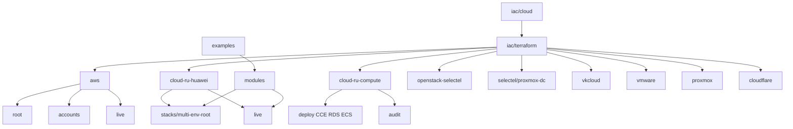

# Terraform / Terragrunt

**Business first:** reusable units so the next env is a **parameter change**. Honest time-to-value: [`../../architecture/03-reuse-modules.md`](../../architecture/03-reuse-modules.md). Night park example: [`examples/night-park/`](examples/night-park/). Existing folders and `RESOURCES.md` stay as they are.

Code proof for [`../cloud/`](../cloud/). Layout matches a real IaC repo: **one folder per cloud**, shared modules, small examples.

Experience and keywords live under [`../cloud/`](../cloud/). This directory is the `.tf` / Terragrunt tree. CI that applies this tree and then calls Ansible: [`../ci/`](../ci/). The cluster package (Helm / GitOps) is the sibling [`../helm/`](../helm/), not a folder under this tree.

Layout is meant to be **obvious**: one folder per cloud, shared `modules`, `live` / stacks for apply units — not a dump monorepo of unrelated products. Secrets stay out of git (`SANITIZE.md`); production estates use Vault / ESO / protected CI, introduced from scratch when missing.

```text
terraform/
  aws/                 # AWS root + multi-account roots + Terragrunt live
  cloud-ru-huawei/     # Huawei-class stacks + Terragrunt live
  cloud-ru-compute/    # Huawei-class compute catalog: CCE, RDS, purpose ECS, split state
  openstack-selectel/  # Selectel Cloud / OpenStack VPC
  selectel/            # Hub + dedicated Proxmox on Selectel HVs
  vkcloud/             # VK Cloud / NOVA Cloud class (OpenStack IaaS, catalog + purpose VMs)
  vmware/              # VMware Cloud Director (VCD): catalog, guest init, DB-class VM
  proxmox/
  cloudflare/
  modules/             # Shared sbercloud modules (used by cloud-ru-huawei)
  examples/            # Greenfield compose + brownfield import
  ai-stack/            # LLMOps map (compose + cases + Karpenter). Extra GPU compose can land later.
```

| Go to | Why |
|-------|-----|
| [`RESOURCES.md`](RESOURCES.md) | Clouds × resource types in code |
| [`COVERAGE.md`](COVERAGE.md) | Published vs private: what is in git per cloud |
| [`aws/`](aws/) | Standalone root + multi-account slice + EKS Terragrunt live |
| [`selectel/`](selectel/) | Selectel hub: dedicated Proxmox DC + pointer to OpenStack VPC |
| [`cloud-ru-huawei/`](cloud-ru-huawei/) | Multi-env root + Terragrunt (CCE, RDS, Kafka, OBS) |
| [`cloud-ru-compute/`](cloud-ru-compute/) | **Compute catalog:** CCE, RDS, GitLab/Vault/AppSec/Teleport ECS; network stays in sibling live |
| [`openstack-selectel/`](openstack-selectel/) | Selectel Cloud VPC: volume-boot, AZ, Postgres WAL, kube etcd |
| [`vkcloud/`](vkcloud/) | **Legacy as code:** vkcs, catalog maps, purpose-split VMs, import |
| [`vmware/`](vmware/) | **VCD greenfield:** catalog, guest init, extra disks, audit stack |
| [`proxmox/`](proxmox/) | Proxmox VE guests |
| [`cloudflare/`](cloudflare/) | DNS + mail + page rules + Access |
| [`modules/`](modules/) | Reusable Huawei-class modules |
| [`examples/`](examples/) | Small entry points |
| [`SANITIZE.md`](SANITIZE.md) | What never goes into git |



## Related

- CI catalog (turnkey map + pipelines): [`../ci/`](../ci/)
- Ansible (what CI runs on hosts after apply): [`../ansible/`](../ansible/)
- Helm (cluster package sibling): [`../helm/`](../helm/)

## Case studies

- [Greenfield turnkey](../../case-studies/02-cloud-platform-turnkey.md)
- [Brownfield import](../../case-studies/04-terraform-brownfield-import.md)
- [Legacy estate as Terraform (VK Cloud)](../../case-studies/05-legacy-estate-as-code.md)
- [VMware VCD from zero + one-button CI](../../case-studies/06-vmware-vcd-greenfield.md)
- [Huawei-class compute catalog (split state)](../../case-studies/07-huawei-compute-catalog.md)
- [SBP-class identity autodeploy (Ansible)](../../case-studies/08-payments-swarm-autodeploy.md)
- [Selectel VPC + dedicated Proxmox](../../case-studies/09-selectel-vpc-and-dedicated.md)
- [Huawei-class estate Ansible](../../case-studies/10-ansible-estate.md)

## Keywords

Terraform, Terragrunt, IaC, AWS, Huawei Cloud, cloud.ru, OpenStack, Selectel, VK Cloud, NOVA Cloud, Kazakhstan, vkcs, VMware, VCD, Proxmox, Cloudflare, Kubernetes, IAM, VPC, modules, live, multi-env, brownfield import, legacy estate, remote state, RDS, CCE, Vault, Teleport, AppSec, ESO, secrets, audit, split state
