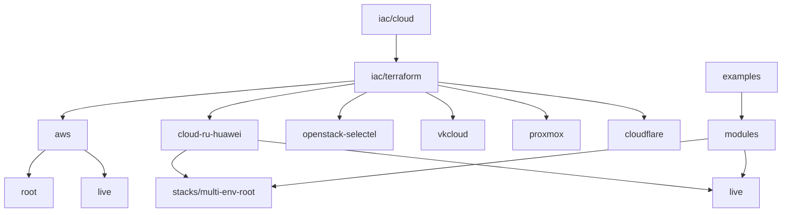

# Terraform / Terragrunt

Code proof for [`../cloud/`](../cloud/). Layout matches a real IaC repo: **one folder per cloud**, shared modules, small examples.

Experience and keywords live under [`../cloud/`](../cloud/). This directory is the `.tf` / Terragrunt tree.

Layout is meant to be **obvious**: one folder per cloud, shared `modules`, `live` / stacks for apply units — not a dump monorepo of unrelated products. Secrets stay out of git (`SANITIZE.md`); production estates use Vault / ESO / protected CI, introduced from scratch when missing.

```text
terraform/
  aws/                 # AWS root + Terragrunt live
  cloud-ru-huawei/     # Huawei-class stacks + Terragrunt live
  openstack-selectel/
  vkcloud/             # VK Cloud / NOVA Cloud class (OpenStack IaaS, catalog + purpose VMs)
  proxmox/
  cloudflare/
  modules/             # Shared sbercloud modules (used by cloud-ru-huawei)
  examples/            # Greenfield compose + brownfield import
  ai-stack/            # Placeholder for GPU/LLM-oriented baseline
```

| Go to | Why |
|-------|-----|
| [`RESOURCES.md`](RESOURCES.md) | Clouds × resource types in code |
| [`aws/`](aws/) | VPC, EC2, RDS, EKS Terragrunt live |
| [`cloud-ru-huawei/`](cloud-ru-huawei/) | Multi-env root + Terragrunt (CCE, RDS, Kafka, OBS) |
| [`openstack-selectel/`](openstack-selectel/) | OpenStack guests for K8s / GitLab / Postgres |
| [`vkcloud/`](vkcloud/) | **Legacy as code:** vkcs, catalog maps, purpose-split VMs, import |
| [`proxmox/`](proxmox/) | Proxmox VE guests |
| [`cloudflare/`](cloudflare/) | DNS as code |
| [`modules/`](modules/) | Reusable Huawei-class modules |
| [`examples/`](examples/) | Small entry points |
| [`SANITIZE.md`](SANITIZE.md) | What never goes into git |



## Case studies

- [Greenfield turnkey](../../case-studies/02-cloud-platform-turnkey.md)
- [Brownfield import](../../case-studies/04-terraform-brownfield-import.md)
- [Legacy estate as Terraform (VK Cloud)](../../case-studies/05-legacy-estate-as-code.md)

## Keywords

Terraform, Terragrunt, IaC, AWS, Huawei Cloud, cloud.ru, OpenStack, Selectel, VK Cloud, NOVA Cloud, Kazakhstan, vkcs, Proxmox, Cloudflare, Kubernetes, IAM, VPC, modules, live, multi-env, brownfield import, legacy estate, remote state, RDS, Vault, ESO, secrets, audit
